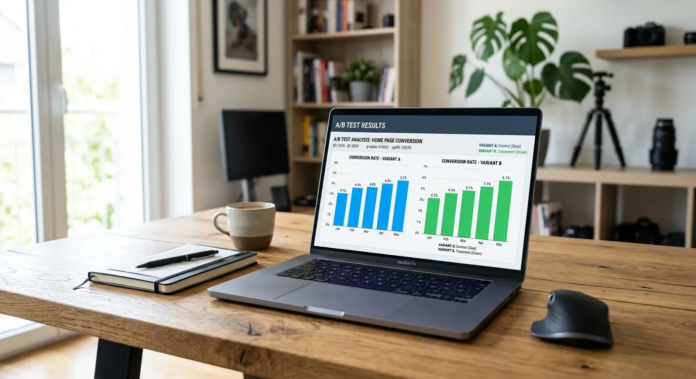
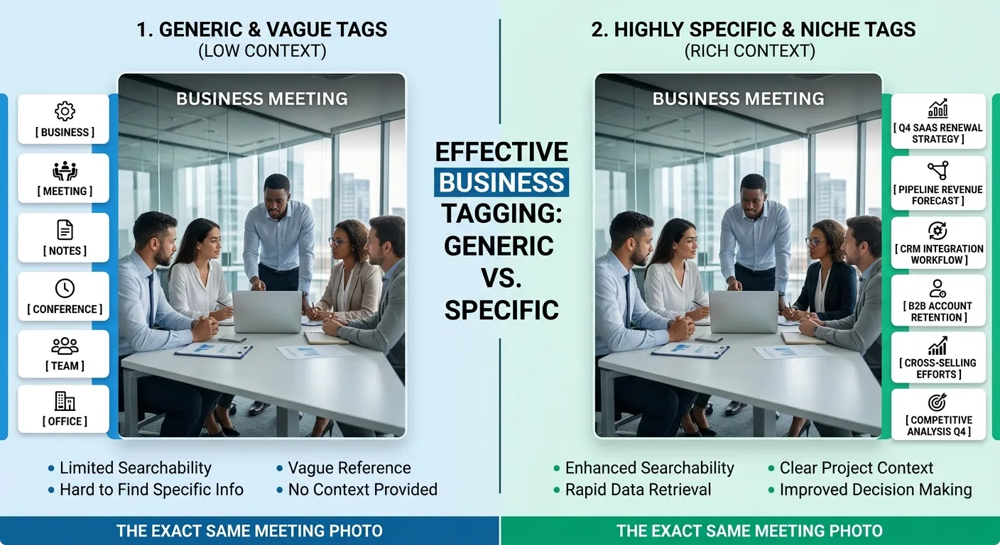

Have you ever wondered why some of your best photos get zero downloads while average ones sell constantly? The secret rarely lies in the image quality alone; it is almost always hidden in your metadata. Mastering A/B testing microstock keywords is the definitive way to stop guessing and start multiplying your royalties. By adopting a data-driven approach, you can systematically uncover exactly which search terms are connecting with buyers.

In the highly competitive world of stock photography and video, relying on basic tags is no longer enough. You need actionable data to thrive. This guide will walk you through creating a solid data-driven keywording microstock strategy that actually works. You will discover how to test variations, track performance, and double down on the tags that convert views into real money.

Along the way, we will explore the specific metrics you need to watch and the testing methods top contributors use. Whether you are selling on Shutterstock, Adobe Stock, or Getty Images, understanding these analytics is crucial. If you want a foundational understanding first, check out [Mastering Microstock Keywords: The Ultimate Guide to Selling More with AI](./mastering-microstock-keywords-the-ultimate-guide-to-selling-more-with-ai) before diving into these advanced testing techniques.

Why a Data-Driven Keywording Microstock Strategy Works
----------

### Shifting from Guesswork to Analytics ###

For years, microstock contributors have relied heavily on intuition when tagging their images. They would simply look at a photo, guess what a buyer might type into a search bar, and hit submit. However, buyer behavior is incredibly complex and constantly changing. What makes sense to a photographer might not match the corporate jargon used by an advertising agency.

This is where A/B testing microstock keywords changes the game. Instead of assuming you know the best terms, you let the market decide. By testing different keyword sets against each other, you remove human emotion and bias from the equation. The numbers will clearly show you which phrases generate actual search volume and drive downloads.

A data-driven keywording microstock approach allows you to build a reliable framework for future uploads. When you know definitively that "remote work" performs 40% better than "working from home" for your specific portfolio, you can apply that knowledge across hundreds of images. This compounding effect is how top earners scale their income.

### The Impact of Keyword Relevance on Downloads ###

Stock agencies use incredibly sophisticated search algorithms to serve images to buyers. These algorithms are designed with one primary goal: to show the most relevant images first. If your keywords do not perfectly align with what the buyer actually wants, your images will quickly be buried on page fifty.

Testing helps you refine your relevance score. When a buyer searches for a specific phrase and clicks your image, the algorithm registers a positive interaction. If they download it, your relevance score skyrockets. A/B testing helps you identify which precise words are triggering these positive interactions, allowing you to trim the "fluff" words that hurt your ranking.

Relevance is not just about isolated tags, either. It is deeply connected to your overall metadata structure. For a deeper dive into how this all connects, you should read [The Role of Descriptions and Titles in Microstock SEO: Beyond Just Keywords](./the-role-of-descriptions-and-titles-in-microstock-seo-beyond-just-keywords). Combining great keywords with optimized titles is a recipe for serious microstock success.

### Overcoming the Saturation Problem ###

The microstock market is flooded with hundreds of millions of assets. If you take a picture of an apple and just tag it "apple, fruit, red," you are competing against millions of identical files. Standing out in a saturated market requires finding the hidden, less obvious search terms.

By A/B testing microstock keywords, you can discover profitable micro-niches. You might find that tagging your apple image with "healthy childhood snack" or "dietary fiber concept" opens up entirely new pools of buyers. These long-tail keywords have much lower competition.

Furthermore, testing helps you understand agency-specific nuances. Shutterstock's algorithm might favor different terminology than Adobe Stock's algorithm. By continually analyzing your data, you can tailor your keyword strategy to beat saturation on every individual platform you upload to.

Setting Up Your Microstock Keyword A/B Tests
----------

### Choosing Which Images to Test ###

You cannot upload the exact same image twice to a stock agency just to test keywords; this violates their spam policies. Therefore, successful A/B testing requires using "similars." These are images from the same photo shoot that are visually similar but distinct enough to be accepted as unique files.

For example, if you shoot a business meeting, select two slightly different angles or expressions. Ensure both images are of equal technical quality and commercial value. If one image is clearly better lit or composed than the other, your test results will be skewed by the image quality rather than the keywords.

It is best to start your testing with highly commercial subjects. Lifestyle, business, healthcare, and technology concepts yield the most reliable data because they have high daily search volumes. Testing niche subjects with low search volume can take months to generate statistically significant results.

### Creating Control and Variation Batches ###

Once you have your similar images, you need to establish your "Control" and your "Variation." The Control image should use your standard, everyday keywording approach. This represents your baseline performance. Tag it exactly how you normally would without overthinking it.

The Variation image is where the testing happens. Change a specific element of your metadata strategy for this image. You might completely change the vocabulary, swap literal terms for conceptual ones, or radically alter the order of the tags. Crucially, only test one major variable at a time so you know exactly what caused any change in performance.

Keep a detailed spreadsheet of these batches. Record the image ID, the specific date uploaded, the Control keyword set, and the Variation keyword set. Without strict documentation, your A/B testing microstock keywords efforts will quickly become a confusing mess.

### Tracking Search Visibility Metrics ###

Uploading the test is only the first step; monitoring the data is where the real work begins. You need to give your images enough time to be indexed and surface in search results. Typically, you should wait at least 30 to 60 days before analyzing the initial data.

Focus on three main metrics: Impressions (Views), Clicks, and Downloads. Impressions tell you if your keywords are successfully placing your image in front of buyers. If the Variation gets significantly more impressions than the Control, your new keywords are generating better search visibility.

Clicks and downloads tell you if those keywords are actually relevant. High impressions but low clicks mean your keywords are getting you seen, but the image isn't what the buyer expected. A successful data-driven keywording microstock strategy aims for a healthy balance of all three metrics.

Key Variables to Test in Your Metadata
----------

### Broad vs Niche Keyword Placement ###

One of the most effective tests you can run is comparing broad, high-volume keywords against highly specific, niche phrases. Broad keywords like "business," "people," and "office" have massive search volume but extreme competition. Niche phrases like "agile project management meeting" have lower volume but high purchase intent.

Try tagging your Control image with broad terms, and your Variation image almost exclusively with long-tail, descriptive phrases. Monitor which image generates consistent, long-term sales. You will often find that niche keywords provide a slower but much more steady stream of income over time.

You can also test combining the two. Try an 80/20 split—80% broad terms and 20% niche terms on one image, and the reverse on the other. This helps you find the sweet spot for maximizing your reach across different types of buyer searches.

### Conceptual vs Literal Tagging Approaches ###

Literal tagging describes exactly what is in the photo: "coffee, mug, wooden desk, laptop, hands." Conceptual tagging describes the feeling, idea, or metaphor the image represents: "morning motivation, starting the workday, productivity, focus." Both are important, but which drives more sales for your style?

Set up a test where the Control image is heavily skewed toward literal descriptions. Make the Variation image heavily skewed toward emotional and conceptual ideas. Advertising agencies often search by concept rather than literal objects, so this test can reveal incredibly valuable data.

Pay attention to the types of images that win these tests. A corporate lifestyle shot might perform better with conceptual tags, while a perfectly isolated object on a white background will almost always require strict literal tagging.

### The Order and Priority of Tags ###

Not all stock agencies treat keywords equally. Adobe Stock, for instance, places massive algorithmic weight on the first 10 keywords attached to an image. If your most important keywords are sitting at positions 40 through 50, they are practically invisible to the algorithm.

Test the order of your keywords. For your Variation image, identify the absolute best, most relevant 10 tags and manually drag them to the top of your list. Leave the Control image with a randomized or alphabetically sorted list.

This is a cornerstone of a data-driven keywording microstock strategy. If reordering your tags results in a 20% bump in views on a specific agency, you immediately know that tag sequence must become a mandatory part of your upload workflow.

Analyzing Microstock Performance Metrics
----------

### Click-Through Rates on Agency Platforms ###

Your Click-Through Rate (CTR) is the percentage of people who saw your image thumbnail in search results and actually clicked on it to view the larger version. A low CTR is a massive red flag. It indicates that while your keywords might be mathematically correct, they aren't matching the buyer's visual intent.

When A/B testing microstock keywords, pay close attention to CTR differences between your Control and Variation. If your Variation uses the keyword "luxury," but the image looks like a standard budget office, buyers will scroll past it. The algorithm will penalize your image for this low engagement.

Improving your CTR means ensuring absolute harmony between your metadata and the visual content. The data you gather here will actually make you a better photographer, as you will learn exactly what visual cues buyers associate with specific search terms.

### Conversion Rates from Views to Sales ###

Views and clicks are great for the ego, but downloads pay the bills. Your conversion rate is the ultimate measure of success for any A/B test. You calculate this by dividing your total downloads by your total views.

Sometimes, a Variation image will get fewer overall views but significantly more downloads than the Control. This is actually a massive victory. It means your new keyword strategy effectively filtered out "window shoppers" and put your image directly in front of buyers with their credit cards ready.

Always base your final metadata decisions on conversion data rather than just impression data. High-converting keywords are the holy grail of a profitable data-driven keywording microstock portfolio.

### Identifying Seasonal Keyword Trends ###

Buyer search behavior changes dramatically throughout the year. A keyword strategy that works in June might fail completely in November. Tracking seasonal analytics allows you to test timing as a variable in your A/B tests.

For example, if you shoot a family dinner scene, you can test generic "family gathering" keywords against seasonal "Thanksgiving dinner" or "holiday feast" keywords. Test uploading these variations two months before the actual holiday to see how the algorithms pick them up.

By keeping historical data on these seasonal tests, you can create a yearly upload calendar. You will know exactly which weeks to push specific seasonal keywords to maximize your visibility right as buyer demand peaks.

Comparing Testing Approaches for Stock Contributors
----------

When implementing a data-driven keywording microstock strategy, you have to decide how you will track your experiments. Both manual tracking and software-assisted tracking have their place, depending on the size of your portfolio. Below is a breakdown of how the two approaches compare.

|      Feature      |    Manual Tracking (Spreadsheets)     |           Software/Automated Tracking            |
|-------------------|---------------------------------------|--------------------------------------------------|
|     **Cost**      |  Free (uses Excel or Google Sheets)   |         Monthly subscription fees apply          |
|**Portfolio Size** |      Best for under 2,000 images      |      Ideal for massive, growing portfolios       |
| **Data Accuracy** |Prone to human error and missed updates|      Highly accurate, pulls via agency APIs      |
|**Time Investment**|High; requires weekly manual data entry|      Low; updates dashboards automatically       |
|**Trend Spotting** | Requires manual graphing and analysis |Visual charts highlight winning keywords instantly|

Expert Tips for Microstock Keyword Optimization
----------

Executing a successful A/B test requires precision and patience. To get the most out of your analytics, keep these proven strategies in mind as you build out your testing framework:

* **Test Only One Variable:** If you change the keywords, the title, and the category all at once, you will never know which change caused the spike in sales. Keep your tests isolated.
* **Give It Time to Simmer:** Stock agency algorithms are notoriously slow. Do not panic and change your keywords after three days. Give every A/B test a minimum of 6 to 8 weeks before drawing conclusions.
* **Use Localized Spellings:** Test American English against British English (e.g., "color" vs. "colour"). Sometimes, targeting a specific regional spelling can dominate a localized market.
* **Log Your Failures:** A failed test is still valuable data. Knowing what search terms do not work prevents you from wasting time on them in future uploads.
* **Keep the Winners, Delete the Losers:** Once a test conclusively proves that a certain keyword sequence performs better, go back and update your older, underperforming portfolio with the winning strategy.

Frequently Asked Questions About A/B Testing Microstock Keywords
----------

### What exactly is A/B testing microstock keywords? ###

It is the process of uploading two visually similar images with different sets of keywords to see which metadata performs better. By comparing the views and downloads of both images, you can identify which search terms are most effective. This removes the guesswork from your tagging process.

### How long should I run an A/B test on my portfolio? ###

You should let an A/B test run for a minimum of 30 to 60 days. Stock agency search algorithms need time to index new files and serve them to buyers. Reacting too quickly to early data can lead to false conclusions.

### Does changing keywords hurt my current search ranking? ###

If an image is already selling extremely well, changing its keywords can be risky and may temporarily disrupt its ranking. It is safer to test new keyword strategies on fresh uploads or on older images that have zero sales. Never mess with your top-tier earners unnecessarily.

### Can I test identical images with different tags? ###

No, uploading the exact same image file twice violates the spam policies of almost every major stock agency. You must use "similars"—images from the same shoot that are slightly different in angle, expression, or composition—to conduct your tests safely.

### Which stock agencies are best for keyword testing? ###

Agencies with high traffic volumes, like Shutterstock and Adobe Stock, are best because they generate data much faster. Smaller agencies may take months to generate enough views to make an A/B test statistically significant.

### How many keywords should I test at once? ###

When running a strict A/B test, it is best to change a specific group of keywords or the overarching theme rather than changing all 50 tags randomly. Focus on testing 5 to 10 high-impact keywords, or testing the order of your top 10 tags, to get clear data.

### What is a data-driven keywording microstock strategy? ###

It is an approach to tagging where your keyword choices are based entirely on analytical performance metrics rather than personal assumptions. You rely on historical sales data, CTRs, and search volumes to dictate how you label your upcoming portfolio.

### How do I track views versus downloads accurately? ###

Most major stock agencies provide contributor dashboards that show both impressions (views) and actual downloads. You can export these reports into a spreadsheet and calculate your conversion rates manually, or use third-party microstock management software to automate the tracking.

### Should I test titles alongside my keywords? ###

Yes, but not at the exact same time on the same image. Titles hold significant SEO weight on platforms like Adobe Stock. Test your keywords first, find the winning combination, and then run a separate test experimenting with different descriptive titles.

Conclusion
----------

Mastering the art of A/B testing microstock keywords is the most reliable way to elevate your stock photography business from a hobby to a consistent revenue stream. By treating your portfolio as a series of ongoing experiments, you gradually build a deep understanding of what buyers want and how they search for it. You stop throwing spaghetti at the wall and start making highly calculated decisions based on real market feedback. The effort you put into tracking spreadsheets and analyzing metrics will pay off exponentially in the long run.

Do not let your best images get lost in the bottomless archives of stock agencies. Start implementing a data-driven keywording microstock strategy today by selecting just five sets of similar images to test this week. Create your control and variation batches, set a calendar reminder for 60 days from now, and let the data guide your next move. Embrace the analytics, refine your tags, and watch your download numbers climb.
