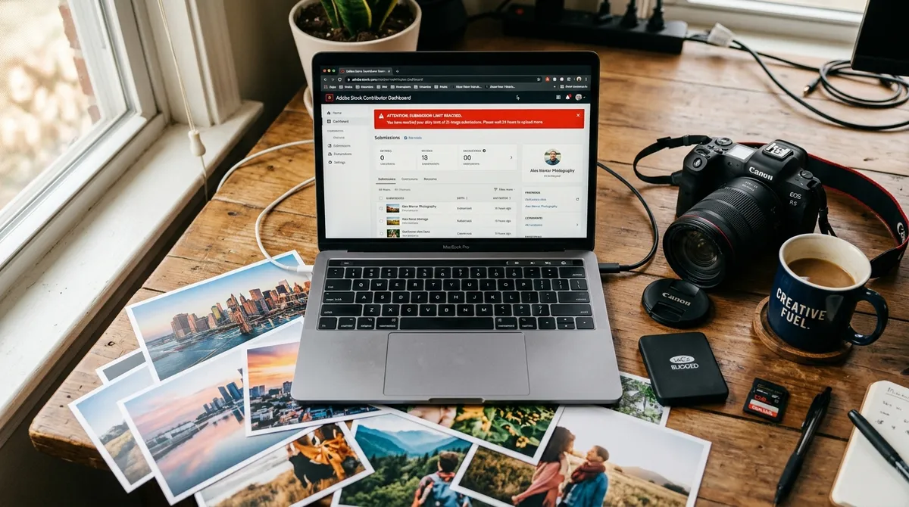
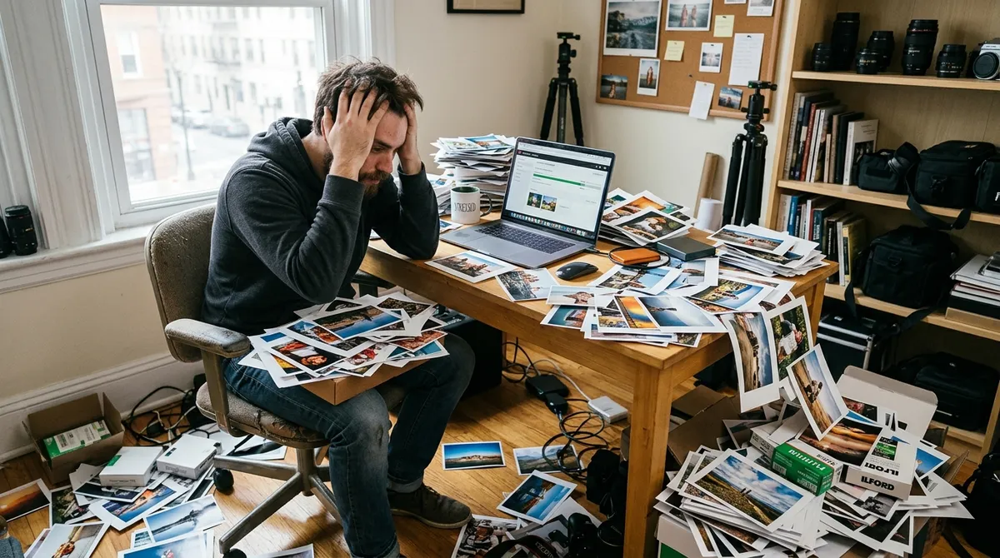

Adobe Stock has recently implemented submission limits for contributors, a move aimed at maintaining the quality of its growing content library. While the decision has sparked mixed reactions within the contributor community, it is clear that Adobe is taking steps to address issues such as spam, AI-generated content flooding, and moderation inefficiencies. Here's a detailed look at the situation, including insights from contributors and the broader implications of these changes.

---

## Why Submission Limits?

The introduction of submission limits is Adobe's response to the overwhelming influx of content, particularly from AI-generated sources and large-scale "content factories." These limits are designed to:

- **Reduce Spam:** Prevent the mass upload of low-quality or repetitive content.
- **Improve Moderation Efficiency:** Allow Adobe's moderation team to focus on reviewing content more effectively.
- **Encourage Quality Over Quantity:** Motivate contributors to prioritize well-crafted, high-quality submissions.

While Adobe has not officially disclosed the exact limits, contributors have reported weekly caps ranging from 200 to 1,000 submissions, depending on factors such as portfolio performance, rejection rates, and contributor history.

---

## Community Reactions: A Mixed Bag

The announcement has led to a lively debate among contributors, with opinions ranging from support to frustration. Here's a breakdown of the key perspectives:

### Support for Submission Limits

Many contributors see the limits as a necessary step to combat spam and improve the platform's overall quality. For example, one contributor highlighted the issue of "content factories" employing hundreds of people to churn out AI-generated images and upload them en masse. These operations often flood the platform with low-quality or repetitive content, making it harder for genuine creators to stand out.

As one contributor put it:

> "It is normal and positive for Adobe to do something radical to stop the unlimited massive influx of junk disguised as AI from third-world countries. The problem was getting bigger and bigger."

Another contributor added:

> "These limits are necessary, so I'm happy that they have finally been implemented."

### Frustration Over Lack of Clarity

On the flip side, many contributors are frustrated by the lack of transparency regarding the new limits. Adobe has not provided clear guidelines on how the limits are determined or how they will impact contributors with varying workflows.

One contributor expressed their concerns:

> "Clarity please. We are adults in this room, and clear, concise communication is key. What exactly are the upload limits imposed?"

Additionally, some contributors have reported long delays in content moderation, with assets sitting in review for months. This backlog could unfairly penalize contributors by counting pending content against their submission limits.

---

## The Bigger Picture: Implications for Contributors

### Impact on High-Volume Uploaders

For contributors who upload hundreds of assets daily, the new limits represent a significant change. Previously, some contributors were able to upload up to 10,000 assets per week. Under the new system, even the highest reported limits (1,000 submissions per week) represent a drastic reduction.

One contributor noted:

> "I read people are uploading 200-300 a day, so I am not sure what's the point of this limit—so they won't upload 600 a day? Does it make a difference at all?"

However, others argue that even a modest reduction in uploads can help reduce the flood of repetitive or low-quality content, benefiting the platform as a whole.

### Challenges for Genuine Creators

Some contributors feel that the new limits unfairly penalize genuine creators who take their craft seriously. For example, one seasoned professional shared their frustration:

> "I am a seasoned pro full stop. My rejections as of late are pathetic. I don't spam at all. I take my profession very seriously. What is going on currently at Adobe makes no sense to me at all."

This sentiment highlights the need for Adobe to refine its moderation process to distinguish between high-quality submissions and spam.

---

## Suggestions for Improvement

Contributors have proposed several ideas to make the new system more effective and fair:

1. **Transparency:** Clearly outline the submission limits and the criteria used to determine them.
2. **Improved Moderation:** Address the backlog of pending content and ensure that high-quality submissions are not unfairly rejected.
3. **Separate Queues for Content Types:** Implement separate moderation queues for photos, videos, illustrations, and AI-generated content, similar to iStock's system.
4. **Contributor Dashboard:** Provide contributors with a dashboard showing their remaining upload slots, pending content, and performance metrics.
5. **Subscription-Based Contributor Model:** Some contributors have suggested requiring Adobe software subscriptions for contributors, which could help filter out non-serious or fraudulent accounts.

As one contributor suggested:

> "On the upload page, a simple message like: 'Welcome [Contributor Name], you have another [X] upload slots left this week. Happy creating, let's make money together!' would go a long way."

---

## Final Thoughts

Adobe Stock's decision to introduce submission limits is a bold move that reflects the challenges of managing a massive and diverse contributor base. While the limits have the potential to improve content quality and reduce spam, the lack of clarity and transparency has left many contributors feeling uncertain.

As the new system continues to roll out, it will be crucial for Adobe to address contributor concerns and refine its approach. By fostering a more transparent and supportive relationship with its contributors, Adobe can ensure that its platform remains a trusted and professional space for creators.

What are your thoughts on Adobe Stock's new submission limits? Are they a step in the right direction, or do they need further refinement? Share your opinions in the comments below!
