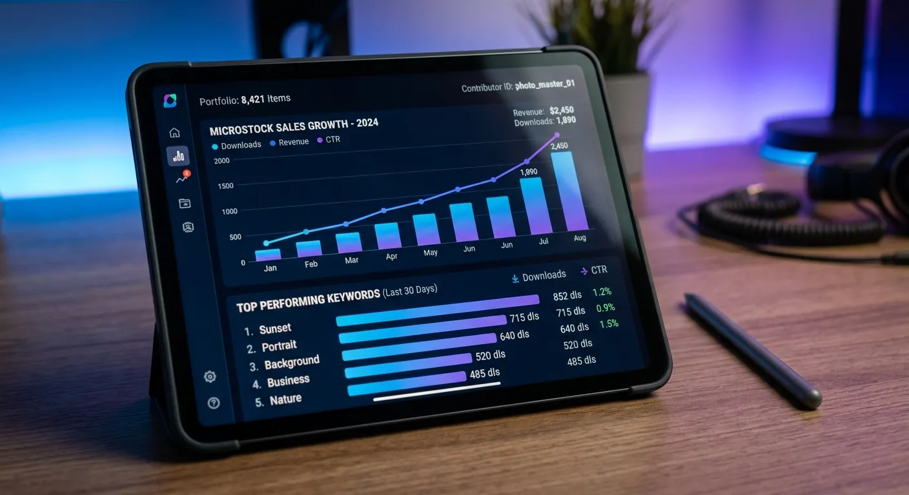

The microstock industry is more competitive today than ever before. Thousands of stunning images, videos, and audio tracks are uploaded daily to platforms like Adobe Stock and Shutterstock. Standing out in this massive sea of content requires more than just exceptional artistic talent. You need a guaranteed way to ensure your files are actually found by the buyers searching for them.

You need a sophisticated approach to data management to secure a massive competitive advantage. This is exactly where ai powered metadata for microlancers future proof strategies comes into play. By upgrading how you tag and title your creative assets, you can ensure your portfolio remains highly visible. Intelligent tagging takes the guesswork out of the upload process completely.

In this comprehensive guide, we will explore exactly how artificial intelligence is changing the stock media landscape. You will learn actionable techniques to save hours of tedious data entry while maximizing your passive income potential. Preparing your creative portfolio for the future starts with optimizing the unseen data attached to it.

The Evolution of Microstock Tagging
----------

The methods we use to prepare media for sale have changed drastically over the last decade. Understanding this evolution is key to realizing why modern automation is so vital for your success. What used to be a grueling manual task has now become a streamlined, highly intelligent process.

### From Manual Entry to Automation ###

In the early days of stock photography, contributors spent hours manually brainstorming keywords. You had to type out every single synonym, object, and concept by hand for every image. This tedious process drained creative energy and severely limited how many files you could upload in a single day.

Today, the landscape has completely shifted toward machine learning and intelligent software. Smart algorithms have permanently replaced the traditional spreadsheet methods of the past. As a modern contributor, embracing [AI microstock keyword tools](https://meita.ai/affiliate/landing) is no longer an optional luxury.

AI systems now analyze visual content instantly with incredible precision. They identify objects, moods, lighting, and overarching concepts that a human might completely overlook during a long editing session. This massive technological leap allows creators to process thousands of assets efficiently.

You can now generate comprehensive tags for a massive wedding shoot or corporate video batch in mere minutes. Automation successfully bridges the gap between artistic creation and commercial distribution. It allows you to spend less time typing and much more time creating.

### Why Search Algorithms Demand Better Data ###

Microstock agencies are constantly updating their search algorithms to improve the buyer experience. Platforms like Adobe Stock want to serve highly relevant results to their customers as quickly as possible. If your metadata is weak, inaccurate, or missing key synonyms, your stunning visuals will simply never surface.

Search engines actively penalize contributors who use spammy or irrelevant keyword stuffing techniques. Conversely, they actively reward files that feature highly accurate, descriptive, and conceptually rich tags. Buyers bounce quickly if they do not find what they need, so agencies strictly prioritize clean data.

Implementing ai powered metadata for microlancers future proof strategies ensures your files align perfectly with these strict algorithm updates. Machine learning tools understand exactly what search terms buyers are currently using in real-time. They effortlessly inject these high-performing keywords directly into your media files.

By giving the search algorithms exactly what they want, you drastically improve your organic ranking on the search results pages. Better rankings inevitably lead to higher download volumes and increased monthly earnings. It is a simple equation of providing the right data to get the right visibility.

How Smart Tagging Boosts Visibility
----------

Visibility is the ultimate currency in the microstock world. You could capture the most breathtaking sunset or record the clearest audio track, but without the right keywords, it remains invisible. Smart tagging bridges the crucial gap between your creative vision and the buyer's search bar.

### Catching the Right Buyer Intent ###

Buyers rarely search for literal descriptions alone when looking for commercial media. An advertising agency might search for "financial freedom" or "retirement planning" rather than simply "man holding money." Advanced AI tagging tools understand these abstract concepts and conceptual nuances seamlessly.

By generating these conceptual keywords, you tap into highly profitable corporate markets. Intelligent software excels at recognizing both the physical objects in the frame and the underlying emotional tones of your media. This dual approach dramatically increases your chances of landing a premium, high-paying sale.

Furthermore, AI tools can identify current commercial trends that you might not be aware of. They suggest keywords that align perfectly with modern marketing campaigns and advertising jargon. This ensures your images speak the exact language of the creative directors looking to purchase them.

### Reducing Agonizing Rejection Rates ###

Spammy, inaccurate, or completely irrelevant keywords are a leading cause of portfolio rejections across major agencies. Reviewers will quickly penalize contributors who try to game the system with unrelated popular tags. This bad practice ruins the buyer experience and can permanently damage your account standing.

AI generators completely eliminate this frustrating risk by analyzing your exact image pixels. They provide highly accurate, strictly relevant keywords that agency reviewers appreciate and approve quickly. Clean, precise metadata helps your submissions sail through the review process much faster.

When your files are approved faster, they hit the market faster. This accelerated time-to-market is crucial when uploading seasonal or trend-based content. A streamlined approval process means your revenue starts generating days or even weeks earlier.

### Multilingual Reach for Global Sales ###

The microstock market is a truly global economy with buyers scattered across the world. Customers from Germany, Japan, Brazil, and beyond are constantly searching for authentic, high-quality content. If your keywords are only optimized for localized English, you are leaving massive amounts of money on the table.

Utilizing ai powered metadata for microlancers future proof strategies inherently includes built-in localization awareness. Advanced platforms format your tags so that global search engines can translate and rank them accurately across borders. This expands your potential customer base exponentially.

You do not need to learn a dozen new languages to sell internationally. The AI does the heavy lifting, ensuring your descriptive metadata translates flawlessly into multiple search ecosystems. This global optimization is a hallmark of a truly resilient portfolio.

Leveraging Automation Tools Like Meita.ai
----------

Transitioning from manual tagging to automated workflows can feel slightly overwhelming at first glance. However, purpose-built platforms are designed specifically to make this digital transition completely effortless. You certainly do not need to be a technical genius to leverage machine learning for your art.

### Batch Processing Your Portfolios ###

The biggest and most frustrating bottleneck for any microlancer is processing large batches of files. After a long photo shoot, the absolute last thing you want to do is sit down and tag 500 images one by one. Automated batch processing tools change this tedious dynamic entirely.

With tools like [Meita.ai](https://meita.ai/affiliate), you can generate comprehensive metadata for your images, music, and videos in mere seconds. The software is designed to handle massive volumes of media without slowing down your workflow. You simply select your folder, and the artificial intelligence goes to work instantly.

This allows you to clear out your backlog of unedited, untagged photos. Many contributors have hard drives full of great content that never gets uploaded simply because the tagging process is too daunting. Batch automation turns that dead digital weight into active, revenue-generating assets.

### Context-Aware Keyword Generation ###

It is important to understand that not all AI tagging tools are created equal. Generic, free image recognition software often misses the highly specific needs of the stock media industry. Microstock platforms require a very precise blend of descriptive, technical, and commercial keywords to rank effectively.

Context-aware AI specifically looks at the complex relationship between subjects in your frame. It knows the crucial difference between a simple "dog in a park" and a commercial "pet therapy session outdoor." This elevated level of detail provides an incredible advantage over basic tagging generators.

Furthermore, specialized tools understand the hierarchy of importance. They know which keywords should be placed first to maximize search engine optimization. This intelligent structuring ensures that your most vital tags carry the most algorithmic weight.

### Security and Seamless Agency Integration ###

Once your perfect metadata is generated, it needs to get into your files effortlessly. Writing keywords into a separate Excel sheet and copying them manually is still a massive waste of valuable time. Your tools should write the data directly to the file's core architecture.

Modern generators embed the title, description, and keywords directly into your JPEGs, MP4s, or MP3s via EXIF or IPTC data. This means your files are instantly ready to upload to Shutterstock, Adobe Stock, Dreamstime, and more. You just drag and drop your final, fully-loaded files into the agency portals.

Additionally, [Meita.ai operates securely from your own computer](https://meita.ai/token). This localized processing means you maintain full ownership and control over your unreleased creative assets. You never have to worry about uploading sensitive client media to an unsecured cloud server just to get tags.

AI Tagging vs Manual Entry Comparison
----------

To truly understand the massive value of this technology, we need to look objectively at the hard data. Comparing traditional methods against modern automation reveals stark differences in daily efficiency. Relying on manual entry is actively holding your potential earnings back.

The table below highlights the dramatic operational differences between doing it yourself and letting software handle it. It becomes immediately clear why top-tier contributors rely heavily on automation.

|    Workflow Feature    |        Manual Metadata Tagging        |             AI Metadata Generation              |
|------------------------|---------------------------------------|-------------------------------------------------|
|  **Processing Speed**  |  2 to 5 minutes per individual file   |   Under 5 seconds per file (Instant Batching)   |
|    **Tag Accuracy**    |Highly prone to fatigue and human error|      High precision, pixel-based analysis       |
|  **Conceptual Depth**  |Requires deep, exhausting brainstorming|Automatically detects moods, themes, and concepts|
|    **Scalability**     |  Severely limited by your free time   |   Infinite scalability for massive portfolios   |
|**Software Integration**|   Requires tedious copy and pasting   |Writes directly to file EXIF/IPTC data naturally |
|    **Burnout Risk**    |Extremely high for active contributors |     Nearly zero, completely passive process     |

As the table clearly illustrates, the return on investment for metadata automation is immediate and profound. You reclaim countless hours that can be spent doing what actually generates revenue: capturing more content. Embracing ai powered metadata for microlancers future proof strategies is undoubtedly the ultimate productivity hack.

Expert Tips for Maximizing Portfolio Sales
----------

Technology alone will not instantly make you a top-tier microstock contributor overnight. You must intentionally combine powerful software with smart, proven business tactics. Here are actionable strategies to maximize your sales using modern tagging methods.

* **Prioritize the first 10 keywords:** Many stock agencies place the heaviest SEO weight on the first few tags of your file. Ensure your AI tool places the most vital, highly descriptive words at the absolute front of your list.
* **Combine literal and conceptual tags:** Always include what is physically in the image, followed immediately by what the image represents emotionally. An AI generator is excellent at providing this balanced mix automatically.
* **Regularly audit your bestsellers:** Look closely at your highest-selling media and carefully analyze their metadata structure. Use those valuable insights to guide your future photo shoots and adjust your tagging parameters.
* **Avoid over-tagging at all costs:** While many platforms allow up to 50 keywords, using 25 to 35 highly relevant tags is often much better. Quality always trumps quantity when avoiding painful search algorithm penalties.
* **Utilize titles effectively:** Your media title should read like a natural, descriptive sentence that captures the scene perfectly. Good AI generators will craft SEO-optimized titles perfectly alongside your keywords.
* **Focus on niche long-tail keywords:** Don't just target broad terms like "business." Use AI to generate highly specific long-tail phrases like "corporate team analyzing financial data on laptop."
* **Keep your media organized locally:** Use clear folder structures on your hard drive before running them through batch processors. This organization makes applying overarching metadata templates much easier and faster.

Implementing these expert practices alongside your automated workflow will create a massive snowball effect. Your files will rank significantly higher, sell much faster, and generate long-term residual income for years. This comprehensive, smart approach forms the very core of a highly successful stock media business.

Frequently Asked Questions about ai powered metadata for microlancers future proof strategies
----------

### What is AI-powered metadata for microstock? ###

AI-powered metadata uses machine learning algorithms to automatically generate titles, descriptions, and keywords for media files. It deeply analyzes the visual or audio content to provide highly accurate, SEO-optimized tags instantly. This intelligent automation saves contributors hours of manual data entry while vastly improving search visibility.

### Will AI tagging tools work for videos and audio? ###

Yes, premium automation tools are designed specifically to handle much more than just still photography. They can accurately analyze and generate complete metadata for 4K videos, vector illustrations, and music tracks. This incredible versatility makes them an absolute necessity for multimedia microlancers.

### Do stock agencies penalize AI-generated keywords? ###

No, stock agencies do not penalize AI-generated keywords as long as they are highly accurate and relevant to the file. Agencies actually prefer accurate AI tagging over spammy, inaccurate manual keyword stuffing. Clean, reliable metadata improves their search engine, which ultimately benefits both the agency and the buyer.

### How does AI tagging actually save time for microlancers? ###

AI tools process entire folders of images in mere seconds through advanced batch processing capabilities. Instead of typing keywords individually, the software writes the data directly to the file's EXIF or IPTC profile automatically. You can then immediately upload these fully prepared files to multiple agencies simultaneously.

### Can AI recognize abstract concepts in my images? ###

Absolutely. Modern machine learning models are heavily trained to recognize emotions, business concepts, and thematic moods effortlessly. For example, they will tag an image of a handshake with concepts like "partnership," "trust," and "corporate agreement."

### Is it difficult to learn how to use AI metadata generators? ###

Not at all. The very best platforms offer intuitive, drag-and-drop interfaces that require absolutely zero technical expertise. If you know how to organize folders on your computer, you can easily use these powerful automation tools.

### Why are my stock photos not selling despite having good keywords? ###

Consistent sales depend on a combination of visual quality, high market demand, and accurate tagging. If your photos aren't selling, you may be targeting oversaturated subjects without offering unique visual angles. Try using an AI tool to uncover niche, long-tail keywords you haven't previously considered.

### What is the ideal number of keywords for an Adobe Stock upload? ###

While Adobe Stock allows up to 50 keywords per asset, the sweet spot is generally between 25 and 35 highly relevant tags. Focus strictly on precise accuracy rather than trying to blindly hit the maximum limit. Irrelevant tags can actively harm your file's ranking and lead to frustrating rejections.

### Does software like Meita.ai work locally on my computer? ###

Yes, premium solutions operate directly from your own computer, providing a lightning-fast and highly secure workflow. This localized processing means you maintain full control over your unreleased creative assets at all times. It seamlessly bridges the gap between your local hard drive and global microstock agency portals.

The microstock industry is moving at lightning speed, and those who refuse to adapt risk being left far behind. Relying on manual data entry is no longer a sustainable practice if you truly want to compete with high-volume, professional contributors. By actively embracing ai powered metadata for microlancers future proof strategies, you are investing directly in your business's longevity. You will dramatically cut down on administrative busywork, reduce frustrating agency rejections, and ensure your best content actually reaches the global buyers who need it most.

The future of creative freelancing ultimately belongs to those who work smarter, not harder. Upgrading your tedious workflow with intelligent tagging is simply the easiest way to scale your passive income portfolio today. If you are ready to stop wasting hours on spreadsheets and start maximizing your sales, it is time to upgrade your toolkit. Generate perfect, agency-ready metadata for your images, music, and videos in seconds, and take your microstock career to the absolute next level.
