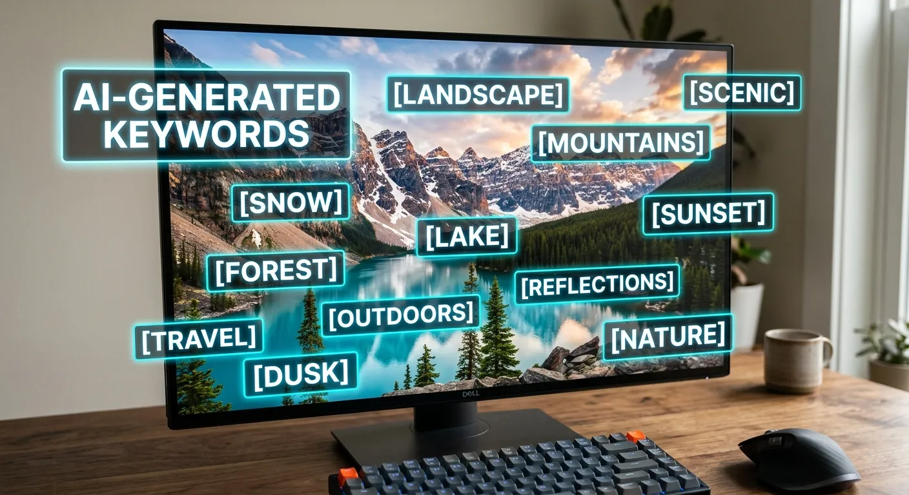
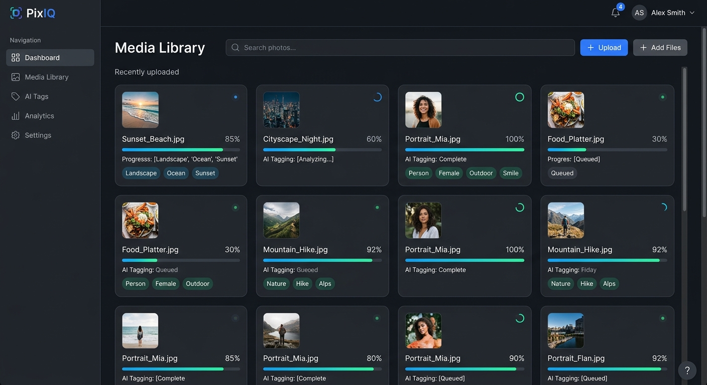

Have you ever stared at a folder of a thousand raw images and dreaded the upload process? Writing titles and tags by hand is undoubtedly the most tedious part of being a microstock contributor. If you are searching for a comprehensive beginners guide automate captioning for photo libraries, you have finally come to the right place.

Photographers lose countless hours typing out descriptions instead of shooting new material behind the lens. This manual data entry creates a massive bottleneck for creatives trying to scale their Adobe Stock, Getty, or Shutterstock portfolios. You absolutely need a streamlined workflow to get your digital assets online faster and more efficiently.

Fortunately, artificial intelligence has completely revolutionized how we handle file metadata. By utilizing advanced metadata generator platforms like meita.ai, you can instantly generate highly accurate titles and tags for hundreds of images at once. Let us explore exactly how you can reclaim your valuable time, optimize your workflow, and significantly boost your stock photo sales.

Why Photographers Need AI Metadata Generation
----------

The stock photography industry is highly competitive and relies heavily on search engine optimization. Without proper metadata, even the most breathtaking photograph will remain completely invisible to potential buyers. Understanding the mechanics of image discovery is your first step toward long-term profitability.

When buyers search for specific imagery, they rely on exact keywords and descriptive phrases. If your file lacks these crucial text markers, the agency algorithms will simply bypass your work. This is exactly why automating your metadata process is no longer a luxury, but an absolute necessity for survival.

### The Hidden Cost of Manual Tagging ###

Manual tagging drains your creative energy and steals hours from your actual work week. Spending five minutes brainstorming keywords for a single image quickly adds up when you have a batch of five hundred photos. This repetitive task inevitably leads to decision fatigue and poor keyword choices.

When fatigue sets in, contributors often resort to copying and pasting generic tags across vastly different images. This practice actively harms your stock portfolio ranking because irrelevant keywords trigger algorithm penalties. Automated systems completely eliminate this human error by analyzing each individual photo objectively.

Furthermore, your time has a direct financial value that you must calculate. The hours spent typing captions could be spent capturing new concepts, editing existing sets, or marketing your services. Leveraging smart tools like meita.ai allows you to redirect that lost time back into income-generating activities.

### Boosting Search Visibility on Stock Agencies ###

Stock photo algorithms prioritize images that possess highly relevant, descriptive, and comprehensive metadata. A simple title like "dog in park" will never compete with "golden retriever running through autumn leaves at sunset." The more precise your text data, the higher your image will rank in buyer search results.

AI tools excel at identifying niche details that a human might easily overlook during a rushed tagging session. They can spot background elements, emotional context, and specific color palettes that buyers actively search for. Including these secondary elements drastically increases your chances of being discovered.

Meita.ai specifically trains its artificial intelligence on the nuances of microstock photography algorithms. This means the generated captions are engineered to match exactly what buyers are typing into search bars. Consequently, your portfolio gains significantly more impressions, leading directly to higher royalty payouts.

### Scaling Your Microstock Portfolio ###

Success in microstock photography is largely a numbers game requiring consistent, high-volume uploads. If you want to earn a sustainable full-time income, you need thousands of active assets in your digital portfolio. Manual metadata entry makes reaching these volume milestones incredibly difficult and slow.

By automating your captioning, you remove the primary barrier to massive portfolio expansion. You can easily shoot a wedding or a corporate event, edit the batch, and have the entire library tagged in minutes. This rapid turnaround time keeps your portfolio fresh and constantly growing.

As your library expands, your passive income potential scales right alongside it. A reliable beginners guide automate captioning for photo libraries always emphasizes that workflow speed is your biggest competitive advantage. Those who publish faster and smarter will ultimately dominate the top search pages.

How AI Image Recognition Transforms Workflows
----------

The technology behind modern metadata generation might seem like pure magic to a beginner. However, it relies on highly sophisticated image recognition models trained on billions of visual data points. Understanding this technology helps you leverage it more effectively for your microstock business.

These advanced systems "see" your photos by breaking them down into identifiable patterns, objects, and concepts. They cross-reference these patterns with vast databases to understand exactly what the image represents. This process happens in mere milliseconds, fundamentally changing how digital asset management operates.

### Understanding Computer Vision ###

Computer vision is a field of artificial intelligence that trains computers to interpret and understand the visual world. Using deep learning models, the software analyzes pixels to identify shapes, faces, lighting conditions, and textures. It is the exact same technology that powers self-driving cars and facial recognition systems.

When applied to stock photography, computer vision evaluates the literal subject matter and the overall atmosphere. It knows the difference between a "sad" rainy day and a "cozy" rainy day based on color temperature and subject posture. This level of emotional intelligence ensures your metadata resonates with human buyers.

The accuracy of these systems has skyrocketed over the past few years. Early versions struggled with complex scenes, but modern platforms like meita.ai can effortlessly decipher chaotic, multi-subject photographs. They provide a level of detail that human taggers would find exhausting to replicate manually.

### Extracting Accurate Keywords Instantly ###

Keywords are the primary currency of microstock agency search engines. A well-optimized image needs anywhere from thirty to fifty highly relevant tags to perform optimally in search results. Generating this list manually requires a thesaurus, competitor research, and a lot of patience.

Automated software extracts these keywords instantly by categorizing the image across multiple dimensions. It generates literal terms (apple, fruit, red), conceptual terms (healthy, diet, fresh), and technical terms (macro, studio lighting, isolated). This multi-layered approach ensures you capture every possible search intent.

Furthermore, meita.ai automatically filters out forbidden words, trademarked terms, and irrelevant spam tags. This built-in safety net prevents your images from being rejected by strict agency reviewers. You get a perfect, ready-to-use keyword list that complies with all major stock platform guidelines.

### Crafting Natural Language Titles ###

While keywords help the algorithm find your image, the title is what convinces a human buyer to click. A great title reads naturally, describes the core subject accurately, and includes the most important primary keywords. Writing these sentences by hand for thousands of files is incredibly tedious.

AI captioning tools analyze the generated keywords and weave them into grammatically correct, highly descriptive sentences. Instead of a robotic string of words, you get a polished title like "Young professional woman working remotely from a sunlit coffee shop." This natural phrasing builds immediate trust with potential buyers.

These systems also understand the specific formatting required by different microstock agencies. Some platforms prefer short, punchy titles, while others reward longer, highly descriptive sentences. Meita.ai adapts its output to ensure your titles are perfectly tailored for maximum conversion rates.

Key Features to Look for in Tagging Software
----------

Not all metadata generation tools are created equal in the rapidly expanding AI marketplace. Some are designed for casual smartphone users, while others are built strictly for enterprise-level digital asset managers. As a stock contributor, you need a solution specifically tailored to the microstock ecosystem.

When evaluating different platforms, you must look beyond basic image recognition capabilities. The best tools offer robust workflow integrations, batch processing power, and specific export formats. Here are the essential features your automated captioning software absolutely must possess.

### Batch Processing Capabilities ###

Uploading and analyzing one photo at a time defeats the entire purpose of automation. Your chosen software must be able to handle massive folders of images simultaneously without crashing or lagging. Batch processing is the cornerstone of any efficient microstock workflow.

With meita.ai, you can drag and drop entire shoots into the platform and let the system run in the background. The AI analyzes hundreds of files simultaneously, generating unique metadata for every single asset. This feature alone will transform your weekly uploading routine from a multi-day chore into a ten-minute task.

Additionally, strong batch processing tools allow you to apply global rules to specific groups of images. If you shot an entire series in Paris, you can ensure the location data is appended to every generated caption. This hybrid approach of AI analysis and user-defined rules provides the ultimate workflow flexibility.

### Multi-Language Support for Global Reach ###

The microstock market is a global industry with buyers searching in dozens of different languages. While English is the primary language for most agencies, localizing your metadata can open up entirely new revenue streams. However, relying on basic translation tools often results in awkward, inaccurate phrasing.

Premium AI tagging platforms utilize native-level language models to generate captions directly in multiple languages. They understand cultural idioms, local search behaviors, and regional keyword variations. This ensures your images are highly discoverable in European, Asian, and South American markets.

By using meita.ai, you can easily export your metadata in the exact language required by regional stock agencies. This is particularly useful if you are contributing to niche platforms that cater to specific geographic demographics. Expanding your linguistic reach is a proven strategy for maximizing your passive income.

### Seamless Exporting and CSV Integration ###

Generating perfect metadata is completely useless if you cannot easily attach it to your actual image files. A robust software solution must offer multiple ways to export and embed the generated data. This is often where basic AI tools fail completely.

The industry standard for bulk metadata uploading is the CSV (Comma Separated Values) file format. Your tagging software must be able to generate clean, properly formatted CSV sheets that map perfectly to Adobe Stock or Shutterstock requirements. This allows you to upload the data spreadsheet alongside your images with zero friction.

Furthermore, meita.ai excels at allowing users to write EXIF/IPTC data directly into the image files themselves. When you embed the metadata into the JPEG file, it travels with the image wherever it goes. Any stock agency will automatically read the embedded titles and tags the moment you upload the file.

Step-by-Step Workflow for Faster Uploads
----------

Implementing a new software tool into your daily routine can sometimes feel overwhelming at first. However, following a structured, proven methodology ensures you get the best possible results with minimal friction. This specific workflow is designed to maximize your efficiency.

If you are applying this beginners guide automate captioning for photo libraries to your business, consistency is key. Set aside dedicated time for shooting, dedicated time for editing, and dedicated time for metadata generation. Let us break down the exact steps to automate your upload process.

### Preparing Your Images for Processing ###

Before introducing your photos to the AI, they must be fully edited, color-corrected, and exported to their final format. AI algorithms analyze exactly what they see; if your image is dark and unedited, the resulting keywords might reflect poor lighting. Always feed the system your absolute best, finished work.

Next, organize your exported JPEGs into logical folders based on the shoot or overarching concept. Grouping similar images together helps you review the generated metadata much faster later on. Clear organization is the foundation of any successful digital asset management strategy.

Finally, ensure your file names are clean and sequential before uploading them to meita.ai. Avoid messy default camera names like "DSC\_0987.jpg" if possible. A neat file structure prevents any mix-ups when matching your exported CSV files back to your original images during the agency upload phase.

### Running the AI Analysis ###

Once your folders are prepped, log into your meita.ai dashboard and initiate a new batch project. Simply drag and drop your organized image folders directly into the browser window. The software will immediately begin securely uploading your files to the processing server.

As the images upload, the AI engine immediately gets to work analyzing the visual data. You can watch in real-time as titles, descriptions, and dozens of optimized keywords populate next to each thumbnail. Depending on the size of your batch, this entire process usually takes just a few minutes.

During this phase, the AI is referencing current microstock trends and search data to formulate its text. It is actively prioritizing commercial keywords over generic terms to ensure maximum buyer relevance. You can comfortably step away and grab a coffee while the heavy lifting is done for you.

### Reviewing and Refining the Results ###

While artificial intelligence is incredibly powerful, it is still highly recommended to perform a quick human review. Skim through the generated gallery to ensure the AI correctly interpreted the core concept of your images. A quick visual check guarantees the highest possible quality standard.

Occasionally, you might want to add a highly specific keyword that the AI couldn't possibly know. For example, if the model in the photo is your brother, you might add a specific model release identifier tag. Meita.ai allows you to easily edit, add, or delete individual keywords directly within the dashboard.

Once you are completely satisfied with the generated text, simply hit the export button. You can choose to download a perfectly formatted CSV file or have the metadata embedded directly into your downloaded image files. You are now fully ready to upload your batch to your favorite stock agencies.

Comparing Traditional vs. AI Captioning Methods
----------

To truly understand the value of this technology, we must compare it directly to the old way of doing things. Traditional keywording requires immense manual labor, specialized knowledge of SEO, and a massive time commitment. It is a slow, tedious process that burns out many aspiring contributors.

When you look closely at the data, the advantages of an automated platform like meita.ai become undeniable. From processing speed to keyword accuracy, the AI approach outperforms human data entry in almost every single metric. Below is a detailed breakdown of how the two methods stack up against each other.

|   Feature / Metric    |         Traditional Manual Tagging         |           Meita.ai Automated Tagging            |
|-----------------------|--------------------------------------------|-------------------------------------------------|
| **Processing Speed**  |          3 to 5 minutes per image          |            Under 5 seconds per image            |
|  **Keyword Volume**   |  Usually 15-20 (limited by human fatigue)  |     Consistently 40-50 highly relevant tags     |
| **SEO Optimization**  |    Relies on user guessing buyer intent    |Data-driven selection based on agency algorithms |
|    **Consistency**    |Low (varies based on mood and energy levels)|     100% consistent across massive batches      |
|   **Cost vs Time**    |  High hidden cost of lost creative hours   | Extremely high ROI, frees up time for shooting  |
|**Spam Tag Prevention**|      Prone to user copy/paste errors       |Automated filtering of irrelevant/forbidden terms|

Pro Tips for Maximizing Your Metadata Strategy
----------

Even with the most advanced AI handling your heavy lifting, applying a smart overall strategy will push your portfolio further. Automation is a powerful vehicle, but you still need to steer it in the right direction. Combining AI tools with stock market knowledge is the ultimate recipe for success.

To ensure you get the absolute most out of your meita.ai subscription, keep these advanced tactics in mind. These strategies separate the amateur contributors from the top-tier professionals who earn passive income year-round.

* **Embrace Concept Keywords:** Don't just rely on literal objects. Ensure your generated lists include conceptual tags like "leadership," "teamwork," or "solitude" depending on the image mood. AI is great at this, but always verify these concepts are present.
* **Keep Titles Descriptive:** A title is not a keyword dump. Ensure your title reads like a natural, descriptive sentence (e.g., "Macro shot of a bee pollinating a vibrant yellow sunflower in spring").
* **Utilize CSV Workflows:** Learn how to properly use CSV files. Exporting your meita.ai data to a CSV allows you to upload metadata for 500 images to Adobe Stock in a single click.
* **Double-Check Trademarks:** While meita.ai filters heavily, always do a quick visual check to ensure no logos or trademarked brand names sneaked into your keywords, which can cause agency rejection.
* **Batch by Theme:** Process your images in thematic batches. It makes reviewing the AI output much faster because your brain is already focused on that specific visual concept.
* **Audit Old Portfolios:** Don't just use automation for new shoots. Run your older, poorly-performing stock photos through meita.ai to refresh their metadata and revive their sales potential.

Frequently Asked Questions about beginners guide automate captioning for photo libraries
----------

Navigating the world of metadata automation naturally brings up a few common questions for newcomers. Below, we have compiled the most frequent inquiries from photographers looking to streamline their keywording process.

### What exactly is image metadata? ###

Metadata is the hidden text information attached to your digital image files, including titles, descriptions, and keywords. Microstock agencies use this data to understand what your photo depicts. It is the primary factor that determines if your image appears in buyer search results.

### Will AI tags get my stock photos rejected? ###

No, provided you use a high-quality platform like meita.ai designed specifically for microstock standards. The AI is trained to provide highly relevant tags and filter out spam. In fact, accurate AI keywording often reduces rejection rates caused by irrelevant human tagging.

### Do I still need to write titles myself? ###

You no longer have to write them manually. Advanced AI tools analyze the visual contents and automatically generate grammatically correct, descriptive sentences. You simply review the generated title and approve it for your portfolio.

### How does meita.ai connect to Adobe Stock? ###

Meita.ai allows you to export your perfectly generated metadata as a CSV file or embed it directly into the image EXIF data. You then simply upload your images or CSV directly through the Adobe Stock contributor portal. The agency automatically reads and applies your generated data instantly.

### Can automation handle complex conceptual photos? ###

Yes, modern computer vision excels at understanding mood, tone, and conceptual themes. It easily identifies abstract concepts like "business success," "depression," or "innovation" based on lighting and composition. This ensures your conceptual imagery reaches the right commercial buyers.

### Is AI keywording considered SEO? ###

Absolutely; image keywording is the purest form of Search Engine Optimization for microstock platforms. You are optimizing your asset to rank higher in a specific search engine (like Shutterstock's search bar). AI tools analyze algorithms to provide the exact keywords buyers are typing.

### Does this work for vector graphics and illustrations? ###

Yes, sophisticated AI metadata generators can analyze digital illustrations, 3D renders, and vector graphics just as effectively as photographs. The system identifies the design elements, artistic styles, and subject matter to generate highly relevant tags for digital artists.

### Is this beginners guide automate captioning for photo libraries suitable for hobbyists? ###

Definitely; whether you upload ten photos a month or ten thousand, saving time is universally valuable. Hobbyists often quit microstock because manual tagging is too frustrating and time-consuming. Automation removes this barrier, making it fun and easy to build a passive income stream.

Conclusion
----------

Mastering your digital workflow is the single most impactful step you can take to grow your stock photography business. As we have covered in this beginners guide automate captioning for photo libraries, relying on manual data entry is a fast track to creative burnout. By embracing intelligent automation, you instantly remove the most tedious bottleneck from your daily routine, allowing you to focus entirely on capturing stunning visual content.

If you are ready to stop wasting hours on manual data entry, it is time to upgrade your workflow. Start using **meita.ai** today to experience the fastest, most accurate metadata generator built specifically for microstock contributors. Reclaim your creative time, boost your search rankings, and watch your portfolio sales grow with the power of artificial intelligence.
