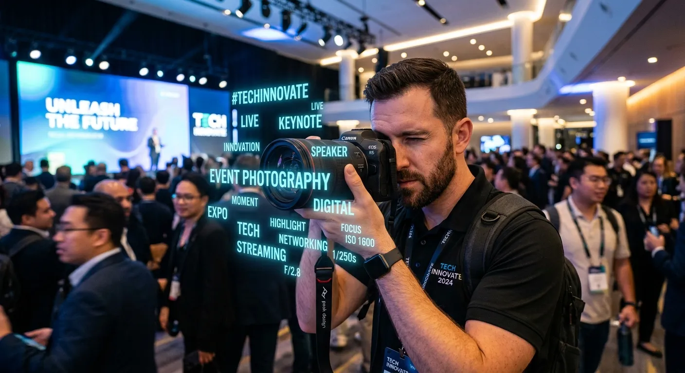

As an event photographer, capturing the perfect shot is only half the battle. The real challenge begins when you return to your desk and face thousands of unorganized images waiting for delivery and microstock distribution. When looking to boost event photography roi ai tagging for faster sales becomes an absolute necessity in today's competitive digital landscape. Spending countless hours manually typing keywords into Lightroom or Adobe Bridge drains your energy and destroys your hourly rate.

Fortunately, the landscape of microstock and event photography is rapidly changing. By leveraging advanced artificial intelligence like meita.ai, you can automate your metadata workflow entirely. This technology eliminates the tedious data entry that slows down your post-production process. Photographers can now focus on what they do best: shooting incredible events and expanding their creative portfolios.

In this comprehensive guide, we will explore exactly how intelligent tagging transforms your post-production workflow. You will discover the hidden costs of manual data entry and learn how automated keywording increases your image discoverability. By the end of this article, you will know exactly how to leverage platforms like meita.ai to maximize your earnings across major stock photography websites.

Why Traditional Photo Tagging Kills Event Profit Margins
----------

### The Hidden Costs of Manual Data Entry ###

Every minute spent typing keywords into an image file is a minute you are not actively making money. Traditional metadata entry requires a photographer to analyze a photo, brainstorm relevant terms, and format them for specific microstock platforms. This manual process is incredibly time-consuming and prone to human error. When you multiply this effort across hundreds of event photos, the time investment becomes staggering.

Consider the actual hourly rate of your photography business. If you charge premium rates for shooting an event, spending ten hours on manual metadata entry drastically reduces your overall profit margin. Your return on investment plummets when your highly specialized skills are traded for basic data entry tasks. This is a primary reason many talented photographers struggle to maintain a profitable microstock portfolio.

Furthermore, manual data entry creates a severe bottleneck in your delivery pipeline. Clients expect rapid turnarounds for their event galleries. When your workflow is clogged by manual keywording, your delivery times suffer, leading to decreased client satisfaction. Automating this step is the fastest way to unblock your pipeline.

### How Fatigue Affects Keyword Quality ###

Metadata generation requires a high level of sustained mental focus. When you are staring at your five-hundredth photo of a corporate conference, your brain naturally begins to take shortcuts. Fatigue sets in, and the quality of your descriptive keywords drops significantly. You might start using repetitive, broad terms instead of the highly specific tags that actually drive sales.

Poor quality keywords directly translate to lost revenue on platforms like Adobe Stock. Search algorithms rely on rich, accurate metadata to connect buyers with your images. If you are too tired to include conceptual keywords like "networking," "leadership," or "collaboration," your photos will simply vanish in the search results. A tired photographer is simply not an effective metadata writer.

Using a smart platform like meita.ai completely removes human fatigue from the equation. The AI applies the same level of granular attention to your thousandth photo as it does to your first. This ensures peak metadata quality across your entire portfolio, keeping your images highly visible to potential buyers.

### The Microstock Opportunity Cost ###

Opportunity cost is the hidden killer of photography businesses. The hours spent manually keywording images could be spent marketing your services to new clients. Alternatively, you could be out shooting new events to expand your microstock portfolio. To successfully boost event photography roi ai tagging for faster sales must become a core part of your daily routine to reclaim this lost time.

Many photographers abandon the idea of selling their event outtakes on microstock sites simply because the upload process is too tedious. They leave thousands of dollars of potential passive income sitting idle on their hard drives. The barrier to entry isn't the photography itself; it is the daunting mountain of required metadata.

By integrating automated metadata generation into your post-processing, you eliminate this barrier. You can instantly prepare vast archives of event photos for commercial licensing. This turns your forgotten hard drives into active revenue streams without adding hours of manual labor to your week.

How AI Metadata Generation Transforms Your Workflow
----------

### Lightning-Fast Image Recognition ###

Modern artificial intelligence processes visual data at speeds that humans simply cannot match. When you upload an image to meita.ai, the system instantly analyzes every pixel. It identifies specific objects, environmental settings, and even the demographic details of the people in the frame. This comprehensive analysis happens in mere seconds.

This level of speed allows event photographers to batch-process massive galleries effortlessly. Instead of agonizing over a single image of a wedding reception or a corporate keynote, you can process entire folders simultaneously. The AI rapidly generates a comprehensive list of accurate, highly relevant keywords for every single file.

Speed does not come at the expense of accuracy, either. Advanced visual recognition models are trained on millions of images, giving them an expansive visual vocabulary. They catch small details in the background that a rushing photographer might easily overlook, adding valuable long-tail keywords to your metadata.

### Generating Highly Relevant Keywords ###

Microstock success relies heavily on conceptual keywording, not just literal descriptions. While a human might tag a photo with "man, suit, shaking hands," an AI understands the broader context. Meita.ai excels at generating conceptual tags like "agreement," "partnership," "b2b," and "corporate success."

These conceptual keywords are exactly what marketing agencies and graphic designers search for. Buyers rarely search for literal descriptions; they search for the feeling or business concept they need to illustrate. By providing these high-value tags automatically, AI tools bridge the gap between your photograph and the buyer's intent.

Furthermore, intelligent systems know how to prioritize keywords based on relevance. Stock photography algorithms favor images where the most accurate tags appear first. Automated systems format your metadata to perfectly align with these algorithmic preferences, boosting your search rankings instantly.

### Instant Title and Description Creation ###

Drafting unique titles and descriptions for hundreds of similar event photos is a grueling task. However, stock agencies require this information to index your work properly. Meita.ai removes this burden by automatically writing compelling, SEO-friendly titles and descriptions based on the visual contents of the image.

These generated descriptions are specifically formatted to perform well on platforms like Shutterstock and Adobe Stock. They utilize natural language processing to create readable sentences that also satisfy search engine spiders. This dual optimization is difficult to achieve manually but effortless with AI.

By automating the entire metadata package—titles, descriptions, and keywords—you create a frictionless upload process. Implementing systems that boost event photography roi ai tagging for faster sales becomes a natural byproduct of your increased efficiency. You can move from the editing room to the digital storefront in record time.

Maximizing Microstock Earnings With Smart Keywording
----------

### The Algorithm Demands Accuracy ###

Search engines on major microstock platforms are becoming increasingly sophisticated. They heavily penalize keyword spamming, which is the practice of adding irrelevant popular tags to an image to gain views. If you tag an indoor conference photo with "outdoor nature," the algorithm will flag your account and bury your portfolio.

Accuracy is the primary currency of microstock SEO. AI tagging platforms are trained to generate highly specific, truthful representations of your images. By analyzing the actual content of the frame, tools like meita.ai ensure that every single keyword applied is justified and relevant.

This strict adherence to accuracy improves your conversion rate. When a buyer searches for a specific term and finds your perfectly matched image, they are highly likely to purchase a license. High conversion rates signal to the algorithm that your content is valuable, pushing your entire portfolio higher in future search results.

### Tailoring Tags for Specific Platforms ###

Not all stock photography websites operate under the same rules. Some platforms allow up to 50 keywords, while others cap it at lower numbers. Additionally, the way titles and descriptions are indexed varies wildly from site to site. Managing these differing requirements manually is an administrative nightmare for contributors.

Meita.ai acts as a specialized assistant that understands these platform-specific nuances. The metadata generated is optimized to meet the strict submission guidelines of the industry's largest agencies. You no longer have to worry about rejected batches due to formatting errors or keyword limit violations.

The platform also allows you to export your newly generated metadata in clean, platform-ready CSV files. This means you can use bulk-uploading tools seamlessly. You simply drop your images into your FTP client, attach the CSV, and watch your portfolio grow effortlessly.

### Scaling Your Portfolio Without Scaling Your Time ###

The secret to substantial microstock income is volume. A larger portfolio naturally generates more regular passive income. However, scaling a portfolio manually requires a linear increase in the time spent tagging. This makes massive growth physically impossible for a solo photographer.

Automation breaks this linear relationship. With AI metadata generation, processing 1,000 images takes nearly the same amount of human effort as processing 10 images. You simply initiate the batch process and let the software do the heavy lifting while you focus on other tasks.

If your goal is to dramatically boost event photography roi ai tagging for faster sales allows you to submit ten times the volume of images. More approved images lead to more daily sales, transforming a sporadic side hustle into a reliable, automated income stream.

Comparing Manual vs Automated Image Tagging Methods
----------

To truly understand the value of AI metadata generation, we must look at the hard data. The transition from traditional keywording to AI-assisted processing represents a monumental shift in business operations. Below is a detailed breakdown of how these two methodologies compare across critical workflow metrics.

As the data shows, if your goal is to successfully boost event photography roi ai tagging for faster sales clearly outperforms manual data entry on every single front. The return on investment for adopting an AI tool pays for itself within the first bulk upload session.

|       Workflow Metric       |             Manual Keywording              |            Meita.ai Automated Tagging             |
|-----------------------------|--------------------------------------------|---------------------------------------------------|
|**Processing Time per Image**|               3 to 5 minutes               |                  Under 5 seconds                  |
|    **Keyword Accuracy**     |  Decreases over time due to human fatigue  |      Consistently high, pixel-level accuracy      |
|     **Conceptual Tags**     |       Requires intense brainstorming       |  Automatically generated based on visual context  |
|       **Scalability**       |Very low; limited by available working hours|Infinite; batch processing handles thousands easily|
|    **Formatting Errors**    |High risk of spelling mistakes and spamming |  Zero risk; formatted to platform specifications  |

Expert Tips to Streamline Your Post-Processing Pipeline
----------

Adopting new technology is only the first step. To truly maximize your efficiency, you need to build a structured workflow around your AI tools. Follow these exact steps to boost event photography roi ai tagging for faster sales and better client delivery times.

* **Cull Ruthlessly Before Tagging:** Never waste time generating metadata for blurry or poorly exposed photos. Use an initial culling software to select only your absolute best, commercially viable shots before uploading them to meita.ai.
* **Batch Process Similar Scenes:** Group your event photos by setting or lighting before running them through the AI. Processing all the outdoor networking shots together ensures consistent, highly targeted conceptual keywords across that specific batch.
* **Review and Refine AI Suggestions:** While AI is incredibly accurate, you should still perform a quick spot-check. Review the generated titles and add any highly specific event names or locations that the AI wouldn't naturally know (e.g., "TechCrunch Disrupt 2024").
* **Utilize CSV Exports for Microstock:** Do not copy and paste keywords individually. Use meita.ai to export a master CSV file of all your metadata. You can upload this single file alongside your images to stock agencies to populate everything instantly.
* **Embed Metadata Directly:** If you are delivering images to private corporate clients, use tools that embed the AI-generated keywords directly into the EXIF/IPTC data of the JPEG. This makes the files highly searchable for your clients on their internal servers.
* **Build a Consistent Routine:** Schedule dedicated time for microstock uploads. Shoot an event on the weekend, cull on Monday, run through meita.ai on Tuesday, and have your images generating passive income by Wednesday.

Frequently Asked Questions about boost event photography roi ai tagging for faster sales
----------

### What is AI photo tagging? ###

AI photo tagging uses artificial intelligence to visually analyze an image and automatically generate relevant keywords, titles, and descriptions. It replaces the manual data entry process required for stock photography uploads. Tools like meita.ai make this process nearly instantaneous.

### How does metadata affect my microstock sales? ###

Metadata is the only way search algorithms know what your photo contains. Accurate, rich keywords and well-written descriptions push your images to the top of buyer search results. Without excellent metadata, even the greatest photos will never sell.

### Can AI recognize specific event contexts? ###

Yes, advanced AI can differentiate between a formal corporate presentation and a casual networking mixer. It analyzes clothing, lighting, background elements, and body language to generate contextually accurate tags. This provides valuable conceptual keywords for buyers.

### Will AI-generated keywords get my photos rejected? ###

Not if you use a high-quality platform designed for microstock contributors. Tools like meita.ai are programmed to avoid keyword spamming and adhere to agency guidelines. They provide highly relevant tags that improve your acceptance rates.

### How much time can I save using Meita.ai? ###

Most photographers save hours per batch. Manually keywording 100 images can take over two hours of tedious typing. With AI bulk processing, those same 100 images can be fully metadata-optimized in just a few minutes.

### Does automated tagging work for corporate events? ###

Absolutely. Corporate event photography is one of the most lucrative microstock categories. AI excels at identifying business concepts like "leadership," "teamwork," and "innovation," which are highly sought after by commercial buyers.

### Do I need to learn complex software to use AI metadata tools? ###

No, modern platforms are incredibly user-friendly. Most feature simple drag-and-drop interfaces where you upload your images and wait seconds for the results. You can easily export the data without needing any coding or advanced technical skills.

### How do accurate titles improve my image discoverability? ###

Titles act as the primary anchor text for search engine optimization on stock sites. An AI-generated title is structured to include primary subjects and actions naturally. This signals high relevance to the algorithm, boosting your image visibility.

In conclusion, the modern photography industry moves too quickly to rely on outdated, manual administrative tasks. By embracing automated metadata generation, you reclaim countless hours previously lost to staring at spreadsheets and typing repetitive tags. You empower yourself to focus purely on the creative aspects of your business, knowing that your digital assets are perfectly optimized for discoverability behind the scenes. Ultimately, deciding to boost event photography roi ai tagging for faster sales is the smartest move a modern professional can make.

If you are ready to transform your post-production workflow and scale your microstock income, it is time to upgrade your toolkit. Stop letting valuable images sit un-monetized on your hard drives because the keywording process is too daunting. Visit meita.ai today to automate your metadata generation, drastically cut down your processing time, and start turning your event photography archives into profitable, searchable assets.
