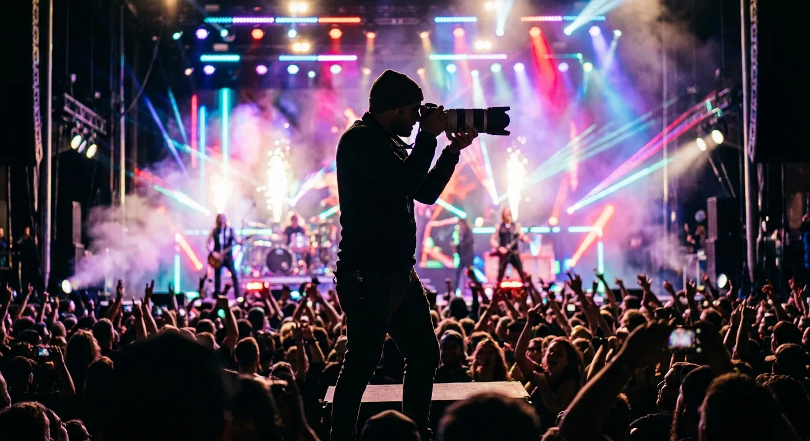
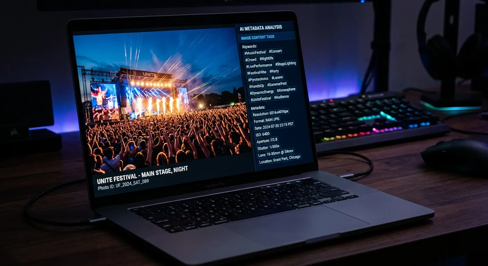
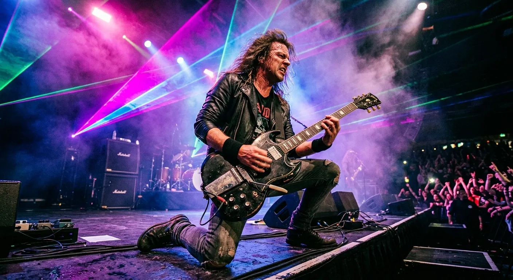

Capturing the electric energy of a live music performance is only half the battle for modern professional photographers. If your breathtaking shots are buried online without the right metadata, you are leaving serious money on the table. Knowing exactly how to boost event roi ai tagging for concert photos is the ultimate game-changer for digital creators today. It bridges the massive gap between a brilliant capture and a highly lucrative digital sale.

Photographers often spend hours sorting, editing, and manually typing keywords for their extensive stock portfolios. This incredibly tedious process eats directly into your profit margins and severely delays your time to market. By the time your amazing images finally go live on stock platforms, the viral buzz of the event might have already faded away. Buyers are always looking for fresh content, making speed an absolute necessity in this industry.

Fortunately, artificial intelligence offers a powerful, streamlined solution to this age-old workflow problem. In this comprehensive guide, we will explore how automated metadata generation can instantly transform your media uploading process. You will learn highly actionable strategies to maximize your earning potential on microstock platforms using cutting-edge tools.

Maximizing Music Festival Profitability with Smart Metadata
----------

### The Hidden Value of Live Music Photography ###

Live events generate a massive volume of stunning visual content every single weekend across the globe. From intimate local club gigs to massive outdoor summer festivals, the demand for authentic concert imagery is constantly growing. Stock agencies are incredibly hungry for dynamic shots of passionate performers, ecstatic crowds, and dazzling stage productions.

However, capturing a beautifully composed image does not guarantee it will actually sell on platforms like Adobe Stock. The secret lies in how easily commercial buyers can find your specific photo among millions of competing assets. This is exactly where you must boost event roi ai tagging for concert photos to stand out. Superior search visibility is the lifeblood of any successful stock photography business.

Proper keywords perfectly connect your visual art with the graphic designers, promoters, and marketers who desperately need it. When your metadata accurately reflects the mood, lighting, and subjects, your sales potential skyrockets overnight. Buyers simply cannot purchase what they cannot find.

### Speed to Market Drives Photo Sales ###

In the fast-paced world of digital media, timing is absolutely everything for a media contributor. News outlets, music blogs, and promotional agencies look for high-quality images immediately after a major event concludes. If you delay your portfolio uploads, you risk entirely missing out on the initial wave of editorial demand.

Manually keywording hundreds of photos can delay your portfolio updates by days or even agonizing weeks. Automated solutions drastically reduce this friction, allowing you to publish massive galleries almost overnight. Faster uploads directly correlate to higher search visibility and increased initial download rates from eager buyers.

Being the very first photographer to upload high-quality, searchable images of a specific tour gives you a massive competitive edge. Creative directors tend to grab the first excellent photo they find rather than digging through fifty pages of search results. Speed secures the sale before your competitors even finish their basic photo editing.

### Why Manual Keywording Fails at Scale ###

Typing out individual keywords for every single concert photo is incredibly mind-numbing and repetitive work. Human fatigue inevitably sets in after just a few images, leading to misspelled words and completely missed search terms. A tired photographer might only apply ten basic tags instead of the highly recommended forty tags.

Furthermore, manual tagging often lacks the objective precision heavily required by modern stock algorithms. You might focus entirely on the lead singer, completely forgetting to tag valuable concepts like "nightlife," "entertainment," or "stage lighting." These broader conceptual tags are often exactly what commercial buyers are actually searching for.

This blatant inefficiency creates a major bottleneck in your creative photography business. Switching to an intelligent system eliminates this tedious administrative chore entirely. It successfully frees you up to do what you actually love doing: capturing incredible moments through your camera lens.

Streamlining Photographer Workflows with Artificial Intelligence
----------

### Automating the Tedious Tagging Process ###

Artificial intelligence has completely revolutionized how digital artists and photographers manage their massive media assets. Tools like meita.ai are specifically designed to deeply analyze your images and generate perfect metadata almost instantly. It acts as your dedicated personal administrative assistant, working tirelessly in the background of your business.

Instead of constantly racking your brain for useful synonyms of "concert," the AI does all the heavy lifting for you. It accurately recognizes musical instruments, complex lighting setups, crowd reactions, and even the emotional tone of the photograph. This incredibly comprehensive analysis ensures no valuable search term is ever left out of your final submission.

By seamlessly integrating meita.ai into your post-production workflow, you immediately reclaim hours of valuable time. You can simply drag, drop, and let the advanced software fully prepare your files for microstock submission. It is the easiest way to optimize your daily routine.

### Enhancing Image Discoverability on Microstock Sites ###

Microstock platforms like Adobe Stock and Shutterstock use highly complex search algorithms to perfectly match buyers with images. These advanced search engines rely heavily on the accuracy, order, and relevance of your provided keywords. If your tags are too broad or wildly inaccurate, your best concert photos will unfortunately sink to the bottom of the search results.

Smart metadata platforms like meita.ai understand exactly what these microstock algorithms naturally favor. The AI intelligently prioritizes keywords in the exact order that dramatically maximizes search visibility. This highly strategic arrangement ensures your images always surface for the most lucrative search queries.

When your primary goal is to boost event roi ai tagging for concert photos becomes your most valuable asset. The easier it is for a creative director to effortlessly find your shot, the faster you get paid royalties. Discoverability is the true engine of microstock profitability.

### Generating Precise Titles and Descriptions ###

While keywords are absolutely essential, compelling titles and descriptions are equally vital for long-term stock photography success. Many contributors lazily copy and paste the exact same generic title across an entire batch of event images. This terrible practice severely hurts your overall chances of ranking well on internal agency search engines.

Advanced digital tools like meita.ai do not just stop at generating a massive list of tags. They actively craft unique, highly descriptive titles and captions perfectly tailored to each specific image you upload. A tight photo of a bass guitarist receives a completely distinct description from a wide shot of the roaring crowd.

This granular level of detail fully satisfies both the strict search algorithms and the human buyers browsing the catalog. A well-written description provides necessary context, assuring the buyer that your image fits their specific project perfectly. It essentially acts as a tiny sales pitch for your photograph.

Scaling Stock Agency Revenue Using Automated Tagging
----------

### Meeting Adobe Stock and Shutterstock Standards ###

Every major microstock agency possesses its own highly strict set of metadata requirements and formatting rules. Keeping track of specific character limits and keyword restrictions can be a massive headache for busy contributors. A single formatting error can quickly result in a frustrating batch rejection from the platform's reviewers.

Fortunately, meita.ai is perfectly tuned to the specific demands of industry giants like Adobe Stock. The platform ensures your generated metadata is incredibly clean, strictly compliant, and fully ready for seamless ingestion. You will face significantly fewer rejections and enjoy a much smoother overall uploading experience.

Strict compliance is absolutely crucial when you are actively trying to scale your portfolio to thousands of images. Automated checks cleverly prevent silly formatting mistakes from stalling your daily revenue generation. It keeps your business moving entirely in the right direction.

### Capturing the Long-Tail Search Queries ###

Most amateur photographers easily remember to tag obvious words like "band," "music," and "stage" when uploading. However, the real consistent money in stock photography often lies hidden in long-tail search queries. These are highly specific, multi-word phrases that buyers use when they know exactly what they want to purchase.

An intelligent AI generator heavily excels at identifying these highly niche concepts within your concert photography. It might automatically tag "blue laser lights," "sweaty drum performance," or "euphoric summer festival atmosphere." These highly detailed phrases face much less competition, giving your submitted photos a vastly better chance to sell.

Capitalizing heavily on these hidden search terms is how you aggressively boost event roi ai tagging for concert photos. It perfectly connects your creative work with motivated buyers who are ready to license an image immediately. Capturing these niches ensures a steady stream of passive income.

### Building a Consistent Upload Pipeline ###

Consistency is undoubtedly the ultimate secret to generating serious passive income through microstock photography. Agencies inherently favor dedicated contributors who upload fresh, high-quality content on a highly regular schedule. A sporadic or lazy uploading habit rarely yields any significant financial returns over time.

Using meita.ai actively allows you to quickly process massive batches of event photos without suffering from creative burnout. You can shoot a massive concert on Friday night and have the entire gallery fully keyworded and uploaded by Sunday morning. This incredibly rapid turnaround keeps your portfolio highly active and signals strong relevance to the platform's search engine.

As your online visual catalog rapidly grows, so does your baseline monthly revenue from stock sales. A highly streamlined metadata pipeline easily transforms your fun photography hobby into a scalable, highly profitable digital business. Automation is the absolute key to sustainable growth.

Comparing Manual vs AI Metadata Generation
----------

Choosing the absolute right metadata strategy profoundly impacts your bottom line as a professional stock photographer. Many talented creators stubbornly stick to manual keywording, completely unaware of the incredible efficiency they are sacrificing daily. To clearly illustrate the massive difference, we must critically compare the traditional method against intelligent modern automation.

The following data breakdown clearly highlights why modern photographers are rapidly transitioning to AI-powered solutions. When you critically evaluate the precious time saved and the extreme accuracy gained, the choice becomes incredibly clear. Using a robust platform like meita.ai offers highly distinct competitive advantages across every major performance metric.

|       Feature       |                        Manual Tagging Process                        |                           meita.ai Automation                            |
|---------------------|----------------------------------------------------------------------|--------------------------------------------------------------------------|
|**Processing Speed** |  Extremely slow, taking several minutes per image to think of tags.  |       Instantaneous processing of massive batches in mere seconds.       |
|**Keyword Relevance**|Often limited to obvious literal terms, missing deep conceptual ideas.| Highly comprehensive, capturing both literal objects and abstract moods. |
| **Fatigue Factor**  |  High. Accuracy drops significantly after the first twenty images.   |Zero. The software delivers perfect consistency across thousands of files.|
|**Title Generation** | Often generic, lazily copy-pasted across entirely different photos.  |Generates unique, context-aware descriptive titles for every single file. |
|   **Scalability**   |   Severely limited by human typing speed and available free time.    |   Infinitely scalable, allowing seamless growth of massive portfolios.   |
|   **Overall ROI**   |Low. Wasted time directly eats into potential creative shooting hours.|Extremely high. Maximizes sales visibility while freeing up your schedule.|

Expert Strategies to Optimize Live Event Photography
----------

Upgrading your daily metadata workflow is strictly only one crucial piece of the profitability puzzle. To truly succeed on highly competitive microstock platforms, you must constantly approach your event photography with a strong commercial mindset. Here are proven, highly actionable strategies to help you drastically maximize your sales and build a truly standout portfolio.

* **Shoot with Purposeful Copy Space:** Always intentionally frame a few wide shots that leave empty, dark areas in the overall composition. Graphic designers absolutely need this vital negative space to safely overlay event text, tour dates, and band logos.
* **Capture the Passionate Audience:** While the lead performers are definitely the main attraction, do not completely ignore the dedicated fans. High-energy shots of wildly cheering crowds and raised hands are incredibly popular in massive commercial advertising campaigns.
* **Leverage meita.ai for Strict Consistency:** Consistently run every single batch of event photos directly through meita.ai before ever uploading. This securely guarantees a highly uniform standard of metadata quality across your entire expansive stock portfolio.
* **Focus on Raw Emotion:** Commercial picture buyers actively look for powerful images that naturally convey a specific human feeling. Try your hardest to perfectly capture the raw passion of the lead singer or the pure joy of the festival attendees.
* **Get Model Releases When Possible:** If you clearly photograph a highly recognizable face in the massive crowd, a signed model release is absolute gold. Commercial licenses consistently pay significantly more money than strict editorial uses ever will.
* **Upload in Thematic Batches:** Always group highly similar images together when aggressively processing your visual metadata. This smart practice makes it drastically easier for the AI to deeply understand the context and generate highly relevant thematic tags.

Implementing these relatively simple, proven techniques will drastically improve the overall commercial viability of your live shots. When perfectly combined with highly intelligent tagging, your festival and dark club photography quickly becomes a powerful passive income stream. Strategic shooting makes your metadata even more effective.

Frequently Asked Questions about boost event roi ai tagging for concert photos
----------

### What exactly is AI tagging for stock photography? ###

AI tagging actively uses artificial intelligence to deeply analyze visual content and automatically generate highly relevant keywords. Advanced tools like meita.ai instantly read your images to correctly create accurate titles, descriptions, and metadata files. This incredible technology entirely eliminates the frustrating need for tedious manual data entry.

### How does smart metadata actually increase my event photo sales? ###

Smart metadata ensures your photos consistently appear in highly specific search results on platforms like Adobe Stock. When your tags are incredibly accurate, your brilliant images are easily found by motivated buyers actively looking to purchase. Better search visibility directly and consistently leads to much more frequent image downloads.

### Why should I rely on meita.ai instead of manual keywording? ###

Manual keywording is incredibly slow, highly prone to simple human error, and completely mentally exhausting for busy photographers. Using meita.ai securely guarantees highly comprehensive, perfectly objective tags that easily satisfy complex microstock search algorithms. It effectively saves you hours of frustrating work while drastically improving your overall search rankings.

### Can the AI effectively recognize different types of complex concert lighting? ###

Yes, modern advanced AI systems can incredibly easily identify complex stage elements like striking laser lights, bright strobes, and dark silhouettes. This actively allows the intelligent software to instantly generate specific atmospheric keywords that commercial buyers frequently search for. These highly niche tags quickly give your digital portfolio a distinct, powerful competitive advantage.

### Will automated photo tagging still work for strict editorial concert photos? ###

Absolutely, it works perfectly. The AI can instantly generate incredibly detailed descriptive terms perfect for editorial use, accurately capturing the mood and setting. However, you will still likely need to carefully manually add specific proper nouns like the main band's name or the venue.

### How does a faster uploading process improve my overall return on investment? ###

Selling stock photography is absolutely a high-volume game where speed to market matters immensely. To strategically boost event roi ai tagging for concert photos gets your incredible images online significantly faster than manual methods. Being the very first to legally publish quickly captures the massive initial surge of buyer demand right after an event.

### Is the meita.ai platform fully compatible with Adobe Stock and Shutterstock? ###

Yes, meita.ai is highly specifically designed to seamlessly generate metadata formatted perfectly for all major microstock platforms. It carefully organizes keywords by strict relevance and rigidly adheres to the exact character limits required by these massive agencies. This powerful feature significantly reduces your chances of ever suffering annoying batch rejections.

### Do I still need to personally write my own titles and descriptions? ###

No, highly intelligent platforms like meita.ai automatically write totally unique titles and incredibly compelling descriptions entirely for you. The software brilliantly tailors these vital text elements to perfectly match the exact visual contents of your specific concert photograph.

### Can AI tagging really help graphic designers find my creative work? ###

Graphic designers very frequently search for highly conceptual keywords rather than just simple literal image descriptions. AI absolutely excels at correctly recognizing abstract concepts like "high energy," "wild nightlife," or "summer celebration" within your event photos. This brilliantly bridges the critical gap between your visual art and the designer's strict marketing needs.

Elevating Your Music Photography Portfolio
----------

Surviving and thriving as a modern professional concert photographer requires much more than just a great creative eye and highly expensive camera lenses. You must passionately embrace modern digital technology to strictly ensure your hard work actually reaches the specific people willing to pay for it. When you actively boost event roi ai tagging for concert photos, you instantly transform hidden digital files into highly active revenue streams. Intelligent metadata successfully bridges the massive gap between a brilliantly timed capture and a highly lucrative stock agency sale.

Stop wasting your incredibly valuable time just staring at a dark keyboard trying to guess what commercial buyers are currently searching for. By seamlessly integrating meita.ai into your daily professional routine, you can easily automate your entire workflow, eliminate severe administrative fatigue, and scale your portfolio effortlessly. Try meita.ai today to automatically generate absolutely perfect titles, descriptions, and highly searchable keywords for your next music festival gallery. You simply focus on capturing the pure magic on stage, and proudly let the AI handle the entire business of getting you quickly discovered.
