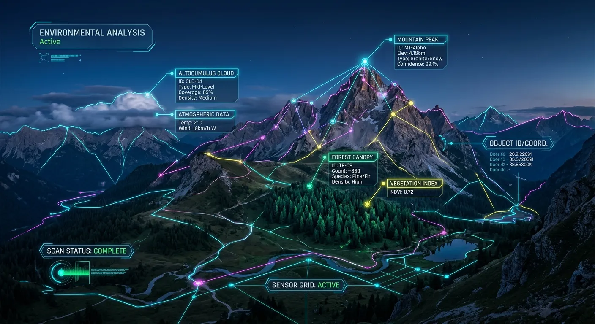

Every stock contributor knows the frustration of spending hours capturing the perfect shot, only to dread the tedious uploading process. If your goal is to boost microstock sales ai batch keywording in 30 mins can completely transform your portfolio's earning potential. The days of manually typing out dozens of tags for every single image are over.

Metadata is the invisible bridge connecting your creative work to paying buyers around the globe. Without highly accurate, descriptive tags, even the most breathtaking photographs will remain buried under millions of other search results. Leveraging advanced artificial intelligence tools like Meita.ai allows you to automate this mundane task completely.

In this comprehensive guide, we will explore exactly how intelligent tagging systems work and why they are essential for your success. You will learn how to optimize massive batches of images effortlessly, reclaim your valuable creative time, and ultimately drive more downloads. Let us dive into the modern workflow that top contributors are using to dominate the microstock market.

Why Traditional Metadata Entry Kills Your Earning Potential
----------

### The Hidden Cost of Manual Tagging ###

Manually typing keywords is not just boring; it actively drains your most valuable resource as a creator. Every minute you spend racking your brain for synonyms is a minute you are not behind the camera. This massive time sink severely limits the volume of content you can upload to agencies.

Furthermore, human error plays a significant role in poor search rankings. We often forget crucial conceptual keywords or overlook background elements that buyers might be actively searching for. When fatigue sets in after tagging fifty photos, the quality and depth of your metadata inevitably drop.

Consistency is another major hurdle for manual taggers. A buyer might search for "residential architecture," but if you only tagged "house" and "home," you lose that sale instantly. Relying on your own vocabulary puts a hard ceiling on your image discoverability.

### How Algorithm Updates Favor Precision ###

Microstock agencies constantly update their search algorithms to deliver better results to their customers. These platforms now prioritize highly relevant, hyper-specific metadata over keyword stuffing. If your tags do not perfectly match the visual content of the image, your search ranking will plummet.

Modern search engines on sites like Adobe Stock and Shutterstock use visual recognition alongside text. They compare your provided keywords against what their internal AI sees in your image. If there is a mismatch, your image is flagged as spammy and pushed to the back pages.

To successfully boost microstock sales ai batch keywording in 30 mins offers the precision these algorithms demand. Advanced AI tools analyze the image exactly how the agency's algorithm will, ensuring a perfect alignment. This synergy guarantees that your portfolio stays in good standing and ranks highly for relevant queries.

### Reclaiming Your Creative Time ###

The ultimate goal of any stock contributor is to generate passive income while focusing on their passion. When you automate the metadata process, you instantly remove the biggest bottleneck in your production pipeline. You can easily process an entire weekend's photoshoot while you enjoy a cup of coffee.

This freed-up time can be reinvested into analyzing market trends or planning new shoots. You could even explore emerging niches like AI-generated art. For instance, using a [Free AI Keywording Tool](https://meita.ai/en-us/ai-keywording-tool) designed for Midjourney and stock photos helps you scale your output exponentially.

Ultimately, automation shifts your role from data entry clerk back to creative director. You get to focus on visual storytelling and composition, which are the true drivers of long-term success. The technology handles the tedious administrative work in the background.

The Mechanics of Automated Photo Tagging
----------

### What is Bulk Keyword Generation? ###

Bulk keyword generation is the process of applying metadata to hundreds or thousands of files simultaneously. Instead of opening each image individually, you drop entire folders into a centralized processing tool. The software then systematically evaluates every single file without human intervention.

This batch processing approach is what makes rapid portfolio scaling possible for modern contributors. The system looks for overarching themes in a series of photos while noting the unique variations in each shot. It generates distinct, highly customized metadata for every individual file in the batch.

By automating this workflow, contributors bypass the repetitive strain of copy-pasting tags. Whether you shoot editorial events, commercial lifestyle, or abstract backgrounds, the system adapts instantly. It is the core engine behind rapid microstock success.

### Understanding Image Recognition Technology ###

At the heart of any modern tagging tool is sophisticated computer vision technology. These artificial intelligence models have been trained on billions of image-text pairs to understand visual concepts. When you upload a photo, the AI "sees" the contents much like a human would.

It identifies primary subjects, secondary background objects, colors, and lighting styles instantly. More importantly, advanced systems can interpret abstract concepts, emotions, and moods. If you upload a photo of a person looking out a rainy window, the AI knows to include tags like "melancholy," "solitude," and "reflection."

This deep visual understanding prevents the omission of highly profitable niche keywords. The AI does not suffer from writer's block or vocabulary limitations. It simply outputs the most mathematically relevant terms based on its vast training data.

### How Meita.ai Enhances Search Visibility ###

Meita.ai takes standard image recognition a step further by tailoring its output specifically for microstock platforms. The platform understands that commercial buyers use specific industry jargon when searching for assets. It ensures those highly sought-after commercial terms are included in your batches.

Additionally, the tool excels at identifying potential copyright or intellectual property issues before you upload. It can auto-detect brand logos or restricted landmarks, saving you from frustrating agency rejections. This proactive filtering is a massive time-saver for busy professionals.

By using a dedicated [AI Microstock Keyword Tool](https://meita.ai/affiliate/landing), you ensure your tags are prioritized correctly. Most agencies place higher weight on the first 10 to 15 keywords attached to a file. Meita.ai intelligently orders your tags by relevance, maximizing your search visibility from day one.

Step-by-Step Workflow to Optimize Portfolios Quickly
----------

### Preparing Your Images for Processing ###

Before you can successfully boost microstock sales ai batch keywording in 30 mins, you need to organize your files. Start by culling your recent photoshoots and removing any out-of-focus or visually unappealing shots. AI tools work best when fed high-quality, commercially viable imagery.

Group your images into logical folders based on the shoot location, subject matter, or overall theme. This makes it easier to track your progress and manage your exported data files later. Keeping a clean, structured hard drive is the foundation of a professional stock business.

Ensure all your images are edited, color-corrected, and saved in the highest quality JPEG format. Most keywording platforms require standard file formats to perform their visual analysis. Once your folders are prepped, you are ready to initiate the batch process.

### Generating Titles and Descriptions ###

Titles and descriptions are just as critical to search ranking as individual keywords. Buyers often search using long-tail phrases, which are matched directly against your image descriptions. Fortunately, advanced AI tools generate these elements simultaneously alongside your tags.

When you import your prepared batch, the system analyzes the visual data to craft compelling, grammatically correct sentences. A generic title like "Woman with Coffee" becomes an optimized description like "Young professional woman drinking morning coffee while working on a laptop in a bright modern cafe."

If you need a comprehensive walkthrough on this specific stage, you can explore [How to Use AI to Generate Stock Photo Keywords](https://meita.ai/blog/ai-stock-photo-keywords-tutorial). Learning the nuances of title generation will give you a significant edge over contributors with lazy metadata.

### Exporting CSV Files for Major Agencies ###

Once the AI has generated all your metadata, the final step is exporting the data for the agencies. Entering this data manually into agency dashboards would defeat the purpose of automation. Instead, you utilize the CSV export feature.

A CSV (Comma Separated Values) file is a universal spreadsheet format accepted by almost every major microstock platform. Meita.ai formats this spreadsheet perfectly, aligning titles, descriptions, and keywords into the exact columns required by sites like Shutterstock and Adobe Stock.

You simply upload your images via FTP to the agency, then upload the single CSV file alongside them. The agency's system will automatically map the metadata to the correct images based on the file names. This final step is how you truly process hundreds of images in under half an hour.

Comparing Manual vs Automated Keyword Strategies
----------

### Speed and Efficiency Metrics ###

The starkest difference between manual entry and AI generation is the sheer speed of execution. A fast typist might fully metadata a single complex image in three to five minutes. Scaling that up, processing a batch of 100 images manually could easily take an entire eight-hour workday.

In contrast, automated platforms can analyze and generate comprehensive metadata for those same 100 images in minutes. The processing happens in the cloud, utilizing powerful servers that never tire or slow down. This exponential increase in speed completely changes the math of stock photography profitability.

When you rely on AI, your hourly effective rate skyrockets because your labor time plummets. You can submit massive portfolios rapidly, catching seasonal trends before manual taggers even finish uploading. Speed to market is a massive competitive advantage.

### Accuracy and Relevance Scores ###

Speed means nothing if the resulting data is inaccurate or rejected by the agencies. Manual tagging is highly subjective and heavily dependent on the contributor's vocabulary and current mental state. It is incredibly common to miss obvious keywords simply because you were tired.

AI consistency remains flawless whether it is analyzing the first image or the five-thousandth. It consistently pulls a diverse mix of literal, conceptual, and technical terms for every file. Below is a breakdown of how the two methods compare across critical performance metrics.

|    Feature / Metric    |            Manual Keywording             |          AI Batch Keywording (Meita.ai)           |
|------------------------|------------------------------------------|---------------------------------------------------|
|**Time per 100 Images** |               5 to 8 Hours               |                 Under 30 Minutes                  |
| **Keyword Diversity**  |      Limited by personal vocabulary      |      Expansive, driven by global data trends      |
| **Conceptual Tagging** |      Often forgotten or overlooked       | Automatically detected via mood/lighting analysis |
|**IP & Brand Detection**|   Requires manual zooming and checking   |        Auto-flagged during visual scanning        |
|**Agency Upload Method**|Tedious dashboard entry or slow copy/paste|Instant mapping via universally accepted CSV export|
| **Relevance Ordering** |   Randomized or alphabetically sorted    |  Algorithmically sorted by commercial importance  |

Expert Tips to Maximize Earnings with AI Tools
----------

Even with the best tools available, having a strategic approach is vital for long-term success. The way you manage and oversee your automated workflow can make a significant difference in your monthly payouts. Here are the top strategies used by high-earning contributors to get the most out of AI platforms.

* **Always Review the First Five:** When you run a massive batch, manually check the first five images to ensure the AI interpreted your artistic intent correctly. This quick QA check prevents bulk errors.
* **Leverage Conceptual Synonyms:** Make sure your AI tool is set to include conceptual tags like "freedom," "innovation," or "tranquility." These emotional triggers are highly sought after by ad agencies.
* **Target Localized Keywords:** If you shoot travel photography, ensure specific geographical markers and local cultural terms are included. Niche localized searches often have higher conversion rates.
* **Keep Titles Natural:** Avoid keyword-stuffed titles. Ensure the AI generates descriptive, human-readable sentences, as search engines increasingly favor natural language processing.
* **Utilize the 30-Minute Rule:** If you want to boost microstock sales ai batch keywording in 30 mins should be your standard workflow block. Process smaller batches frequently rather than letting thousands of files pile up.
* **Embrace New Mediums:** Do not just tag photos. Use tools like Meita.ai to generate metadata for illustrations, vectors, and AI-generated art to diversify your portfolio income.

Frequently Asked Questions about boost microstock sales ai batch keywording in 30 mins
----------

### How does artificial intelligence improve image discoverability? ###

AI improves discoverability by generating highly accurate, comprehensive metadata that perfectly matches visual content. It includes literal objects, overarching concepts, and technical photography terms. This multi-layered tagging ensures your image appears in a wider variety of relevant buyer searches.

### Can I really tag hundreds of photos in just half an hour? ###

Yes, bulk processing tools can analyze and generate data for hundreds of images in minutes. The most time-consuming part is simply uploading your files to the tool and downloading the resulting CSV. The actual metadata generation happens almost instantly in the cloud.

### Does Meita.ai work for platforms like Adobe Stock and Shutterstock? ###

Absolutely, Meita.ai is designed specifically for major microstock agencies. It formats its CSV exports to meet the exact requirements of Adobe Stock, Shutterstock, Dreamstime, and Freepik. This cross-platform compatibility saves you from formatting data multiple times.

### Will using automated tags get my portfolio banned? ###

No, using AI to generate accurate keywords is fully compliant with agency terms of service. Agencies only penalize keyword stuffing or irrelevant tagging. Because AI generates highly relevant tags based on visual analysis, it actually keeps your portfolio in excellent standing.

### What file formats are supported for metadata export? ###

The industry standard for bulk metadata upload is the CSV (Comma Separated Values) file. AI tagging platforms generate a clean, properly formatted CSV that maps to your image filenames. This file can be uploaded alongside your JPEGs directly to the agency.

### How accurate is AI for conceptual or abstract photography? ###

Modern AI is exceptionally good at reading lighting, color palettes, and composition to determine mood. It can accurately apply tags like "futuristic," "melancholy," or "chaotic" to abstract images. This ensures even non-literal art reaches the right buyers.

### Can I edit the generated metadata before uploading? ###

Yes, you always retain full control over your metadata. Good AI tools provide an interface where you can easily add, delete, or rearrange keywords before exporting. This allows you to inject your own specific niche knowledge into the AI's solid foundation.

### Does this tool detect brand names and intellectual property? ###

Advanced platforms like Meita.ai feature automatic IP and brand detection. If it spots a recognizable logo or restricted building, it will flag the image. This helps you avoid annoying commercial rejections and allows you to submit the file as an editorial image instead.

### Do I need technical skills to use automated tagging software? ###

Not at all; these platforms are built with intuitive, drag-and-drop interfaces. If you know how to organize folders on your computer and upload files to a website, you can use them. They are designed to be accessible for photographers of all technical skill levels.

Conclusion
----------

Transforming your stock photography hobby into a lucrative business requires abandoning outdated, labor-intensive practices. The sheer volume of content required to succeed today makes manual metadata entry an impossible hurdle. When you actively implement strategies to boost microstock sales ai batch keywording in 30 mins completely reshapes your daily workflow. You reclaim hours of your life, eliminate the fatigue of data entry, and guarantee that your images are optimized to meet the strict demands of agency search algorithms.

The technology is accessible, affordable, and incredibly easy to integrate into your existing upload routine. By embracing advanced visual recognition platforms, you ensure your portfolio remains competitive in an increasingly crowded market. Stop letting your best photographs gather digital dust because of poor metadata. Try out Meita.ai today, automate your keyword generation, and watch your microstock downloads climb higher than ever before.
