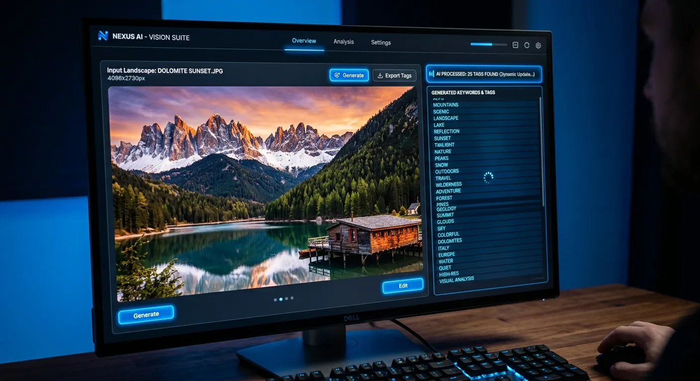

Every stock photographer knows the thrill of capturing the perfect image, but that excitement often fades when it is time to upload. Manually typing out titles, descriptions, and keywords for hundreds of assets is a tedious, soul-crushing chore. However, if you want to succeed in the highly competitive stock photography market, you simply cannot ignore the power of accurate tagging.

Fortunately, technology has evolved to solve this exact problem for creative contributors. You can now effortlessly boost microstock sales with bulk metadata tags ai, transforming hours of mundane administrative work into seconds of automated brilliance. By leveraging artificial intelligence, you can ensure your portfolio gets in front of the right buyers at the exact right time.

In this comprehensive guide, we will explore why optimized keywording is the secret engine behind passive income generation. You will discover how AI-driven platforms like Meita.ai streamline your entire submission workflow. From understanding search algorithms to mastering batch processing, you will learn everything you need to scale your portfolio and maximize your daily royalties.

Why Accurate Metadata Drives Microstock Success
----------

In the world of microstock, your photographs, videos, and illustrations are essentially invisible without the right text attached to them. Buyers do not browse through millions of images one by one; they rely entirely on the agency's search bar. Therefore, your metadata is the vital bridge connecting your creative vision to a buyer's specific commercial need.

When you provide precise and comprehensive tags, you drastically improve your chances of appearing on the crucial first page of search results. Agencies like Adobe Stock and Shutterstock reward contributors who supply highly relevant keywords that match buyer intent. Missing the mark with your tags means leaving money on the table, no matter how stunning your visuals are.

### The Role of Search Algorithms in Stock Agencies ###

Microstock platforms utilize complex search algorithms designed to surface the most relevant content quickly. These systems scan your titles, descriptions, and keywords to determine what your asset is about. They also weigh the order of your tags, often giving priority to the first ten or fifteen keywords you list.

Moreover, these algorithms track conversion rates based on specific search queries. If a buyer searches for "corporate teamwork," clicks your image, and buys it, the algorithm boosts your ranking for that term. This makes starting with highly accurate, AI-generated metadata incredibly important for your initial visibility.

### How Better Keywords Connect You With Buyers ###

Understanding your buyer is the first step to successful keywording. Most microstock customers are graphic designers, marketers, and art directors looking for specific concepts to complete a project. They rarely search for purely literal terms; instead, they search for emotions, themes, and business concepts.

For example, a picture of a woman looking at a laptop is literally just that. But a buyer might be searching for "remote work burnout," "financial planning success," or "distance learning." By utilizing a [free AI keywording tool for stock photos](https://meita.ai/en-us/ai-keywording-tool), you can automatically extract these lucrative conceptual keywords that you might have otherwise missed.

### Overcoming the Manual Keywording Bottleneck ###

The biggest hurdle to growing a profitable stock portfolio is the time it takes to process files. Many talented photographers have hard drives full of beautiful, unsellable images simply because they dread the uploading process. Manual keywording creates a massive bottleneck that stifles your earning potential.

Typing fifty unique, relevant keywords for every single image is not sustainable for high-volume contributors. It leads to creative fatigue, repetitive strain, and inevitably, keyword spamming where contributors copy and paste irrelevant tags. Eliminating this bottleneck is essential for long-term survival in the microstock industry.

The Power of Automation for Stock Photographers
----------

Automation is no longer a luxury for stock contributors; it is a fundamental requirement for staying competitive. As millions of new assets flood agencies every week, manual workflows simply cannot keep pace. Embracing AI technology allows you to shift your focus from data entry back to what you do best: creating exceptional content.

When you automate your tagging process, you instantly multiply your output capacity. Instead of uploading fifty images a week, you can seamlessly process five hundred in a fraction of the time. This rapid portfolio expansion is the most proven method for increasing your monthly royalty checks.

### Scaling Your Portfolio Without Losing Time ###

The microstock business is largely a numbers game. While quality is undeniably important, quantity provides the necessary surface area for consistent daily sales. Scaling your portfolio requires a streamlined system that minimizes friction between post-production and publication.

By using AI to analyze and tag your images in large batches, you remove the most time-consuming step of the process. You can drop hundreds of files into an intelligent platform and watch as it automatically populates the required data. This efficiency allows you to upload consistently, which algorithmically favors your account on most stock websites.

### Maintaining Consistency Across Large Batches ###

When dealing with a photoshoot containing hundreds of similar images, maintaining metadata consistency manually is a nightmare. It is easy to forget a crucial keyword halfway through the batch or make a typo that ruins search visibility. Inconsistent tagging means some images in a series will sell well while others vanish into obscurity.

AI keywording tools analyze visual similarities and ensure that critical overarching themes are applied universally to a batch. Simultaneously, the AI is smart enough to detect minor variations between shots and adjust the specific keywords accordingly. This guarantees a uniform standard of quality across your entire portfolio.

### Avoiding Spelling Errors and Inaccurate Tags ###

Human error is a significant silent killer of microstock sales. A simple typo in your title or a misspelled primary keyword ensures that buyers will never find your content. Furthermore, adding inaccurate tags in a rush can lead to account penalties or outright bans from strict agencies.

Artificial intelligence completely eradicates spelling mistakes from your workflow. The algorithms cross-reference massive dictionaries and established stock agency taxonomy to ensure perfect spelling and formatting. This level of precision protects your account standing and guarantees maximum search visibility.

How AI Transforms the Contributor Workflow
----------

The integration of artificial intelligence into the stock photography ecosystem has completely revolutionized how contributors manage their businesses. Modern AI doesn't just guess what is in a photo; it deeply understands the context, composition, and commercial value of the asset. This technological leap allows you to effectively boost microstock sales with bulk metadata tags ai.

Platforms like Meita.ai are specifically trained on stock photography data, meaning they think like a buyer. They seamlessly integrate into your existing file management routine, bridging the gap between your local hard drive and global stock agencies. Let's break down exactly how this technology changes the game.

### Smart Object and Conceptual Recognition ###

Early auto-tagging tools were rudimentary, only capable of identifying basic objects like "dog," "tree," or "car." Today's advanced AI vision models can identify thousands of distinct objects, background elements, and specific color palettes in milliseconds. They accurately detect the age, ethnicity, and expressions of human models, which are highly searched criteria.

More importantly, modern AI excels at conceptual recognition. It analyzes the interaction between objects in a frame to deduce abstract themes. An image of a sapling growing out of a stack of coins will be automatically tagged with "investment," "growth," "financial planning," and "sustainability."

### Generating Titles and Descriptions Instantly ###

Keywords are only part of the metadata equation. Crafting compelling, descriptive titles is equally important, as some search engines prioritize words found in the title. Writing hundreds of unique, grammatically correct sentences is incredibly draining for human contributors.

AI models can instantly generate highly descriptive, commercially appealing titles based on the visual data. These titles naturally incorporate primary keywords and describe the scene perfectly for the end-user. This ensures your assets meet the strict metadata requirements of premium platforms like Adobe Stock.

### Exporting to Major Agencies Seamlessly ###

Once your metadata is generated, getting it onto the actual stock platforms is the final hurdle. The best AI tools write the generated titles, descriptions, and keywords directly into the EXIF/IPTC data of your JPEG files. This means the data is permanently embedded inside the image itself.

When you upload these processed files via FTP or a web browser to Shutterstock, Dreamstime, or Getty Images, the agency automatically reads the embedded data. All your fields populate instantly, allowing you to hit the submit button without any further typing. This universal compatibility makes multi-agency distribution completely effortless.

Comparing Manual Keywording Versus AI Generation
----------

To truly understand the value of upgrading your workflow, it is helpful to look at a direct comparison. Many veteran contributors are hesitant to change their established routines, fearing a loss of control. However, the data clearly shows that those who adopt AI tools experience faster portfolio growth and higher earnings.

When you attempt to boost microstock sales with bulk metadata tags ai, you are optimizing every facet of your production pipeline. The table below illustrates the stark differences between traditional manual data entry and leveraging a modern AI keywording platform.

|        Feature        |                  Manual Keywording                  |                 Meita.ai Bulk Generation                  |
|-----------------------|-----------------------------------------------------|-----------------------------------------------------------|
| **Processing Speed**  |                3-5 minutes per image                |                 Seconds for bulk batches                  |
| **Keyword Capacity**  |   Usually tapers off at 20-30 tags due to fatigue   |  Consistently generates maximum allowed (up to 50 tags)   |
|**Conceptual Accuracy**|Highly dependent on contributor's vocabulary and mood|     Trained on millions of commercial buyer searches      |
| **Typo & Error Rate** |High risk of spelling mistakes and repetitive tagging|  Zero spelling errors, perfectly formatted for agencies   |
| **Language Support**  |    Limited to the contributor's native languages    |  Effortless multi-language translation for global reach   |
|    **Scalability**    |Extremely poor; creates a major uploading bottleneck |Infinite scalability; handles thousands of files seamlessly|

Best Practices to Maximize Your Earnings
----------

While artificial intelligence handles the heavy lifting, your strategy still matters. Generating metadata is a collaborative process between your creative vision and the AI's processing power. To achieve the highest possible return on investment, you should implement a few strategic best practices.

Using an AI tool is not just about speed; it is about intelligent optimization. By guiding the AI and understanding what microstock agencies prioritize, you can dominate niche search results. Here are the most effective strategies for maximizing your portfolio's earning potential.

### Balancing Broad and Niche Search Terms ###

A successful metadata profile includes a healthy mix of broad and highly specific keywords. Broad terms like "business," "nature," or "technology" have massive search volumes, but the competition is fierce. It is difficult for new images to rank for these saturated keywords immediately.

Niche keywords, on the other hand, have lower search volumes but much higher conversion rates. Terms like "hydroponic indoor farming" or "vintage film camera repair" face minimal competition. AI tools are excellent at providing this balanced mix, ensuring you capture both long-tail buyer intent and general category traffic.

### Reviewing AI Outputs for Optimal Accuracy ###

Although modern AI is incredibly smart, it is always wise to briefly review the generated tags before final export. This takes only seconds per batch but ensures absolute perfection. You know your image's context better than anyone, especially regarding specific locations or specialized equipment.

Take a quick glance to remove any tags that might be technically true but commercially irrelevant. For instance, if a tiny, out-of-focus dog is in the deep background of a portrait, you probably do not want to rank for "dog." Culling minor irrelevancies keeps your conversion rate high, which pleases the search algorithms.

### Leveraging Multi-Language Tagging Opportunities ###

The microstock market is completely global, with buyers purchasing assets from every continent. While most agencies automatically translate English keywords, relying on their internal translation engines isn't always foolproof. Cultural nuances and localized idioms often get lost in translation.

Advanced AI tools allow you to generate highly accurate keywords in multiple languages from the start. If you are shooting localized content—such as regional festivals or culturally specific cuisine—generating native-language tags can give you a massive edge. It allows you to dominate local search results while international competitors rely on clunky auto-translations.

Expert Tips for High-Converting Stock Portfolios
----------

Building a lucrative microstock portfolio requires more than just good lighting and sharp focus. You must treat your portfolio like a digital storefront, optimizing every asset for maximum discoverability. To consistently boost microstock sales with bulk metadata tags ai, implement these proven expert strategies into your routine.

* **Prioritize Keyword Order:** Many agencies weigh the first 10-15 keywords the heaviest. Ensure your AI tool is configured to place the most descriptive, relevant, and commercial terms at the very beginning of the list.
* **Include the "Who, What, Where, and Why":** Your title should read like a natural sentence that answers these four questions. "A mature businesswoman (Who) reviewing financial documents (What) in a modern office (Where) for tax preparation (Why)."
* **Embrace Negative Space Conceptually:** If your image has copy space (empty areas for text), always include keywords like "copy space," "mockup," "template," and "background." Designers actively search for these exact terms.
* **Avoid Brand Names and Trademarks:** Unless submitting as Editorial, strictly avoid trademarked names. Good AI tools auto-detect and warn you about potential IP violations before you upload.
* **Tag the Mood and Lighting:** Buyers often search for aesthetic qualities. Ensure your metadata includes terms like "cinematic lighting," "moody," "bright and airy," or "golden hour" if applicable.
* **Regularly Update Older Assets:** Don't let your older portfolio gather dust. Run your earliest, poorly-tagged images through an AI generator to refresh their metadata and revive their sales potential.
* **Share the Knowledge:** If you find a workflow that dramatically increases your earnings, consider joining a [microstock affiliate program](https://meita.ai/affiliate) to earn extra income by recommending the software to fellow creatives.

Frequently Asked Questions About Boost Microstock Sales With Bulk Metadata Tags AI
----------

### What is bulk metadata AI generation for microstock? ###

Bulk metadata AI generation uses artificial intelligence to automatically analyze hundreds of images at once. It instantly creates accurate titles, descriptions, and up to 50 relevant keywords for each file. This data is embedded into the files, making them ready for immediate upload to stock agencies.

### Will AI-generated keywords get my account banned? ###

No, using AI to generate relevant keywords will not get you banned. Agencies penalize contributors for "keyword spamming," which is adding irrelevant tags to trick the search engine. High-quality AI tools focus strictly on relevance and accuracy, which agencies actually encourage.

### Can AI recognize specific locations and landmarks? ###

Yes, advanced AI models are trained on massive datasets and can easily recognize famous landmarks, cities, and geographical features. However, for highly obscure or localized places, it is always recommended to manually add the specific location name for absolute precision.

### Does embedded metadata work on all stock photography websites? ###

Yes, embedding IPTC/EXIF metadata is the universal industry standard for digital imagery. Major platforms like Adobe Stock, Shutterstock, Dreamstime, Freepik, and Getty Images will automatically extract and populate this data when you upload your files.

### How does AI help with conceptual keywords? ###

AI looks beyond the literal objects in a photo and analyzes the context and emotion of the scene. It understands that a picture of a handshake represents "agreement," "partnership," or "trust." This conceptual tagging is crucial because it matches how commercial buyers actually search.

### Do I still need to write titles if I use AI? ###

No, premium AI keywording platforms automatically generate comprehensive, commercially viable titles based on the visual content. You can review and tweak these titles if desired, but the AI handles the bulk of the sentence construction for you.

### Is AI keywording suitable for AI-generated stock art like Midjourney? ###

Absolutely. AI-generated stock art requires the exact same metadata as traditional photography to be discovered by buyers. AI tagging tools are perfect for processing high volumes of Midjourney or stable diffusion creations efficiently.

### How much time does bulk AI tagging save? ###

Manual keywording typically takes 3 to 5 minutes per image, meaning 100 images could take over 6 hours to process. A bulk AI tagging tool can process those same 100 images in just a few minutes, saving you days of administrative work every month.

### Can I use AI tagging for video and audio stock files? ###

Many modern AI metadata platforms are expanding their capabilities to analyze video clips and audio tracks. By analyzing visual frames or audio waveforms, the AI can generate accurate tags for multimedia files, streamlining your entire creative portfolio.

### Will using an AI keyword tool guarantee more sales? ###

While no tool can guarantee sales if the visual content isn't commercially viable, accurate metadata guarantees maximum visibility. By ensuring your images appear in front of the right buyers, AI tagging drastically increases your mathematical probability of making a sale.

The microstock industry moves at lightning speed, and those who cling to outdated, manual processes will inevitably be left behind. When you choose to boost microstock sales with bulk metadata tags ai, you are reclaiming your most valuable asset: your time. By automating the tedious data entry process, you can direct all your energy into shooting, creating, and expanding a high-quality portfolio that generates consistent passive income.

Stop letting unsellable images pile up on your hard drive because you dread the uploading process. Embrace the future of stock photography workflow with intelligent platforms designed specifically for contributors. Try out Meita.ai today, optimize your entire backlog in minutes, and watch as your agency dashboards light up with increased daily downloads.
