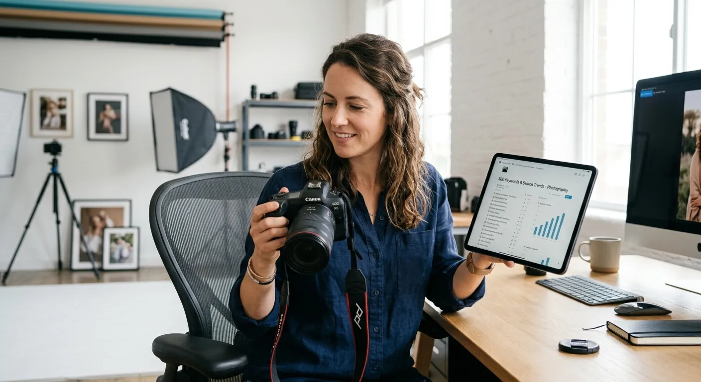
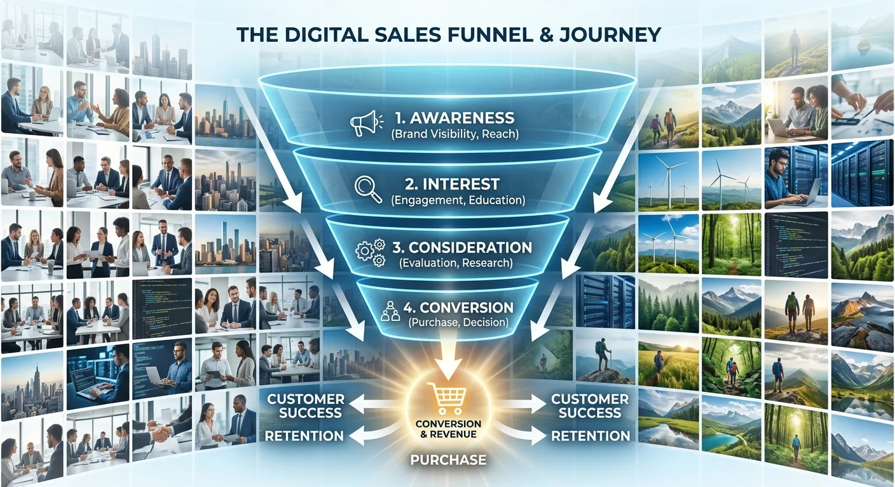

Every day, millions of stunning images are uploaded to microstock platforms, only to become buried under an avalanche of competing content. You might spend hours perfectly lighting a scene, meticulously editing the colors, and carefully uploading your files, only to hear crickets. The harsh reality of the stock photography industry is that a beautiful image is entirely useless if the customer cannot find it. This disconnect usually happens because contributors focus on what the image is, rather than understanding why a customer wants to buy it.

Mastering microstock buyer intent is the secret bridge between your creative portfolio and consistent, recurring sales. When you understand the underlying psychology of the person typing words into a search bar, you can tailor your metadata to meet them exactly where they are. Customers are rarely browsing for fun; they are actively trying to solve a visual problem, communicate a specific message, or sell a product to their own audience.

In this comprehensive guide, we will explore how to decode these search behaviors and apply targeted keyword research buyer intent strategies to your portfolio. You will learn how to identify the three core types of stock buyers, how to match your visual assets to their specific needs, and how to use advanced tagging techniques to ensure your work surfaces at the exact moment a buyer is ready to download. By shifting your mindset from a descriptive photographer to a strategic problem-solver, you will dramatically increase your content's discoverability and revenue.

Decoding the Psychology of Image Buyers
----------

To effectively tag your images, you must first understand who is on the other side of the screen. Stock photo buyers are not a monolith; they come from vastly different industries with completely different goals. Understanding their daily pressures and project requirements is the first step in mastering microstock buyer intent.

### The Corporate Marketer's Mindset ###

Corporate marketers and advertising art directors are often operating under tight deadlines with strict brand guidelines. They are not looking for "pretty pictures" — they are hunting for visual assets that drive conversions, illustrate brand values, or serve as the backdrop for an advertising campaign. Their search queries reflect a need for utility, safety, and modern aesthetics.

These buyers frequently search for concepts rather than literal objects. They need images that convey "teamwork," "innovation," or "financial security." Furthermore, they desperately need technical space to do their jobs. Keywords like "copy space," "isolated," and "banner" are incredibly valuable to them because they indicate an image that can comfortably house a headline or a company logo.

### Editorial and News Publishers ###

Journalists, bloggers, and editorial content creators operate with a completely different set of rules. They are seeking authenticity, accuracy, and timely relevance to support a factual narrative. For these buyers, microstock buyer intent is purely informational and illustrative of real-world events or specific niche topics.

An editorial buyer isn't looking for a perfectly polished, smiling family eating breakfast. They are looking for realistic representations of modern life, specific geographic locations, recognizable landmarks, or cultural events. Their keyword searches are highly specific, often utilizing exact names of cities, distinct cultural traditions, or current social issues. Accuracy in your metadata is absolutely critical for this demographic.

### Small Business and Solo Creators ###

The rise of the creator economy has introduced a massive new demographic to microstock platforms. Small business owners, social media managers, and solo YouTubers need high volumes of content to feed their daily publishing schedules. Their budgets might be smaller, but their download volume is exceptionally high.

These buyers often search for trendy, aesthetic, and highly relatable content. They want images that look natively captured on a high-end smartphone rather than a sterile studio setup. Keywords targeting this group should include terms related to "authenticity," "social media," "vlog," "lifestyle," and contemporary aesthetic trends. They are looking for instant visual impact to stop the scroll.

Core Types of Microstock Buyer Intent
----------

Search engine optimization teaches us that every search query has an underlying intent, and the microstock industry is no different. By categorizing your images into specific intent buckets, you can drastically refine your keyword strategy and attract the right purchasers.

### Commercial Intent Explained ###

Commercial intent is driven by the desire to sell, promote, or persuade. Buyers in this category need images that make products look desirable or services appear trustworthy. The images must be legally safe, meaning all recognizable people have signed model releases, and no trademarked logos are visible.

Keywords for commercial intent often blend literal descriptions with aspirational adjectives. Instead of just tagging "woman drinking coffee," a commercial keyword strategy would include "energetic morning routine," "premium lifestyle," or "refreshing start." The intent here is to associate the visual with a positive consumer feeling.

### Informational and Editorial Intent ###

Informational intent is about education, reporting, and documentation. Buyers need these images to explain a concept, document an event, or accompany an informative article. These images are often sold under editorial licenses, meaning they cannot be used to sell a product, but they are vital for publishers.

When optimizing for this intent, your keywords must be journalistic. Think about the "who, what, where, when, and why" of the image. Exact dates, specific locations, precise event names, and the demographic details of the subjects are crucial. The buyer intent here is fact-finding; they need the truth, not a heavily manipulated concept.

### Conceptual and Creative Intent ###

Conceptual intent is the most abstract and often the most lucrative area of microstock. Buyers here are looking for visual metaphors to explain complex, invisible ideas like "cybersecurity," "mental health," "economic inflation," or "artificial intelligence."

This requires a highly creative approach to metadata. You must look past the literal elements in the frame and tag the emotions and metaphors the image evokes. A simple photo of a small plant growing out of a stack of coins literalizes "wealth," but the conceptual keywords should include "investment growth," "financial future," "economic recovery," and "nurturing assets."

Keyword Research Buyer Intent Strategies
----------

Executing a successful metadata strategy requires more than just guessing what words might work. You need a systematic approach to keyword research buyer intent that consistently aligns your portfolio with market demand. This involves researching trends, understanding emotional triggers, and using the right tools to build your metadata framework.

If you want a deeper dive into modern tagging techniques and how artificial intelligence can streamline this process, check out our guide on [Mastering Microstock Keywords: The Ultimate Guide to Selling More with AI](./mastering-microstock-keywords-the-ultimate-guide-to-selling-more-with-ai).

### Uncovering the Why Behind the Search ###

To truly capture the market, you have to ask yourself why a buyer would spend money on your image. What problem does this photo solve? If you have a picture of a messy, chaotic desk, a literal keyword approach would be "desk, papers, coffee cup, mess." But that doesn't sell the image.

By applying keyword research buyer intent, you uncover the true value. A buyer searching for this image is likely writing an article about "workplace stress," "burnout," "disorganization," or "tax season panic." Adding these problem-solving phrases ensures your image appears precisely when a buyer is trying to illustrate that specific pain point.

### Using Adjectives to Filter Intent ###

Adjectives are the secret weapon of microstock tagging. They act as powerful filters that immediately categorize your image for a specific type of buyer. A generic noun like "office" will face millions of competitors, but pairing it with strategic adjectives narrows the field to highly motivated buyers.

Consider the difference between "corporate office," "modern creative office," and "abandoned office." Each of these phrases targets a completely different microstock buyer intent. By carefully selecting 5-10 highly descriptive adjectives that define the mood, lighting, and style of your image, you can capture long-tail searches that have much higher conversion rates.

### Balancing Broad Themes with Specific Actions ###

A healthy metadata profile balances broad, high-volume keywords with highly specific, low-competition phrases. Broad themes capture the general category, while specific actions capture the exact need of the buyer.

For instance, if you upload a video clip of a chef preparing a meal, your broad themes are "cooking," "restaurant," and "food." Your specific action keywords should describe exactly what is happening: "chopping vegetables," "sizzling pan," "garnishing plate," or "culinary preparation." Buyers with strong commercial intent usually search using these specific action phrases because they have a clear storyboard in their minds.

Aligning Visual Assets with Search Expectations
----------

Keyword research is only half of the equation; your visual execution must deliver on the promise of your tags. If a buyer searches for a specific concept and clicks on your image, the composition, lighting, and styling must instantly satisfy their requirements. Misalignment between keywords and visual reality leads to skipped images and lower search rankings.

### Shooting for the Commercial Client ###

When you know you are targeting a commercial buyer intent, you must shoot with their needs in mind from the very beginning. This means intentionally leaving negative space in your composition for text placement. It means ensuring colors are vibrant, lighting is flattering, and the overall aesthetic aligns with current advertising trends.

If you tag an image with "background" or "copy space," the area you leave blank must actually be usable. It shouldn't be cluttered with distracting textures or out-of-focus elements that make typography unreadable. Your visual choices must actively support the utility promised by your keywords.

### Capturing Authentic Editorial Moments ###

Editorial intent demands realism. If you are targeting documentary or news-related keywords, your editing should be minimal and your subjects should look unposed. Over-processing an editorial image destroys its credibility and immediately alienates the buyer who needs authentic representation.

When targeting keywords like "candid," "street photography," or "real life," ensure your visual assets match. Avoid heavy color grading, artificial lighting setups, or unnatural poses. The buyer expects a fly-on-the-wall perspective, and your visual style must deliver that raw honesty.

### Creating Metaphorical Imagery for Concepts ###

For conceptual keywords to work, the visual metaphor must be instantly recognizable but not overly cliché. If you are targeting the keyword "teamwork," a photo of people in business suits shaking hands is literal but tired. Buyers are searching for fresh ways to illustrate these old concepts.

Instead, you might shoot a sports team huddle, musicians tuning instruments together, or a diverse group of hands assembling a complex puzzle. The visual execution must be strong enough that the buyer immediately understands the metaphor before they even read your conceptual keywords.

Comparing Microstock Buyer Intent Categories
----------

To help you visualize how these strategies differ in practice, the following table breaks down the three primary categories of buyer intent. Understanding these distinctions will help you organize your shoots and streamline your metadata entry process.

|      Buyer Intent Type      |                          Primary Goal                          |                        Target Audience                         |                            Example Keywords                            |                           Recommended Image Style                            |
|-----------------------------|----------------------------------------------------------------|----------------------------------------------------------------|------------------------------------------------------------------------|------------------------------------------------------------------------------|
|       **Commercial**        |   Sell a product, promote a service, build brand awareness.    |        Ad agencies, corporate marketers, web designers.        | Copy space, modern lifestyle, premium, business success, diverse team. |Polished, well-lit, intentional negative space, aspirational, model-released. |
|**Editorial / Informational**|   Educate, report news, document reality, illustrate facts.    |    Journalists, news outlets, bloggers, documentary makers.    |   [City name], [Event name], candid, documentary, [Exact date/year].   |Unposed, authentic, minimal editing, accurate to reality, true-to-life colors.|
|  **Conceptual / Creative**  |Illustrate abstract ideas, convey complex emotions or metaphors.|Graphic designers, book publishers, thought leadership bloggers.|Mental health, financial growth, teamwork, isolation, technology future.|     Metaphorical, creative lighting, composite images, symbolic objects.     |

Expert Tips for Intent-Driven Keyword Tagging
----------

Now that you understand the theory behind microstock buyer intent, it is time to put it into practice. Elevating your keyword game requires discipline and a strategic workflow. Here are practical, actionable tips to ensure your metadata captures the right attention and drives consistent downloads.

* **Prioritize the "Why" and "How":** Always ask yourself why someone needs this image and how they will use it. Include keywords that answer these questions, such as "background," "template," "concept," or "header."
* **Audit Your Top Performers:** Regularly review your highest-selling images. Look at the exact search terms that led to those sales (if platform analytics allow) and identify the underlying buyer intent. Replicate this strategy in future shoots.
* **Use Emotional Descriptors:** Don't just describe the action; describe the feeling. Words like "joyful," "frustrated," "serene," or "chaotic" help buyers find images that match the emotional tone of their content.
* **Avoid Keyword Spamming:** Only include tags that genuinely represent the image. Tagging a sunny beach photo with "snow" or "business" will frustrate buyers, hurt your conversion rate, and ultimately lower your ranking in platform algorithms.
* **Leverage Conceptual Synonyms:** If an image represents "success," also include words like "achievement," "victory," "triumph," and "winning." Buyers use different vocabularies to search for the same concept.
* **Sequence for Importance:** Many microstock algorithms prioritize the first 10-15 keywords. Place your strongest, most accurate, and highly intent-driven keywords at the very beginning of your list.
* **Think in Phrases:** Buyers rarely search for single words. They search for "happy family eating dinner" or "modern minimalist living room." Include these natural, multi-word phrases in your tagging strategy.
* **Update Seasonal Metadata:** Anticipate seasonal buyer intent. Add relevant holiday or seasonal keywords a few months in advance of the actual event, as corporate buyers plan their campaigns early.

Frequently Asked Questions about Microstock Buyer Intent
----------

### What exactly is microstock buyer intent? ###

Microstock buyer intent refers to the underlying reason or goal a customer has when searching for an image. It is the difference between simply looking at a picture of a laptop and needing a picture of a laptop to illustrate an article about remote work productivity.

### How does intent differ from basic image descriptions? ###

Basic descriptions simply state what is physically present in the frame, like "man, dog, park, grass." Intent-based keywords describe the value or meaning of the image, such as "companionship," "outdoor lifestyle," or "pet care concept."

### Can one image target multiple buyer intents? ###

Yes, a single image can often serve multiple intents. A high-quality photo of a solar panel could be used commercially by a green energy company, editorially by a news outlet reporting on climate change, or conceptually to represent "sustainable future."

### Why are conceptual keywords important for commercial buyers? ###

Commercial buyers often need to sell invisible services like insurance, cybersecurity, or financial planning. They rely on conceptual keywords to find visual metaphors that accurately represent these abstract business ideas to their customers.

### How do I identify keyword research buyer intent? ###

You can identify keyword research buyer intent by studying advertising trends, reading industry blogs, and analyzing the emotional needs of different target audiences. Thinking about the end-use of the image—like a billboard or a blog header—also reveals intent.

### What are the best tools for analyzing stock image trends? ###

Many microstock platforms provide internal contributor dashboards that highlight trending search terms. Additionally, general SEO tools like Google Trends, Pinterest Trends, and dedicated stock analytics software can help you identify rising visual demands.

### How often should I update my portfolio keywords? ###

It is a good practice to audit your portfolio annually, particularly for images that have stopped selling. Updating keywords to reflect new cultural terminology, modern slang, or shifting industry concepts can breathe new life into older files.

### Should editorial images have different keywords than commercial ones? ###

Absolutely. Editorial images require highly factual, literal, and specific keywords including dates, locations, and names. Commercial images benefit more from aspirational, emotional, and conceptual keywords designed to sell a lifestyle.

### Do buyers search differently on different microstock platforms? ###

Yes, user behavior varies by platform. A premium site might attract corporate ad agencies searching for broad concepts, while a budget-friendly subscription site might attract bloggers searching for literal, highly specific literal actions.

### How does artificial intelligence change buyer search habits? ###

AI-driven search engines are becoming better at understanding natural language and complex concepts. This means buyers are typing longer, more descriptive sentences into search bars, making long-tail, intent-driven keywords more important than ever.

Conclusion
----------

Thriving in the competitive world of stock photography requires a fundamental shift in how you view your work. You are no longer just capturing beautiful moments; you are providing targeted visual solutions for businesses, creators, and publishers. By deeply understanding microstock buyer intent, you align your creative vision with market demand, ensuring that every image you upload has a specific purpose and a waiting audience.

Take the time to audit your current portfolio and apply these keyword research buyer intent strategies today. Look past the literal elements in your photographs and start describing the emotions, concepts, and utility they offer. When you start thinking like a buyer, speaking their language, and anticipating their needs, you will see a dramatic improvement in your discoverability, leading to a more profitable and successful microstock career.
