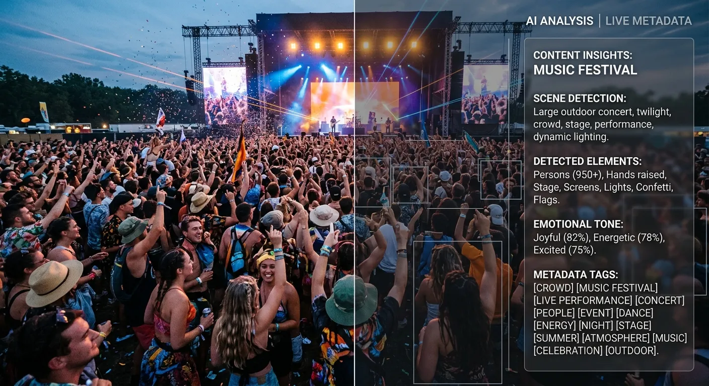
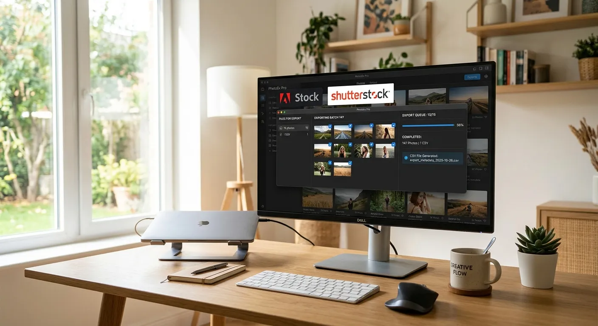

The demand for high-quality event photography on global stock platforms is skyrocketing right now. However, capturing the perfect candid moment or dynamic stage lighting is only half the battle. To truly succeed in a crowded market, you need a strategy to elevate event photography ai keywording in trends that actively dominate buyer search engines.

For years, stock contributors spent countless hours manually typing descriptions and brainstorming synonyms for every single image. This tedious process often led to burnout and a backlog of unsellable photos sitting on hard drives. By automating your metadata creation, you can spend significantly less time typing at your desk and more time shooting behind the lens.

This comprehensive guide will show you exactly how to streamline your workflow and boost your microstock sales using smart technology. You will learn the best practices for generating titles, descriptions, and tags effortlessly. Discover how platforms like meita.ai can transform your portfolio visibility and maximize your passive income potential.

The Evolution of Event Photography Metadata
----------

### From Manual Tagging to Smart Automation ###

In the early days of microstock, contributors relied entirely on manual data entry to categorize their portfolios. Photographers had to inspect each image, brainstorm up to fifty relevant terms, and type them out meticulously. This manual tagging process was incredibly time-consuming and prone to human error. A single typo could make a brilliant image completely invisible to potential buyers.

Today, artificial intelligence has completely revolutionized this tedious workflow. Modern machine learning algorithms can instantly "see" and comprehend the contents of an image. They automatically generate highly accurate titles, descriptions, and keywords in a matter of seconds. This shift allows creators to process massive batches of files without breaking a sweat.

Automation platforms like meita.ai are leading this creative charge for stock contributors. By utilizing advanced vision models, these tools eliminate the guesswork from portfolio management. Photographers can now focus their energy entirely on capturing compelling visual stories.

### Why Speed Matters for Event Photographers ###

In the fast-paced world of event photography, speed is a critical factor for financial success. Buyers often look for images of recent festivals, corporate conferences, and cultural celebrations immediately after they occur. If you delay your uploads, you risk missing the peak purchasing window entirely.

Fast metadata generation ensures your images hit the marketplace while the subject matter is still highly relevant. This rapid turnaround is especially important when you want to capitalize on [seasonal microstock keywords](https://meita.ai/blog/seasonal-trending-microstock-keywords-capitalizing-on-timely-opportunities-with-ai). Artificial intelligence bridges the gap between your camera's memory card and the buyer's search bar.

Furthermore, uploading fresh content consistently tells platform algorithms that you are an active contributor. This active status often results in a subtle boost in your overall portfolio ranking. Speeding up your workflow directly translates to higher visibility and increased royalty earnings.

### Maximizing Visibility on Microstock Platforms ###

Search algorithms on major platforms like Adobe Stock and Shutterstock rely heavily on text data. No matter how stunning your composition is, buyers will never find it without the right descriptive tags. Your metadata serves as the essential bridge connecting your creative work to a client's specific needs.

To effectively elevate event photography ai keywording in trends, you must understand exactly how these search engines operate. They prioritize relevance, keyword order, and conceptual accuracy above all else. AI tools are specifically trained on these exact microstock search patterns.

Machine learning models ensure that your most important keywords appear first in your metadata sequence. This strategic ordering aligns perfectly with platform guidelines and maximizes your chances of landing on the coveted first page of search results.

How Artificial Intelligence Changes Image Tagging
----------

### Analyzing Complex Event Scenes ###

Event photos are notoriously complex and chaotic compared to standard studio shoots. A single frame from a music festival might contain elaborate lighting setups, diverse crowds, musical instruments, and intense atmospheric smoke. Manually identifying and tagging every single element in these busy scenes is exhausting.

When you elevate event photography ai keywording in trends, you leverage technology that instantly dissects these complicated visual layers. Advanced AI models break down the image into primary subjects, background elements, and environmental conditions. This ensures that no searchable detail goes unnoticed.

Meita.ai excels at parsing these dynamic event environments with incredible precision. The platform recognizes nuanced details that a human might overlook, ensuring your image ranks for a wider variety of buyer searches.

### Detecting Brands and Avoiding Rejections ###

One of the biggest frustrations for stock photographers is having their images rejected due to visible trademarks. Corporate events and public festivals are often filled with branded clothing, logos, and copyrighted background signage. Missing just one tiny logo during your review process leads to an automatic platform rejection.

Fortunately, modern metadata generators include built-in safety mechanisms to protect your portfolio. A high-quality tool will automatically detect IP and brand names within your images. It then alerts you to these potential commercial licensing issues before you waste time uploading them.

With meita.ai, you can confidently process your event coverage knowing the system is watching out for trademark violations. This feature alone saves contributors hours of frustrating resubmissions and keeps their platform approval rates exceptionally high.

### Understanding Emotional and Conceptual Tags ###

Microstock buyers rarely search using purely literal terms when looking for event imagery. Instead of typing "group of people in a dark room," an art director will search for "nightlife," "celebration," or "youthful energy." Literal descriptions are important, but conceptual keywords actually drive the majority of high-value sales.

AI tagging tools are explicitly trained to understand the mood, emotion, and abstract concepts portrayed in an image. They analyze the lighting, facial expressions, and overall atmosphere to generate powerful emotional tags. This conceptual understanding is what separates amateur portfolios from top-earning professionals.

By including terms like "teamwork" for a corporate retreat or "euphoria" for a concert, your images become useful for broader marketing campaigns. Artificial intelligence effortlessly translates visual feelings into highly searchable text data.

Mastering Modern Stock Photography Workflows
----------

### Batch Processing Thousands of Images ###

Professional event shooters rarely return home with just a handful of images. A typical weekend conference or wedding can easily yield thousands of final edited photographs. Attempting to manually keyword a batch of this size is a logistical nightmare.

This is where bulk automation becomes an absolute necessity for serious contributors. By utilizing a [Free AI Keywording Tool](https://meita.ai/en-us/ai-keywording-tool), you can process entire folders of images simultaneously. You simply drag and drop your files, and the software handles the heavy lifting.

Batch processing allows you to generate titles, descriptions, and fifty keywords for hundreds of photos in minutes. This massive increase in productivity means you can build a massive, profitable stock portfolio in a fraction of the time.

### Ensuring Consistent Metadata Quality ###

Consistency is a vital component of long-term success on stock media platforms. If your metadata quality fluctuates wildly from one upload to the next, platform algorithms will struggle to categorize your portfolio accurately. Maintaining a strict standard for spelling, relevance, and keyword density is essential.

To consistently elevate event photography ai keywording in trends, you must remove human fatigue from the equation. Even the most dedicated photographer gets tired after tagging their hundredth image, leading to sloppy, repetitive keywords. Machine learning algorithms never get tired, ensuring every single image receives premium treatment.

AI tools apply the exact same high standard to your final image as they did to your first. This uniform quality signals to microstock agencies that you are a reliable, professional contributor deserving of premium search placement.

### Integrating Meita.ai for Adobe Stock Success ###

Generating the metadata is only the first step; getting it onto the agency platforms is the final hurdle. Meita.ai is designed specifically with the microstock contributor workflow in mind. The platform allows you to effortlessly bridge the gap between generation and publication.

Once your titles, descriptions, and tags are ready, you can export them directly into universally accepted formats. The tool generates perfectly formatted CSV files that map seamlessly to Adobe Stock, Shutterstock, and Freepik. You no longer have to copy and paste data individually for each image.

Simply upload your media files via FTP alongside your meita.ai generated CSV file. The agency systems will automatically pair your images with their optimized metadata, making your entire submission process entirely frictionless.

Comparing Traditional vs AI Metadata Generation
----------

### Analyzing Time and Cost Efficiency ###

Time is the most valuable asset you have as a freelance photographer. Every hour you spend typing out keywords is an hour you could have spent shooting a new, profitable event. Traditional tagging methods easily consume up to five minutes per image when done correctly.

In contrast, AI generation processes metadata in mere seconds. When you multiply this time-saving across an entire portfolio of ten thousand images, the efficiency gains are staggering. The return on investment for using smart software becomes immediately apparent.

### Precision and Platform Acceptance Rates ###

Manual keyword entry often suffers from "keyword spamming," where contributors add irrelevant tags hoping to catch more views. Microstock platforms actively penalize this behavior, resulting in lowered search rankings or outright image rejections. Agencies demand strict relevance and accuracy.

Smart tools utilize [predictive keyword research microstock strategies](https://meita.ai/blog/beyond-basic-suggestions-using-ai-for-predictive-microstock-keyword-research) to ensure every tag is perfectly suited to the image. This precision keeps your portfolio in excellent standing with agency reviewers. AI protects your account health while simultaneously boosting your sales potential.

|  Feature Comparison   |     Traditional Manual Tagging      |              Meita.ai Automation               |
|-----------------------|-------------------------------------|------------------------------------------------|
| **Processing Speed**  |        3-5 minutes per image        |         Less than 5 seconds per image          |
|**Batch Capabilities** |      None, strictly one-by-one      |   Bulk process thousands of files instantly    |
|  **Brand Detection**  |Relies on human memory and sharp eyes|      Automatic IP and trademark scanning       |
|**Conceptual Keywords**|Difficult to brainstorm consistently |  Automatically generated based on visual mood  |
|  **Export Formats**   |          Manual copy/paste          |Direct CSV export for Adobe Stock & Shutterstock|

Expert Tips for Boosting Event Photo Sales
----------

Follow these actionable strategies to effectively elevate event photography ai keywording in trends and maximize your royalty earnings. Implementing these best practices will give you a significant edge over the competition.

* **Focus on Broad Concepts:** Ensure your AI tool generates broad concepts like "networking," "celebration," or "community." Buyers use these broad terms for large advertising campaigns rather than searching for specific literal actions.
* **Review AI Suggestions Briefly:** While AI is incredibly accurate, always perform a quick visual scan of your generated metadata. A brief ten-second review ensures that the primary subject is heavily weighted at the front of your keyword list.
* **Utilize Location Data:** If your event took place at a recognizable landmark, add the specific location tags. Many buyers search for regional event photography to match local marketing materials.
* **Clear Out Visible Logos:** Before running your images through an AI tagger, use editing software to clone out distracting logos. This step guarantees smooth sailing during the agency review process.
* **Embrace Bulk Uploading:** Don't upload images one by one. Use meita.ai to generate a comprehensive CSV file for your entire shoot, and upload the batch simultaneously to maintain a consistent portfolio presence.
* **Target Timely Trends:** Keep an eye on global events and current cultural trends. Shoot and upload relevant content quickly, letting AI handle the metadata to beat competing photographers to the market.

Frequently Asked Questions about elevate event photography ai keywording in trends
----------

### What is AI keywording for event photography? ###

AI keywording is the use of machine learning algorithms to automatically analyze visual content and generate descriptive text. The software identifies objects, people, lighting, and concepts within your event photos. It instantly produces optimized titles, descriptions, and tags for stock platforms.

### How does automation increase microstock sales? ###

Automation drastically reduces the time spent on tedious data entry, allowing you to upload significantly more content. It also generates highly relevant, SEO-optimized keywords that rank better in agency search engines. Higher search visibility directly leads to more buyer downloads and increased royalties.

### Can AI recognize specific event types like weddings or concerts? ###

Yes, modern AI vision models are highly sophisticated and easily differentiate between various event atmospheres. They recognize the visual cues of a corporate conference, a music festival, or an intimate wedding. The software will automatically tailor the vocabulary to fit the specific occasion.

### Will AI keywording tools flag copyrighted brand logos? ###

Premium tools like meita.ai feature automatic IP and brand name detection built directly into their systems. They scan your image for recognizable logos and alert you to potential trademark issues. This helps you avoid frustrating commercial rejections from agencies like Adobe Stock.

### How do I export metadata to Adobe Stock or Shutterstock? ###

Most advanced platforms offer bulk export features designed specifically for microstock contributors. You can download your generated metadata as a neatly formatted CSV file. You simply upload this file alongside your images using your agency's contributor portal or FTP client.

### What makes meita.ai different from manual entry? ###

Meita.ai processes thousands of images in the time it takes a human to manually tag just one photo. It eliminates human error, prevents keyword spamming, and automatically includes valuable conceptual terms. It transforms a grueling multi-day administrative chore into a simple five-minute task.

### Does AI catch seasonal event trends? ###

Artificial intelligence is constantly updated to recognize seasonal elements like holiday decorations, seasonal clothing, and weather patterns. It automatically applies appropriate seasonal tags to your metadata. This ensures your festive event photos capture high seasonal search traffic.

### Are conceptual keywords included in AI generation? ###

Absolutely, understanding abstract concepts is one of the strongest features of machine learning. When you elevate event photography ai keywording in trends, the AI generates emotional tags like "joy," "teamwork," or "success." These conceptual keywords are highly sought after by commercial art directors.

The microstock industry is more competitive than ever, but technology has leveled the playing field for smart contributors. By embracing automation, you eliminate the most frustrating bottleneck in your creative workflow. It is time to elevate event photography ai keywording in trends and watch your monthly downloads soar to new heights.

Stop wasting precious hours typing out endless lists of synonyms and let machine learning do the heavy lifting for you. Try out meita.ai today to automatically generate premium titles, descriptions, and tags for your entire portfolio. Streamline your microstock business, avoid tedious trademark rejections, and start earning the royalties your photography truly deserves.
