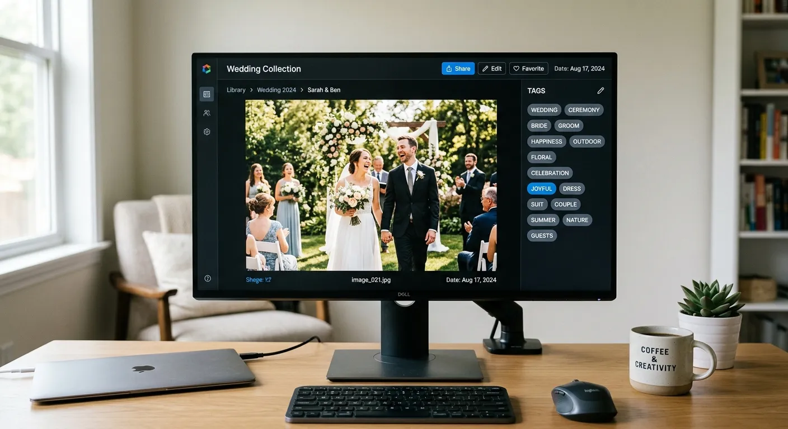

For many gig-based creatives, hard drives become digital graveyards filled with thousands of incredible, unseen photos from past shoots. Weddings, corporate seminars, trade shows, and local concerts generate massive amounts of visual content. Once the client receives their gallery, these high-quality images usually sit dormant, completely stripped of their earning potential.

This dormant content represents a massive missed opportunity for passive income. Many creatives are finally waking up to the reality that these archives hold immense value for stock photography buyers. The secret to unlocking this revenue stream lies in making these images discoverable. This is exactly why event photographers boost microstock sales with ai tags.

By utilizing advanced metadata generation tools, professionals are transforming their archives into profitable assets. Platforms like Meita.ai handle the heavy lifting of keyword generation, allowing creators to focus on shooting rather than tedious data entry. In this guide, we will explore how artificial intelligence is revolutionizing the stock photography workflow, helping you maximize the earning potential of every event you shoot.

The Untapped Potential of Event Photography in Microstock
----------

Event photography naturally produces highly authentic, candid imagery that modern brands crave. Gone are the days of stiff, perfectly posed models smiling awkwardly at a camera. Advertisers, bloggers, and corporate designers are actively searching for real people interacting in genuine environments.

### Repurposing Your Existing Portfolio ###

Most professional photographers capture hundreds of surplus images during a standard event. These "B-roll" shots might not make the final client cut, but they are absolutely perfect for stock libraries. A simple shot of empty chairs at a seminar or a close-up of a customized table setting holds significant commercial value.

Instead of letting these files gather digital dust, smart creatives are uploading them to platforms like Adobe Stock and Shutterstock. The key is ensuring these images are properly categorized so buyers can actually find them. Without accurate descriptions, even the most stunning corporate event photo will remain buried in search results.

### High Demand for Authentic Real-World Assets ###

Modern marketing relies heavily on relatability, which drives the demand for authentic event imagery. When a company needs a photo for an article about networking, they want a picture that feels like a genuine conference. Your raw, documentary-style event photos perfectly fill this market gap.

This authenticity extends to weddings, parties, and cultural festivals as well. Lifestyle brands are constantly hunting for realistic celebrations to feature in their campaigns. By tapping into your event archives, you are providing exactly what these high-paying buyers are actively searching for.

### Overcoming the Metadata Bottleneck ###

The primary reason photographers abandon microstock is the sheer tediousness of the keywording process. Manually describing hundreds of images from a single event is a mind-numbing task that drains creative energy. It is a massive bottleneck that prevents massive portfolios from ever seeing the light of day.

This is precisely where technology bridges the gap between effort and profit. Savvy event photographers boost microstock sales with ai tags because it completely eliminates this frustrating bottleneck. By automating the metadata process, you can upload massive batches of event photos in a fraction of the time.

Why Manual Keywording is Holding Back Your Earnings
----------

If you are still typing out keywords by hand, you are actively losing money. The stock photography market is a numbers game, requiring consistent, high-volume uploads to maintain steady revenue. Manual keywording simply cannot keep up with the volume of content a busy event photographer produces.

### The Time-Consuming Nature of Manual Tagging ###

Think about the time it takes to accurately keyword a single image of a corporate keynote speaker. You have to brainstorm descriptive words, conceptual themes, and technical terms while checking your spelling. If this takes just three minutes per photo, processing a batch of two hundred images becomes a multi-day ordeal.

Your time as a professional is far too valuable to be spent doing basic data entry. Every hour spent agonizing over metadata is an hour you could spend marketing your business or shooting a new gig. This traditional workflow is simply not sustainable for anyone looking to scale their passive income.

### Missing the Mark on Buyer Search Intent ###

Humans are inherently biased when describing their own creative work. A photographer might focus heavily on the camera techniques used, tagging words like "bokeh," "shallow depth of field," or "golden hour." However, the corporate buyer is likely searching for concepts like "leadership," "business communication," or "public speaking."

When your tags do not align with buyer intent, your photos will not sell. To [avoid generic microstock keywords](https://meita.ai/blog/avoiding-generic-keywords-in-microstock-strategies-for-specificity-and-uniqueness), you need an objective system that understands market trends. AI systems are trained on actual search data, ensuring your images are tagged exactly how buyers search for them.

### Leaving Money on the Table with Generic Tags ###

Another common pitfall of manual tagging is keyword fatigue. After tagging fifty images from a wedding, photographers often resort to copying and pasting the same broad terms across the entire batch. This leads to generic labeling that fails to capture the unique selling points of individual photos.

Generic tags throw your images into highly saturated search pools where they will never rank. A photo labeled simply "party" competes with millions of other images. Conversely, a highly specific AI-generated string of tags ensures your photo ranks for niche, low-competition searches.

How AI Transforms the Keywording Workflow
----------

Artificial intelligence has fundamentally changed the landscape of digital asset management. Tools like Meita.ai use advanced vision models to analyze your photos just like a human buyer would. This technology sees beyond simple objects, recognizing complex concepts, emotional tones, and commercial themes.

### Lightning-Fast Batch Processing ###

The most immediate benefit of an AI metadata generator is the sheer speed of execution. You can drag and drop an entire folder of event photos into Meita.ai and have them fully keyworded in minutes. The system simultaneously processes titles, descriptions, and up to fifty highly relevant keywords per image.

This rapid processing completely changes the economics of microstock photography. What used to take a week of dedicated desk work can now be accomplished during your morning coffee. By accelerating your workflow, you can drastically increase the volume of your portfolio.

### Generating Highly Contextual Labels ###

Modern AI doesn't just list objects; it understands the context of a scene. If you upload a photo of two professionals talking over coffee at a seminar, the AI recognizes the business context. It will automatically generate conceptually rich tags like "networking," "collaboration," "B2B," and "corporate strategy."

This level of contextual understanding is why event photographers boost microstock sales with ai tags so effectively. The AI connects the visual elements to the abstract concepts that advertisers are looking for. Utilizing [AI predictive keyword research microstock strategies](https://meita.ai/blog/beyond-basic-suggestions-using-ai-for-predictive-microstock-keyword-research) ensures you are always one step ahead of buyer demands.

### Seamless Integration with Agencies Like Adobe Stock ###

The best AI tagging platforms are designed specifically for the microstock ecosystem. Meita.ai formats your metadata exactly how major agencies like Adobe Stock and Shutterstock require it. It embeds the generated titles and keywords directly into the EXIF data of your JPEG files.

This means that when you upload your files to the agency portal, all the data populates automatically. There is no need to copy and paste text between different windows. This seamless integration ensures your files are instantly ready for submission, streamlining your path to profit.

Comparing Manual vs AI Metadata Generation
----------

To truly understand the impact of this technology, we must look at the data. Let's compare the traditional manual keywording process with an AI-driven workflow powered by Meita.ai. The differences in speed, accuracy, and overall profitability are staggering.

|   Feature / Metric   |       Manual Keywording        |       Meita.ai Generation        |
|----------------------|--------------------------------|----------------------------------|
| **Processing Speed** |     2-5 minutes per image      |     Seconds for bulk batches     |
|**Keyword Relevancy** |Prone to human bias and fatigue |  Data-driven and buyer-focused   |
|**Conceptual Tagging**|Often limited to literal objects|Recognizes deep abstract concepts |
|**Formatting & EXIF** | Requires tedious copy/pasting  |  Automatic embedding into files  |
|   **Scalability**    |   Very low, leads to burnout   |Unlimited, perfect for high volume|

### Time Investment and Efficiency Metrics ###

The table clearly illustrates that manual keywording is a severe time drain. Spending hours on metadata limits the amount of content you can actually produce and submit. Every moment saved by using an AI generator is a moment you can reinvest back into your core photography business.

With AI, the time investment shifts from data entry to simple review and approval. You become an editor of your metadata rather than the sole creator of it. This efficiency is the cornerstone of building a massive, profitable microstock portfolio.

### Keyword Quality and Search Relevance ###

Quality is just as important as speed when it comes to metadata. Manual tagging often misses crucial secondary keywords that buyers use in long-tail searches. AI tools meticulously scan every pixel to ensure no marketable detail is overlooked.

By utilizing comprehensive, AI-generated tags, your images appear in a much wider variety of search queries. This increased visibility directly translates to a higher frequency of downloads. More downloads push your images higher in the agency algorithms, creating a snowball effect of continuous sales.

### Overall Return on Investment ###

Investing in a platform like Meita.ai yields an incredible return on investment for event shooters. The minimal cost of the software is quickly eclipsed by the revenue generated from previously dormant photos. You are essentially monetizing digital waste from your past client gigs.

When you factor in the value of your time, AI tagging becomes an absolute necessity. You are no longer trading hours for pennies in the stock market. Instead, you are building a scalable passive income engine that works around the clock.

Actionable Strategies to Maximize Your Earnings
----------

Having the right tools is only half the battle; applying them strategically guarantees success. Event photography offers unique opportunities if you know how to frame and tag your shots for the commercial market. Let's explore some proven techniques to elevate your stock photography game.

### Focusing on Commercial Value ###

Not every event photo makes a good stock image. A tight shot of the bride's uncle eating cake is likely too personal for commercial use. However, a beautifully lit wide shot of the wedding reception venue is highly versatile for wedding planners and magazines.

When shooting events, intentionally take a few moments to capture generic, highly usable B-roll. Focus on details like catering setups, generic technology use, and unidentifiable crowds. These commercially viable shots are precisely how event photographers boost microstock sales with ai tags.

### Anticipating Seasonal Event Trends ###

The demand for event photography heavily fluctuates with the calendar year. Corporate kickoff images sell best in January, while wedding imagery peaks during the spring and summer months. Understanding these cycles allows you to upload your archives at the exact moment buyers need them.

You can supercharge this approach by targeting [seasonal microstock keywords](https://meita.ai/blog/seasonal-trending-microstock-keywords-capitalizing-on-timely-opportunities-with-ai) ahead of major holidays. Upload your corporate holiday party photos in October to catch the early wave of magazine editors. Meita.ai will help you ensure these seasonal themes are perfectly captured in your metadata.

### Analyzing What the Competition Does Right ###

Success in microstock requires paying attention to the top sellers in your specific niche. Look at the highest-ranking corporate event photos on Adobe Stock and study their composition and color grading. Understanding what buyers are currently downloading helps you select the best images from your own archives.

You can also use [competitor keyword analysis](https://meita.ai/blog/competitor-keyword-analysis-for-microstock-outranking-the-competition-with-ai) to find out which tags are driving traffic. AI tools can help identify gaps in the market where your specific style of event photography can shine. This analytical approach ensures your portfolio is always optimized for maximum visibility.

Expert Tips for Optimizing Your Event Images
----------

To truly master the microstock market, you need a streamlined system that prioritizes both legal safety and discoverability. Follow these expert tips to ensure your event photos are ready for prime time.

* **Secure Model Releases Early:** Always try to get a blanket model release signed for corporate events or private parties. Commercial buyers pay a premium for fully released imagery featuring recognizable faces.
* **Utilize Editorial Licenses:** If you cannot get a model release for a public concert or festival, submit the images under an editorial license. News outlets and bloggers constantly need unreleased editorial event coverage.
* **Remove Logos and Branding:** For commercial submissions, spend time cloning out visible brand names on microphones, clothing, or event banners. Clean, unbranded images are much more versatile for advertisers.
* **Leave Negative Space:** Ad agencies love event photos that have empty wall space or blurred backgrounds. This negative space provides the perfect canvas for them to drop in their own text and logos.
* **Batch Process with Meita.ai:** Never tag images one by one. Organize your event photos into cohesive folders and let Meita.ai generate the metadata for the entire batch simultaneously.
* **Build a Keyword Strategy:** Do not just rely on random uploads. Develop a [profitable microstock keyword strategy](https://meita.ai/blog/mastering-microstock-keywords-the-ultimate-guide-to-selling-more-with-ai) that targets specific buyer demographics for your niche.
* **Upload Consistently:** Microstock algorithms favor contributors who upload regularly. Drip-feed your newly AI-tagged event photos over several weeks to maintain a strong presence on the platform.

Frequently Asked Questions about event photographers boost microstock sales with ai tags
----------

### How do event photographers boost microstock sales with ai tags? ###

They use AI tools to rapidly generate highly accurate, conceptually rich metadata for their massive archives of event photos. This automated process makes their images far more discoverable to buyers while saving hours of manual data entry. Ultimately, better visibility leads directly to increased download volume and higher royalty payouts.

### Can I sell wedding photos on microstock platforms? ###

Yes, wedding photography is incredibly popular on stock platforms for lifestyle blogs, magazines, and event planners. Just ensure you have model releases for recognizable faces if you intend to sell them commercially. Detail shots like rings, dresses, and venue setups sell exceptionally well without needing releases.

### Do I need model releases for event photography? ###

If you want to sell the images for commercial use (advertising, marketing), you absolutely need signed model releases for recognizable people. If you do not have releases, you can still sell the photos as "Editorial Use Only," which are used by news outlets and documentaries.

### What types of events sell best on Adobe Stock? ###

Corporate conferences, trade shows, and business networking events are consistently top sellers due to high corporate marketing budgets. Diverse, candid lifestyle events like local cultural festivals and authentic celebrations are also in very high demand.

### How does an AI metadata generator like Meita.ai work? ###

Meita.ai uses advanced machine learning vision models to scan the pixels of your uploaded image. It recognizes objects, settings, emotions, and conceptual themes, instantly translating them into agency-approved titles and keywords. This data is then embedded directly into your file for seamless uploading.

### Will AI keywording actually save me money? ###

It saves you massive amounts of time, which translates directly to money for a working professional. Instead of spending ten hours a week typing keywords, you can spend that time shooting new paid gigs or marketing your business. It also increases your sales by providing better search visibility.

### Should I upload my event images as editorial or commercial? ###

Commercial images generally earn higher royalties and are purchased more frequently, making them the ideal choice when you have model and property releases. However, if you shoot public events, concerts, or protests without releases, editorial is your only viable path. Both options can be highly profitable with the right AI tags.

### Can AI identify specific objects in my event photos? ###

Yes, advanced AI models can identify specific photography equipment, catering setups, instruments, and architectural details within your event shots. It captures both the broad themes (like "celebration") and the minute details (like "champagne flute"). This comprehensive tagging strategy captures all types of buyer search intents.

### Are AI keywords better than manual ones? ###

In almost all cases, yes. AI eliminates human bias, prevents keyword fatigue, and ensures your images are tagged based on actual market search data. It consistently provides a more thorough and commercially relevant set of tags than a human can generate manually.

Conclusion
----------

Unlocking the hidden revenue in your hard drives doesn't have to be a miserable, time-consuming chore. The digital landscape has evolved, and the tools available to creators have never been more powerful. We have clearly seen how event photographers boost microstock sales with ai tags by eliminating the friction of manual data entry. By treating your past event shoots as valuable commercial assets, you can build a robust portfolio that generates passive income long after the client gallery has been delivered.

Now is the perfect time to modernize your workflow and let technology handle the heavy lifting. Stop letting your beautiful, authentic event photography go to waste simply because you dread the keywording process. Head over to Meita.ai today to automate your metadata generation, perfectly optimize your portfolio, and start earning what your images are truly worth on global microstock platforms.
