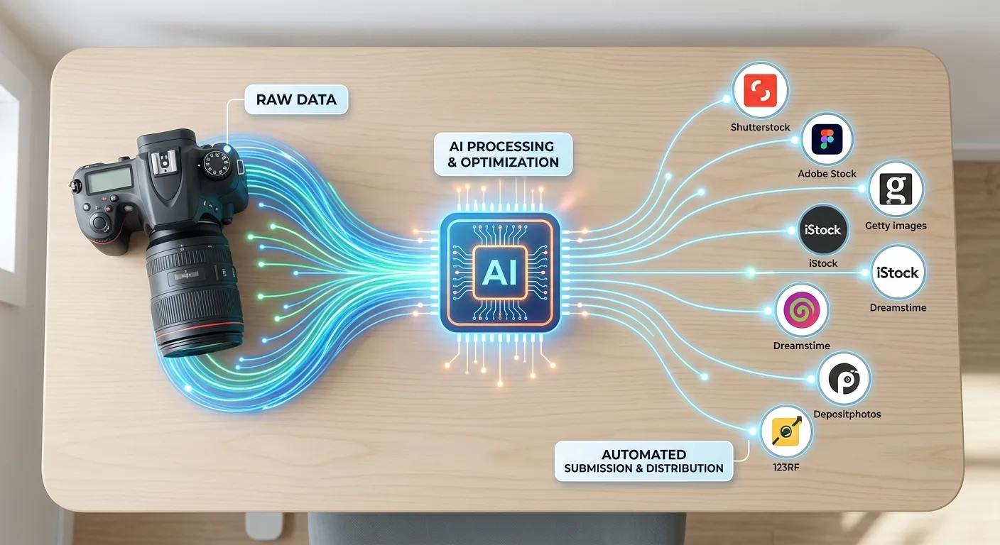

Starting out in the competitive world of microstock photography can feel overwhelming, especially when managing metadata. The future of image seo ai tagging for new photographers changes this by replacing hours of tedious data entry with smart, automated systems. You no longer have to guess what buyers are typing into Adobe Stock or Shutterstock. Instead, modern technology does the heavy lifting for you.

By embracing artificial intelligence, contributors can focus more on taking stunning photos and less on typing keywords. This technology analyzes your visuals instantly to generate highly relevant tags, titles, and descriptions. Automated software ensures that your assets are highly discoverable without the headache of manual brainstorming.

In this article, we will explore how these automated tools work and why they are essential for growing your portfolio. We will uncover the massive benefits of machine learning in search optimization. Let's dive into how platforms like meita.ai can help you outrank the competition and boost your passive income.

The Evolution of Automated Image Search Optimization
----------

### Moving Beyond Manual Keyword Entry ###

For years, stock contributors spent countless hours manually typing descriptions for every single photo. This tedious process often led to severe creative burnout and inconsistent search rankings. Photographers had to brainstorm dozens of terms, hoping they aligned with what art directors actually needed. Fortunately, the industry is experiencing a massive shift toward automation.

Today, manual entry is rapidly becoming a thing of the past for serious contributors. Smart algorithms now evaluate visual elements in milliseconds, extracting accurate data without human error. This shift is incredibly valuable for beginners trying to build large portfolios quickly. Using advanced tools means your uploads hit the marketplace faster than ever.

Transitioning away from manual data entry frees up vital creative energy. Instead of staring at a blinking cursor, you can plan your next profitable photoshoot. The microstock landscape rewards volume and consistency, both of which are easier to achieve when metadata is automated.

### How Computer Vision Transforms Metadata ###

Computer vision is the driving force behind modern auto-keywording tools. It allows software to "see" and understand the contents of an image much like a human would. From identifying specific objects to recognizing emotions and lighting styles, the technology is remarkably precise. This deep visual understanding ensures no detail is left out of your tags.

When a platform like meita.ai analyzes your shot, it detects nuanced elements that a human might overlook. For example, it can recognize the specific breed of a dog or the architectural style of a building in the background. These hyper-specific tags are exactly what buyers use to find niche content. Better recognition directly leads to more accurate search placements.

Furthermore, computer vision understands context and composition. It knows the difference between a blurry background and a deliberate depth-of-field effect. Translating these technical photography terms into searchable keywords makes your assets highly appealing to professional designers.

### Predicting Buyer Intent in Microstock ###

Search engine optimization is no longer just about describing what is physically in the frame. The true future of image seo ai tagging for new photographers lies in predicting why a buyer wants the image. Are they looking for a corporate background or a lively lifestyle banner? AI bridges the critical gap between literal descriptions and commercial concepts.

By analyzing millions of past searches, artificial intelligence identifies trending concepts and commercial needs. This means your metadata will seamlessly include emotional and conceptual tags like "teamwork" or "sustainability." These are the highly profitable search terms that drive significant licensing revenue.

If you want to dive deeper into this predictive technology, optimizing your workflow is key. Check out our comprehensive guide on [AI predictive keyword research microstock strategies](https://meita.ai/blog/beyond-basic-suggestions-using-ai-for-predictive-microstock-keyword-research) to learn how forecasting trends can skyrocket your downloads.

Key Benefits of Artificial Intelligence in Stock Photography
----------

### Saving Hours on Tedious Metadata Work ###

Time is money, especially when you are building a microstock portfolio from scratch. The traditional workflow required spending almost as much time keywording as shooting and editing. This severe bottleneck prevented many talented creators from scaling their businesses effectively. Now, automated systems can process massive batches of images in minutes.

With a robust tool like meita.ai, you simply upload your batch and watch the metadata generate instantly. This reclaimed time can be reinvested into mastering your editing skills or scouting new locations. The faster you can get your polished content online, the sooner it can start generating passive income.

Speed to market is a massive competitive advantage in stock photography. When a new visual trend emerges, the photographers who upload relevant content first win the most sales. Automated tagging ensures you are always ahead of the curve.

### Unlocking Hidden Niche Markets Quickly ###

One of the biggest struggles for beginners is figuring out which keywords actually drive microstock sales. It is easy to use generic terms, but generic terms face the highest competition on agency platforms. The future of image seo ai tagging for new photographers helps you easily discover untapped, low-competition niches. The software suggests highly specific related keywords you probably never considered.

For instance, instead of just tagging "coffee," an AI might suggest "flat lay morning espresso" or "barista pouring latte art." These long-tail keywords connect you directly with buyers who know exactly what they want. Niche buyers are often willing to pay premium prices for the exact right shot.

AI essentially acts as your personal market research assistant, revealing lucrative opportunities hidden within your existing portfolio. Over time, dominating these smaller niches leads to a highly stable, diversified income stream.

### Higher Ranking on Adobe Stock and Shutterstock ###

Stock photo agencies use complex search algorithms to determine which images appear on the first page. These algorithms strongly favor assets with complete, accurate, and spam-free metadata. If your tags are irrelevant or repetitive, the algorithm will actively penalize your portfolio's visibility. AI ensures your metadata strictly follows all agency guidelines.

Meita.ai specifically formats your keywords to meet the exact technical requirements of major agencies like Adobe Stock. By providing the perfect balance of broad concepts and specific terms, your images become hyper-relevant to search queries. Increased relevance directly leads to higher click-through rates.

As your click-through and conversion metrics improve, the algorithms take notice. Over time, agencies will consistently reward your high-performing content with premium search placements. This snowball effect is how successful contributors build sustainable businesses.

AI vs Manual Keywording in Stock Photography
----------

### Speed and Efficiency Differences ###

The most obvious contrast between manual tagging and artificial intelligence is sheer processing speed. A human might take three to five minutes to properly keyword, title, and describe a single image. Multiply that by a weekend shoot of two hundred photos, and you are looking at days of tedious administrative work.

In stark contrast, automated systems handle the exact same workload in mere seconds. This rapid processing allows contributors to upload massive, diverse catalogs consistently. Consistency is a known ranking factor on almost every major microstock platform.

When you automate the metadata generation, you eliminate the biggest hurdle to maintaining a regular upload schedule. You never have to leave profitable images sitting idle on your hard drive because you dread the keywording process.

### Accuracy and Relevance in Search Results ###

Humans are naturally prone to bias and mental fatigue, which heavily affects the quality of manual tagging. After typing descriptions for hours, you might start taking shortcuts or reusing the same generic words. This inevitably leads to poor search relevance and lost sales opportunities.

The future of image seo ai tagging for new photographers solves this fatigue problem completely. Machine learning algorithms maintain absolute consistency from the first photo to the ten-thousandth. They objectively analyze every pixel to provide accurate, unbiased keywords every single time.

This incredibly high level of precision ensures your images match the exact search intent of potential buyers. When your tags accurately reflect the visual content, buyer satisfaction increases, leading to more regular downloads.

### Adapting to Changing Search Trends ###

Language and search trends evolve constantly in the fast-paced commercial photography space. A keyword or concept that was massively popular last year might be completely obsolete today. It is nearly impossible for a solo creator to track these shifting market dynamics manually.

Smart keywording tools, however, continuously update their databases based on real-time global market data. Platforms like meita.ai are constantly learning from successful microstock trends across various industries. They effortlessly adapt to new industry buzzwords and commercial concepts automatically.

This automated learning keeps your newly uploaded portfolio fresh and perfectly aligned with current buyer demands. You can trust that the keywords applied to your images are relevant for today's specific market needs.

|    Feature Comparison     |          Manual Keywording Workflow          |         AI Metadata Tagging (Meita.ai)          |
|---------------------------|----------------------------------------------|-------------------------------------------------|
|   **Processing Speed**    |            3-5 minutes per image             |        Seconds for entire large batches         |
|   **Keyword Accuracy**    |   Prone to human error, bias, and fatigue    |     Highly precise computer vision analysis     |
|**Market Trend Adaptation**|     Requires continuous manual research      |   Updates automatically via machine learning    |
|  **Cost Effectiveness**   |  High time investment, lost shooting hours   |   Extremely high ROI and massive time savings   |
|  **Conceptual Tagging**   |Often limited to literal physical descriptions|Identifies complex, lucrative commercial concepts|

Building a Winning Microstock Strategy with Meita AI
----------

### Streamlining Your Agency Uploads ###

Success in microstock requires a seamless, highly efficient workflow from your camera straight to the marketplace. Uploading to multiple agencies often means dealing with different metadata requirements, character limits, and formats. This fragmentation can quickly become a logistical nightmare for eager beginners.

Using a dedicated AI platform centralizes this entire administrative process. With meita.ai, you generate your titles, descriptions, and tags in one highly convenient dashboard. The software automatically handles the heavy lifting of organizing your data.

You can then export your data perfectly formatted for major agencies without any extra tweaking. You no longer have to worry about missing tags or rejected files due to frustrating formatting errors. It is the ultimate tool for streamlining your worldwide distribution pipeline.

### Leveraging Predictive AI Features ###

The future of image seo ai tagging for new photographers is heavily focused on accurate market prediction. It is not just about tagging what is currently popular, but anticipating what global buyers will need next season. Predictive models analyze vast amounts of historical data to forecast upcoming visual trends.

This incredible foresight gives you a massive head start on producing in-demand content before the market saturates. By utilizing these advanced features in meita.ai, you can strategically plan your photoshoots around high-value concepts. You shoot exactly what the market will want to buy.

If the AI predicts a massive surge in demand for remote healthcare images, you can produce and upload them immediately. Being first to market with perfectly tagged images practically guarantees maximum visibility and long-term sales.

### Enhancing Portfolio Searchability ###

Every single image you upload is a digital asset that needs to be easily discoverable by art buyers. If your portfolio is poorly tagged, it is essentially invisible to the people trying to pay you. Artificial intelligence ensures that every single asset reaches its absolute maximum discoverability potential.

It covers all necessary bases, from broad category terms down to ultra-specific technical photography details. As you continue to use meita.ai, your overall portfolio health improves dramatically in the eyes of the search algorithms. Agencies actively recognize and promote contributors who consistently provide high-quality, trustworthy metadata.

This heightened trust means that even your older, well-tagged images will continue to generate steady passive income. A fully optimized portfolio is a powerful engine for recurring microstock revenue.

Expert Tips for Maximizing Your Portfolio Visibility
----------

Mastering the future of image seo ai tagging for new photographers requires a smart blend of technology and strategy. While AI gracefully handles the heavy lifting, your creative input still matters immensely. Here are some actionable, expert strategies to get the absolute most out of your metadata tools:

* **Review Before Exporting:** Always do a quick visual scan of the AI-generated keywords before finalizing. While platforms like meita.ai are incredibly accurate, removing any mildly irrelevant tags ensures you maintain a pristine, spam-free account.
* **Prioritize Concept Over Subject:** Ensure your tags include powerful emotional or conceptual terms. Words like "determination," "tranquility," or "innovation" often sell significantly better than literal descriptions of objects.
* **Use Natural Language Titles:** Avoid aggressively stuffing keywords into your main titles. Write clear, descriptive sentences that sound like they were crafted by a human, letting the AI handle the dense keyword lists separately.
* **Batch Similar Images:** When processing your metadata, upload similar images together in batches. This smart practice helps the AI recognize the recurring themes in your shoot, generating a much more cohesive set of tags.
* **Stay Updated on Agency Rules:** Every microstock agency has slight variations in their rules regarding metadata and spam. Let meita.ai beautifully format the tags, but always keep yourself informed on the latest contributor guidelines.
* **Leverage Location Data:** If your images feature specific landmarks or recognizable landscapes, ensure the AI includes precise geographical tags. Travel and lifestyle buyers frequently use specific locations to filter search results.

Following these professional best practices will quickly elevate your portfolio from amateur to highly competitive. The perfect combination of your creative eye and AI-driven metadata is the ultimate recipe for lasting microstock success.

Frequently Asked Questions about future of image seo ai tagging for new photographers
----------

### What is AI tagging in photography? ###

AI tagging uses advanced computer vision and machine learning to automatically analyze an image and generate descriptive keywords. It accurately identifies objects, colors, commercial concepts, and human emotions without requiring tedious manual data entry. This technology dramatically helps photographers optimize their visual assets for search engines quickly.

### Why is metadata important for new microstock contributors? ###

Metadata acts as the critical bridge between your creative photograph and the buyer's search query. Without accurate tags, titles, and descriptions, your images will simply not appear in agency search results. High-quality metadata directly translates to higher platform visibility and significantly more sales.

### Can AI replace manual keywording entirely? ###

Yes, modern AI tools like meita.ai are incredibly sophisticated and can handle the entire keywording process flawlessly. While a rapid human review is always recommended, the AI generates highly accurate, comprehensive metadata in seconds. It completely eliminates the exhausting need for manual keyword brainstorming.

### Will using automated tags improve my Adobe Stock sales? ###

Using automated, highly relevant tags absolutely improves your search ranking on competitive platforms like Adobe Stock. When your images are properly optimized, they appear on the first page in front of more potential buyers. Increased exposure naturally leads to a much higher conversion rate and better overall sales.

### How does computer vision recognize abstract concepts? ###

Computer vision algorithms are meticulously trained on millions of images and their corresponding commercial search data. By recognizing specific visual patterns, distinct lighting, and subtle human expressions, the AI can intelligently infer abstract concepts. This allows it to generate lucrative conceptual tags like "leadership" or "grief" accurately.

### Is AI tagging safe for my microstock accounts? ###

Yes, using professional platforms like meita.ai is completely safe and widely encouraged for ambitious microstock contributors. The AI is specifically designed to generate highly relevant, spam-free keywords that strictly comply with agency guidelines. It actively prevents accidental keyword spamming that could otherwise hurt your account standing.

### How much time does auto-keywording actually save? ###

Auto-keywording can easily save busy photographers several hours per week, depending entirely on your upload volume. Processing a batch of 100 images manually could take hours of staring at a screen, while AI does it in less than a minute. This massive time saving allows you to focus exclusively on creating more sellable content.

### Does the future of image seo ai tagging for new photographers apply to editorial images? ###

Yes, AI tools are incredibly useful for tagging fast-paced editorial content as well. They can easily recognize famous global landmarks, specific events, and public figures, making editorial captioning much faster. However, always ensure your editorial metadata meets the strict, factual guidelines of your chosen agency.

### Can I use AI tools for my personal photography website? ###

Absolutely. The immense SEO benefits of AI tagging extend far beyond traditional microstock agencies. You can use generated metadata to optimize the alt text and descriptions on your personal portfolio website. This directly improves your Google Image Search rankings and drives organic client traffic.

The landscape of stock photography is shifting rapidly, and the future of image seo ai tagging for new photographers is brighter than ever. By embracing automated metadata tools, you are no longer limited by the tedious, time-consuming process of manual data entry. You can finally focus your vital energy on what you do best: capturing incredible visuals that tell a compelling story. With machine learning ensuring your images are perfectly optimized for search engines, your portfolio can grow faster and reach more buyers across the globe.

If you are ready to stop guessing and start dominating search results, it is time to drastically upgrade your workflow. Leveraging an intelligent platform like meita.ai will completely transform how you manage and scale your microstock business. From extracting highly lucrative conceptual keywords to formatting your metadata perfectly for major agencies, meita.ai gives you the ultimate competitive edge. Start streamlining your uploads today and watch your passive stock photography sales reach exciting new heights.
