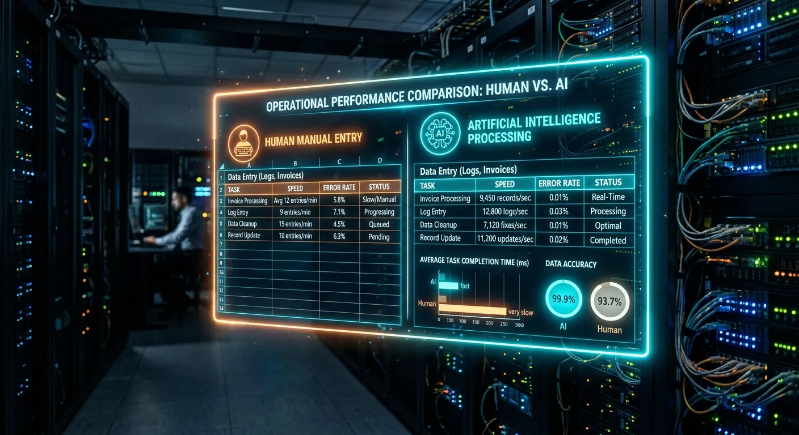

Imagine returning from a brilliant weekend photoshoot with thousands of stunning images on your memory cards. The creative work is done, but a daunting administrative mountain awaits you. Every single photo needs an optimized title, a descriptive caption, and up to fifty accurate keywords before it can make you money. For years, this tedious metadata entry has been the biggest bottleneck for stock photographers and digital artists.

Fortunately, the landscape of digital asset management is shifting rapidly. The future of seo ai metadata for bulk image processing is already here, completely transforming how creators prepare their portfolios for market. We are moving away from manual, soul-crushing spreadsheet entry into an era of intelligent, automated analysis. This technology is not just saving time; it is actually improving search rankings.

In this comprehensive guide, we will explore exactly how artificial intelligence is revolutionizing microstock tagging. You will learn how modern computer vision algorithms generate highly relevant keywords that capture buyer intent. We will also dive into the mechanics of bulk processing, showing you how to scale your portfolio faster than ever while maintaining perfect quality control.

The Evolution of Image SEO and Microstock
----------

To understand where the industry is heading, we first need to look at how image search engine optimization has evolved. In the early days of microstock platforms like Adobe Stock and Shutterstock, keywording was incredibly basic. Contributors would manually type in literal descriptions of what was happening in the frame. The focus was entirely on quantity rather than context or semantic relevance.

This manual approach created massive inefficiencies for high-volume shooters. A photographer might spend more time keywording an editorial batch than they spent actually shooting it. Furthermore, humans are naturally prone to repetitive fatigue. By the hundredth image, keyword quality would inevitably drop, leading to poor search visibility and lost sales opportunities.

### The Era of Manual Tagging Limitations ###

Manual tagging relied heavily on the creator's personal vocabulary and understanding of market trends. If a photographer didn't know the specific industry term for a business concept, their image simply wouldn't be found. Buyers searching for specific commercial concepts often missed great photos due to poor metadata optimization. This disconnect frustrated both buyers and sellers on major microstock platforms.

Additionally, manual keywording often led to accidental spamming. Contributors would copy and paste the same fifty keywords across an entire batch of mildly related images. Today, microstock agencies heavily penalize this behavior. Their search algorithms now demand highly specific, unique metadata for every single variation of an image.

### Transition to Automated Systems ###

The first wave of automated tagging tools offered minor relief but lacked true intelligence. These early systems functioned like simple dictionary matchers. If you typed "dog," the software might auto-fill "animal, pet, canine." While it sped up the process, it failed to understand the actual content, mood, or context of the photograph.

These early tools could not look at an image and distinguish between a "sad dog in a shelter" and a "happy dog playing in a sunny park." Consequently, contributors still had to spend hours manually adjusting the generated data. True automation required a system that could actually "see" and comprehend the visual data.

How Artificial Intelligence is Changing Metadata Creation
----------

Modern artificial intelligence has completely rewritten the rules of image optimization. Today's advanced vision models do much more than simply identify objects within a frame. They analyze lighting, mood, artistic style, and complex interactions between subjects. This deep understanding is exactly why the future of seo ai metadata for bulk image processing is so crucial for modern stock contributors.

AI does not suffer from creative fatigue. Whether it is processing the first image or the five-thousandth, the level of attention to detail remains exactly the same. By bridging the gap between human creativity and machine precision, artificial intelligence ensures your images speak the exact language that search engines and buyers use.

### Deep Learning and Image Recognition ###

Deep learning algorithms have been trained on billions of image-text pairs across the internet. When you upload a photo to a modern AI tool, the system references this massive neural network. It recognizes incredibly specific details, from the architectural style of a building to the specific breed of a cat. This results in hyper-accurate metadata that perfectly describes the asset.

Moreover, AI understands spatial relationships and actions. It knows the difference between a person "holding" a coffee cup and a person "spilling" a coffee cup. This nuanced understanding generates long-tail keywords that human taggers frequently overlook. These highly specific terms are exactly what corporate buyers use when searching for the perfect image.

### Contextual Keyword Generation ###

Search engine optimization relies heavily on context and relevance. Good AI doesn't just list what is in the picture; it lists what the picture represents. A photo of a seedling sprouting from a coin stack isn't just "plant" and "money." An intelligent system recognizes the underlying concepts of "financial growth," "investment," and "economic sustainability."

Conceptual keywords are highly valuable in the microstock industry. Advertising agencies and graphic designers constantly search for emotional or business concepts rather than literal objects. By automatically generating these conceptual tags, AI dramatically increases the commercial viability of your portfolio.

### Adapting to Visual Search Trends ###

The way buyers search for imagery is rapidly changing. Visual search engines and complex natural language queries are becoming the new standard. Buyers now type entire sentences into search bars, such as "diverse business team celebrating a success in a bright modern office." Your metadata needs to perfectly align with these conversational queries.

AI metadata generators are built on the same natural language processing models that power these search engines. This means the AI natively understands how to structure titles and descriptions to match modern search intent. It essentially reverse-engineers the buyer's search process to position your images exactly where they need to be.

Scaling Up: The Power of Bulk Processing Workflows
----------

Having brilliant AI is useless for a stock contributor if it takes five minutes to process a single image. The real magic happens when you combine artificial intelligence with high-speed bulk infrastructure. For creators managing tens of thousands of assets, the ability to process massive batches simultaneously is a game-changer.

This is where specialized platforms truly shine. The future of seo ai metadata for bulk image processing relies on distributed cloud computing. Instead of queuing images one by one, modern systems can deploy dozens of virtual workers to analyze your entire batch at the exact same time.

### Time Savings with Parallel Processing ###

Imagine trying to review 500 images manually; it would take an entire weekend. With parallel processing, multiple AI instances work on different images concurrently. Platforms using parallel AI workers can chew through massive uploads in a matter of minutes. This completely removes the keywording bottleneck from your production schedule.

For example, using a dedicated [bulk metadata generator](https://meita.ai/en-us/bulk-metadata-generator) allows you to harness up to 50 parallel AI workers. You simply drag and drop your batch, click a button, and watch as hundreds of titles, descriptions, and keyword lists populate instantly. You get hours of your life back for every single batch you shoot.

### Consistent Quality Across Large Portfolios ###

When humans process large batches, consistency inevitably suffers. You might keyword the first twenty photos beautifully, but by the end of the batch, you are taking shortcuts. AI maintains strict consistency across your entire portfolio. It applies the same rigorous analytical standards to image number 500 as it did to image number one.

This consistency builds a highly professional and searchable portfolio. Microstock algorithms reward portfolios that maintain high data quality across all submissions. Consistent, accurate tagging improves your overall contributor trust score, leading to better organic placement in search results.

### Seamless Export Integrations ###

Generating the data is only half the battle; getting it into the agency platforms is the other half. Modern AI tools understand the specific formatting requirements of different stock agencies. They automatically format the metadata so it perfectly aligns with Adobe Stock, Shutterstock, and Getty Images standards.

The standard method for bulk uploading is through CSV (Comma Separated Values) files. An advanced bulk processor allows you to review your AI-generated data, make quick global edits, and instantly export a perfectly formatted CSV. You simply upload this file alongside your images to the agency, completing the process in seconds.

Comparing Traditional and Automated Tagging Systems
----------

To truly grasp the impact of this technological shift, it helps to compare the different methods of metadata generation side-by-side. The gap between doing things manually and utilizing an intelligent AI platform is massive. The right tool doesn't just offer speed; it offers superior data structure.

Let's look at how manual entry, basic dictionary auto-taggers, and advanced AI systems like Meita.ai measure up against each other across key performance metrics. This breakdown clearly illustrates why top-tier stock contributors are abandoning older workflows entirely.

|       Feature/Metric       |           Manual Keywording           |        Basic Auto-Taggers         |                    Advanced AI (e.g., Meita.ai)                     |
|----------------------------|---------------------------------------|-----------------------------------|---------------------------------------------------------------------|
|    **Processing Speed**    |  Extremely slow (3-5 mins per image)  |Moderate (10-20 seconds per image) |Lightning fast (Seconds for entire bulk batches via parallel workers)|
|**Contextual Understanding**|    High (but prone to human bias)     |Very Low (Dictionary matching only)|      Extremely High (Understands concepts, actions, and mood)       |
|   **Keyword Relevance**    |   Inconsistent across large batches   |Often generates unrelated/spam tags|           Highly targeted and optimized for search intent           |
|    **Bulk Scalability**    |    Unscalable without hiring staff    | Often crashes with large batches  |              Easily handles 500+ images simultaneously              |
|   **Agency Acceptance**    |Good, but rejection risk for copy/paste|  High rejection rate due to spam  |            Excellent, formats to exact agency standards             |

As the table demonstrates, relying on manual entry or outdated auto-taggers puts you at a severe competitive disadvantage. Advanced AI offers the perfect balance of massive scalability and high-fidelity contextual understanding. It provides the quality of human analysis at the speed of modern computing.

Maximizing Microstock Earnings Through Smart Data
----------

Your beautiful photography cannot sell if buyers cannot find it. In the highly competitive microstock industry, search visibility is the ultimate currency. AI metadata tools are specifically designed to maximize this visibility by speaking the precise language of agency search algorithms.

Understanding how these algorithms prioritize data is key to increasing your earnings. They don't just look for matches; they look for relevance, order, and specificity. By aligning your workflow with these technical requirements, you ensure your images rank on the first page of buyer searches.

### Aligning with Agency Algorithms ###

Different agencies have different rules for how they process metadata. For instance, Adobe Stock places extremely heavy weight on the first ten keywords attached to an image. If your most important keywords are buried at the bottom of a list of fifty, your image will struggle to rank. Shutterstock, meanwhile, looks for conceptual breadth.

Modern AI systems automatically prioritize your keywords by relevance. The most critical, defining terms are placed at the absolute front of the list. If you are unsure how this works, you can try a [free AI metadata generator demo](https://meita.ai/en-us/demo) to see how intelligently the system orders search terms based on visual weight.

### Preventing Keyword Spam and Rejection ###

Microstock reviewers are ruthless when it comes to keyword spamming. Including terms like "Apple" or "iPhone" in an image of a generic smartphone will result in instant rejection. Similarly, adding the keyword "dog" to a picture of a cat just to capture more traffic is a direct violation of agency terms.

AI eliminates this risk by strictly analyzing the actual pixels of the image. It does not guess or try to manipulate search volumes with fake tags. It provides highly accurate, localized, and relevant tags that sail through agency review processes smoothly, keeping your account in perfect standing.

### Capturing Buyer Search Intent ###

Corporate buyers do not search for "person with laptop." They search for "remote worker analyzing data on laptop in modern home office." AI excels at generating these multi-word, descriptive phrases that capture exact buyer intent. These long-tail keywords have lower competition and higher conversion rates.

By filling your metadata with intent-driven phrases, you bypass the crowded generic search terms. Your images appear directly in front of buyers who have their credit cards out, ready to purchase exactly what you have shot. This targeted approach dramatically improves your overall download ratios.

Expert Tips for Optimizing Your Image Portfolios
----------

Even with the most powerful AI tools at your disposal, a strategic approach is required to maximize your microstock success. Simply generating the data is a great start, but understanding how to refine and deploy that data is what separates top earners from hobbyists. The future of seo ai metadata for bulk image processing heavily involves blending AI efficiency with smart creator strategies.

Here are several actionable tips to ensure your portfolio performs at its absolute best in crowded marketplaces:

* **Always Review Your First Batch:** When testing a new AI tool, manually review the first 10-20 images. Ensure the AI's "style" matches your specific niche before processing thousands of files.
* **Focus on the Title:** While keywords get a lot of attention, the image title (or description) is heavily weighted by search algorithms. Ensure your AI is generating descriptive, natural-sounding sentences.
* **Localize When Necessary:** If you shoot specific cultural events or localized landmarks, make sure to add those specific proper nouns manually if the AI defaults to broader terms.
* **Trust the Prioritization:** AI automatically puts the most relevant keywords first. Avoid the temptation to alphabetically sort your keywords, as this will destroy your ranking on platforms like Adobe Stock.
* **Keep Conceptual Tags:** Don't delete emotional or abstract keywords generated by the AI (like "freedom," "stress," or "innovation"). These are highly sought after by commercial designers.
* **Utilize CSV Workflows:** Stop uploading directly through web interfaces. Generate your data, export a CSV, and use FTP or agency bulk uploaders to save countless hours.
* **Refresh Old Portfolios:** Use AI to process and update the metadata on your older, poorly performing images. A fresh set of optimized keywords can breathe new life into stale assets.

Frequently Asked Questions about future of seo ai metadata for bulk image processing
----------

### What is AI metadata generation? ###

AI metadata generation uses advanced machine learning models to analyze the visual content of an image. It automatically creates accurate, SEO-optimized titles, descriptions, and keywords. This eliminates the need for manual data entry for photographers and digital creators.

### How does AI improve stock photo SEO? ###

AI improves SEO by providing highly specific, context-aware keywords that match actual buyer search intent. It naturally prioritizes the most important terms, helping images rank higher in microstock search algorithms. This leads to increased visibility and more potential sales.

### Can I process thousands of images at once? ###

Yes, modern platforms use parallel cloud computing to handle massive batches simultaneously. You can drag and drop hundreds or thousands of files into the system at once. The AI processes them concurrently, completing hours of work in just minutes.

### Will AI-generated keywords cause microstock rejections? ###

No, high-quality AI actually prevents rejections by eliminating irrelevant spam keywords. Because the AI strictly tags what is visually and conceptually present, the accuracy rate is incredibly high. This ensures compliance with strict agency metadata policies.

### Do I need to manually review AI metadata? ###

While AI is highly accurate, a brief skim is always recommended for quality assurance. You may occasionally want to add specific localized names or proprietary brand exclusions. However, the days of typing out fifty keywords from scratch are over.

### What file formats are supported for bulk exports? ###

Most advanced metadata platforms allow you to export your data directly into CSV formats. These CSV files are formatted to be universally compatible with major agencies like Adobe Stock, Shutterstock, and Alamy. You simply upload the file alongside your images.

### How does visual search impact image metadata? ###

Buyers increasingly use conversational, long-tail phrases to search for specific imagery. AI models are built on natural language processing, making them perfectly suited to generate data that matches these complex queries. This ensures your images surface for highly specific buyer requests.

### Is AI better than hiring human keywording services? ###

AI is significantly faster, highly scalable, and far more cost-effective than human keywording services. It also maintains perfect consistency across thousands of images without suffering from fatigue. For bulk microstock processing, AI is now considered the superior industry standard.

Conclusion
----------

The days of staring blankly at a spreadsheet and desperately trying to think of fifty unique keywords are officially behind us. As search algorithms become more sophisticated, the demand for highly accurate, context-rich metadata has never been higher. Embracing the future of seo ai metadata for bulk image processing is no longer an optional luxury; it is a fundamental requirement for anyone looking to seriously compete in the modern microstock industry. By leveraging automated, intelligent tools, you can ensure your hard work gets the search visibility and sales it truly deserves.

Now is the perfect time to optimize your workflow and reclaim your creative hours. Instead of acting as an administrative data-entry clerk, let artificial intelligence handle the heavy lifting while you focus on what you do best: creating stunning visual content. Take the next step in scaling your stock photography business and try a dedicated AI solution today. Transform your chaotic batches into perfectly organized, high-ranking portfolios in a matter of minutes.
