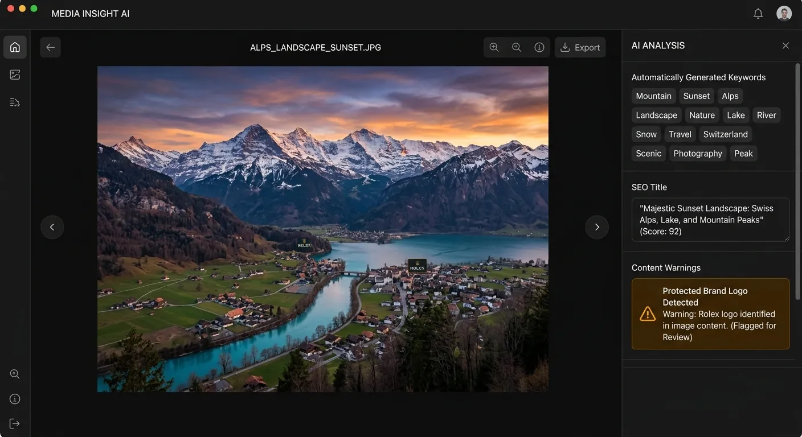

Are your stunning stock photos getting lost in a sea of mediocre images? You can spend hours capturing the perfect shot, but without the right metadata, buyers will never find your work. For years, microstock contributors have dreaded the tedious process of manual keywording, often spending more time typing tags than actually shooting photos.

The landscape of stock photography has completely changed thanks to artificial intelligence. Today, discovering how a lightroom plugin maximize stock sales with ai tags is the smartest move a modern photographer can make. By automating your metadata workflow, you can drastically increase your portfolio's visibility on major agencies like Adobe Stock and Shutterstock.

In this comprehensive guide, we will explore how AI-driven keywording transforms your editing process from a chore into a revenue-generating machine. You will learn how integrating tools like [Meita.ai](https://meita.ai/en-us/ai-keywording-tool) into your daily workflow can help you generate perfect titles, descriptions, and keywords in seconds.

Why Metadata is the Key to Microstock Success
----------

Stock photography is essentially a search engine optimization game. Buyers type specific phrases into the search bar, and the platform's algorithm delivers the most relevant results. If your photos lack the exact keywords buyers are using, your brilliant imagery remains invisible.

Accurate metadata bridges the gap between your creative vision and the buyer's commercial needs. When you understand the power of tagging, you unlock the true earning potential of your portfolio.

### The Hidden Power of Accurate Tagging ###

Every keyword attached to your photo acts as a digital signpost pointing buyers to your portfolio. High-quality tags describe not just the literal subjects in the frame, but also the abstract concepts, emotions, and underlying themes. A photo of a solitary tree isn't just a "tree"; it represents "growth," "resilience," and "environmental conservation."

Manual keywording often fails because human fatigue leads to missed conceptual tags. AI metadata tools excel at analyzing an image and suggesting these secondary, highly profitable keywords. Capturing both literal and conceptual terms ensures your photo appears in a wider variety of buyer searches.

### How Search Algorithms Rank Your Photos ###

Microstock agencies use complex algorithms to rank images. These search engines look closely at the relevance between your title, description, and keywords. If your metadata is cohesive and accurate, the algorithm boosts your image's search ranking.

However, search engines actively penalize keyword spamming. Adding irrelevant tags to artificially boost views will hurt your overall seller rating. This is where an AI solution shines, as it generates highly relevant, context-aware keywords that please both the algorithm and the buyer.

### The Cost of Manual Keywording ###

Time is a stock photographer's most valuable asset. Spending twenty minutes manually brainstorming tags for a small batch of photos represents a massive loss of potential income. That is time you could spend shooting, editing, or planning your next commercial session.

Furthermore, manual entry is prone to spelling errors and inconsistent formatting. A single typo can render a crucial keyword useless. Automating this process eliminates human error and accelerates your upload speed to platforms like Freepik, Dreamstime, and Getty Images.

Automating Your Workflow with AI Technology
----------

Artificial intelligence has revolutionized how we process digital assets. Modern computer vision models can "see" your photographs with astonishing accuracy, identifying objects, lighting conditions, and even specific artistic styles. Leveraging this technology is essential for high-volume contributors.

When you automate your keywording, you remove the biggest bottleneck in the stock photography pipeline. Let's look at how utilizing a lightroom plugin maximize stock sales with ai tags by streamlining your entire post-production routine.

### What an AI Tagging Plugin Does ###

An AI metadata plugin connects directly to your photo management software or operates as a seamless desktop companion. It scans your high-resolution images and uses advanced neural networks to generate rich, descriptive metadata instantly. This includes SEO-optimized titles and comprehensive keyword lists.

The best tools automatically rank these keywords by relevance. This is crucial because many stock agencies place heavier weight on the first ten tags. An intelligent plugin ensures your most powerful keywords are prioritized automatically.

### Connecting Editing Software to Stock Agencies ###

Your workflow shouldn't feel fragmented. The ideal setup allows you to edit a photo, generate its metadata, and export it directly to your target agencies. By writing AI-generated tags directly into the image's EXIF data, you ensure the metadata travels with the file wherever it goes.

When you upload these enriched files to Adobe Stock or Shutterstock, the agency's system instantly reads the embedded tags. You bypass the platform's clunky web interfaces entirely, allowing you to submit hundreds of photos with a single click.

### Meita.ai: Your Metadata Powerhouse ###

For photographers seeking the ultimate solution, [Meita.ai](https://meita.ai/affiliate) stands out as the premier AI microstock keyword tool. It generates flawless metadata for images, music, and videos right from your own computer, readying them for instant upload.

What sets Meita.ai apart is its intelligent auto-detection of intellectual property (IP) and brand names. It instantly flags potential trademark issues, saving you from frustrating agency rejections. Whether you are processing traditional photography or AI-generated art from Midjourney, Meita.ai scales with your creative output.

How a Lightroom Plugin Maximize Stock Sales With AI Tags Effectively
----------

Having access to AI tools is only half the battle; knowing how to integrate them into your daily workflow is what actually drives revenue. To truly see how a lightroom plugin maximize stock sales with ai tags, you need a systematic approach to batch processing.

By establishing a consistent routine, you can increase your weekly upload volume tenfold. More high-quality, perfectly tagged images in your portfolio mathematically guarantee higher monthly royalties.

### Selecting the Best Images for Batch Processing ###

AI tools work best when processing images with clear subjects and commercial intent. Before running your metadata generator, cull your Lightroom catalog aggressively. Select only the images that meet the high technical standards required by premium stock agencies.

Group similar images together before generating tags. If you have a series of photos from a corporate office shoot, processing them as a batch ensures consistent thematic tagging across the entire set, strengthening your portfolio's authority in that niche.

### Generating Titles and Descriptions Instantly ###

Stock agencies require descriptive, grammatically correct titles. Buyers often read the description to confirm the image meets their specific needs. AI engines excel at turning visual data into compelling, natural-sounding sentences.

When using an AI tool, review the generated titles to ensure they highlight the most important commercial aspects of the photo. A good title should answer the "who, what, when, where, and why" of the image in a single sentence.

### Reviewing and Refining AI Keywords ###

While AI is incredibly accurate, a quick human review adds the final polish. Scan the generated keyword list to ensure it captures the exact mood you intended to convey. Sometimes, an image might have a secondary story that the AI missed but your creative eye catches.

Remove any tags that feel like a stretch. Remember, accuracy is better than sheer volume. A tightly curated list of 35 highly relevant AI-generated keywords will always outperform a spammy list of 50 mediocre ones.

Comparing Traditional vs. AI Metadata Workflows
----------

To truly understand the impact of upgrading your process, it helps to see the numbers side-by-side. The difference between manual data entry and AI automation is staggering, particularly for full-time microstock contributors.

Below is a detailed comparison of how traditional workflows stack up against a modern workflow powered by an AI tool like Meita.ai.

|     Workflow Feature     |      Traditional Manual Workflow       |         AI-Powered Workflow (Meita.ai)          |
|--------------------------|----------------------------------------|-------------------------------------------------|
| **Time Spent per Image** |             3 to 5 minutes             |                 5 to 10 seconds                 |
|   **Keyword Accuracy**   |   Variable (prone to human fatigue)    |       Highly consistent and context-aware       |
|  **Conceptual Tagging**  |        Often missed or limited         |  Automatically generates deep conceptual ideas  |
| **IP & Brand Detection** | Requires manual inspection and memory  |Auto-detects trademarks and brand names instantly|
|**Batch Processing Scale**|   Exhausting for more than 20 images   |  Easily processes thousands of images in bulk   |
|   **Export Readiness**   |Requires manual copy-pasting to agencies| Embeds directly to EXIF for instant agency sync |

Expert Tips to Boost Your Portfolio Income
----------

Even with the most advanced AI at your fingertips, applying a little industry strategy will help you outpace the competition. Successful stock contributors treat their portfolios like a business, utilizing data to drive their creative decisions.

Implement these proven strategies alongside your AI tagging workflow to maximize your passive income and secure long-term royalty streams:

* **Target Micro-Niches:** Use AI to help identify hyper-specific keywords for niche subjects. Instead of just tagging "business," ensure your AI includes terms like "agile methodology," "fintech startup," or "remote collaboration."
* **Leverage Regional Terms:** If your photo was taken in a specific location, ensure local terms, landmarks, and cultural tags are included. Buyers often search for highly localized, authentic content.
* **Keep Synonyms Grouped:** Stock search engines love synonyms. Ensure your AI tool provides variations of your main subject (e.g., "dog," "canine," "pet," "puppy") to capture different buyer search habits.
* **Embrace AI for AI Art:** If you generate Midjourney or NanoBanana images, metadata is even more critical. Use a specialized tool to bulk-generate titles and tags that accurately describe your synthetic media while adhering to agency AI guidelines.
* **Audit Old Portfolios:** Don't just focus on new uploads. Use your AI metadata tool to analyze and re-tag older, underperforming images in your portfolio to give them a fresh boost in the search algorithms.
* **Monitor Agency Trends:** Keep an eye on the "trending searches" provided by Adobe Stock and Shutterstock. Incorporate these themes into your shoots, and use AI to ensure those trending keywords are applied perfectly to your new content.

Frequently Asked Questions about lightroom plugin maximize stock sales with ai tags
----------

### How does AI generate keywords for photos? ###

AI utilizes advanced computer vision algorithms to analyze the pixels in your image. It identifies objects, colors, actions, and overall mood, then cross-references this data with a massive language model to output highly relevant search terms.

### Can a lightroom plugin maximize stock sales with ai tags for beginners? ###

Absolutely. In fact, a lightroom plugin maximize stock sales with ai tags perfectly for beginners by removing the learning curve of metadata SEO. It ensures your very first uploads are tagged with the same professional quality as veteran contributors.

### Is AI keywording accepted by major stock agencies? ###

Yes, major agencies like Adobe Stock, Shutterstock, and Getty Images fully support and encourage accurate AI-generated keywords. As long as the tags are relevant to the image and not spammy, agencies prefer the rich data AI provides.

### What happens if the AI tags a trademarked brand? ###

Top-tier tools like Meita.ai include brand and IP detection features. If the AI spots a logo or protected design, it will flag it for you, allowing you to either remove the logo in post-production or submit the image as editorial content.

### Can I edit the AI-generated keywords before uploading? ###

Always. AI metadata tools provide a review interface where you can easily add, delete, or rearrange keywords before they are embedded into your image's EXIF data. You always retain full creative control over your metadata.

### Does AI keywording work for video and audio assets? ###

Yes! Advanced metadata platforms are capable of analyzing video clips and audio tracks to generate relevant titles and descriptions. This allows multimedia creators to streamline their entire microstock upload process across all file types.

### How many keywords should I attach to a stock photo? ###

Most agencies allow up to 50 keywords per image. However, the sweet spot is typically between 25 and 40 highly relevant tags. Focus on quality and accuracy rather than just trying to hit the maximum limit.

### Will AI tags overwrite my existing metadata? ###

This depends on your software settings. Most premium AI tagging tools allow you to append new AI-generated keywords to your existing manual tags, ensuring you never lose the metadata you have already created.

Mastering your metadata workflow is the definitive step toward building a highly profitable microstock portfolio. By eliminating the friction of manual data entry, you free yourself to focus entirely on the creative aspects of photography. You no longer have to guess which search terms will connect your art with paying clients across the globe.

Don't let your best photos sit idle in an invisible portfolio. Embrace the future of automated tagging and watch your monthly royalties climb. Try out Meita.ai today to experience firsthand how effortless keywording can be, and take your stock photography business to the next level.
