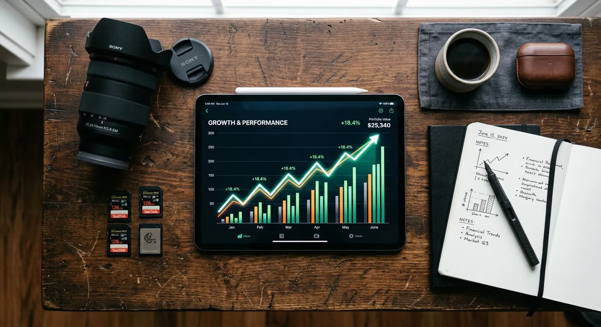

We have all experienced the deep frustration of uploading the exact same image to multiple stock photography agencies, only to watch it become a bestseller on one platform while completely failing to generate views on another. You might initially blame the quality of the image or the time of day you uploaded it, but the real culprit is usually much less obvious. The secret behind these massive discrepancies almost always comes down to subtle microstock keyword differences. Each marketplace utilizes a uniquely coded search algorithm designed to serve a highly specific type of buyer, meaning that a one-size-fits-all approach to metadata simply does not work anymore.

To truly succeed in today’s highly competitive licensing industry, contributors must evolve beyond basic tagging and develop a robust platform-specific keywording strategy. Understanding how varying search engines weight, sort, and display your metadata allows you to manipulate your portfolio's visibility to your advantage. If you want a foundational understanding before diving into these multi-agency tactics, checking out [Mastering Microstock Keywords: The Ultimate Guide to Selling More with AI](./mastering-microstock-keywords-the-ultimate-guide-to-selling-more-with-ai) is a fantastic starting point. Once you have the basics down, adapting those skills to individual agencies becomes your greatest competitive edge.

In this comprehensive guide, we will break down exactly how major agencies interpret your metadata differently. You will learn how to adapt your workflow to satisfy diverse algorithm requirements, avoid frustrating spam penalties, and ultimately maximize your licensing revenue across your entire distribution network. By the end of this article, you will know exactly how to tweak your tags to trigger more sales across the entire microstock ecosystem.

Defining a Platform-Specific Keywording Strategy
----------

### Why One Size Does Not Fit All ###

When you first begin selling photos online, the standard advice is to compile fifty highly relevant descriptive words and embed them into your JPEG’s IPTC data. While this bulk-tagging method is excellent for saving time, it completely ignores crucial microstock keyword differences. A tag that ranks your image on page one of a volume-heavy site might actually bury that same image on a curated marketplace. A platform-specific keywording strategy acknowledges that copying and pasting the exact same metadata across ten different websites is a recipe for missed opportunities. Instead, successful contributors tailor their core metadata lists to highlight the specific traits favored by each individual search engine.

### The Role of Search Intent Across Agencies ###

Buyer intent varies dramatically depending on the marketplace they choose to shop on. A graphic designer subscribing to a budget-friendly platform is often looking for literal, highly specific elements for immediate commercial use. Conversely, an advertising executive shopping on a premium tier site might search for conceptual themes like "financial freedom" or "corporate synergy." Recognizing these microstock keyword differences allows you to adjust your vocabulary accordingly. By leaning into literal descriptions for volume sites and conceptual tags for premium sites, your platform-specific keywording strategy directly aligns your images with the buyers most likely to license them.

### Adapting to Changing Algorithms ###

Search algorithms are living, breathing systems that undergo constant updates. What worked flawlessly two years ago might trigger a spam filter today. Some platforms are shifting toward artificial intelligence and semantic search, meaning they understand the context of your image without needing fifty exhaustive synonyms. Others still rely on exact-match text queries. Continuously monitoring these microstock keyword differences ensures your portfolio does not slowly decay in visibility. A truly effective platform-specific keywording strategy involves regularly auditing your top-selling assets and adjusting your templates to reflect the latest search engine updates rolled out by your primary distribution partners.

Understanding Major Agency Search Engines
----------

### Shutterstock's Volume-Based Search ###

Shutterstock remains one of the largest and most traditional search engines in the licensing industry. Historically, this platform has rewarded broad, comprehensive metadata, allowing contributors to use up to fifty tags to capture a wide net of search traffic. Here, microstock keyword differences manifest in the need for extensive synonyms and variations. If you are uploading an image of a dog, you should also include "canine," "puppy," "pet," and specific breed names. Shutterstock’s algorithm favors exact keyword matches combined with an image's historical download velocity. Therefore, casting a wider net with your vocabulary is generally a safe and effective tactic on this specific site.

### Adobe Stock's Visual AI Focus ###

In stark contrast, Adobe Stock places a massive emphasis on keyword order and artificial intelligence. Their search engine assigns heavy ranking weight to the first ten keywords attached to your file, assuming these are the most critical descriptors. Rearranging your tags to prioritize the main subjects before secondary background elements is a core component of a modern platform-specific keywording strategy. Furthermore, Adobe’s integration with Creative Cloud means their AI is exceptionally good at visually analyzing images. For a deeper dive into this specific engine, read about [Adobe Stock's Keyword Interpretation: Best Practices for AI-Assisted Tagging](./adobe-stock-s-keyword-interpretation-best-practices-for-ai-assisted-tagging) to master their relevancy scores. You do not need to stuff synonyms here; precision and order are what generate sales.

### Getty and iStock's Exclusive Vocabulary ###

Navigating Getty Images and iStock introduces an entirely different set of microstock keyword differences. These platforms utilize a highly controlled, proprietary vocabulary system known as ESP. Instead of allowing contributors to type whatever freeform text they want, tags must be selected from an approved, pre-defined dictionary. This system actively prevents keyword stuffing and forces contributors to be highly accurate. Your platform-specific keywording strategy for iStock must involve carefully selecting the exact right concept from their drop-down menus rather than relying on broad text entry. Understanding how to disambiguate terms—for example, specifying whether "crane" means the bird or the construction equipment—is mandatory for success here.

Navigating Keyword Limits and Restrictions
----------

### Maximum vs Ideal Tag Counts ###

Just because an agency allows you to upload fifty keywords does not mean you should always use all of them. One of the most misunderstood microstock keyword differences is the gap between allowable limits and algorithmic preference. While sites like Dreamstime and 123RF generally accept the standard fifty tags, using fifty loosely related words on Adobe Stock can actually dilute the power of your top ten tags. A sophisticated platform-specific keywording strategy requires knowing when to stop typing. If your image can be perfectly described in twenty-five highly accurate words, adding twenty-five more generic filler terms will only harm your visibility on relevancy-driven search engines.

### The Dangers of Keyword Spamming ###

Agency reviewers are cracking down on metadata spam harder than ever before. Keyword spamming occurs when you add popular, high-traffic words to an image that do not actually appear in the frame, such as tagging an empty landscape with "people" or "business." The penalties for ignoring these rules highlight severe microstock keyword differences across platforms. While one agency might simply delete the offending tag during the review process, stricter agencies will entirely reject the image, demote your entire portfolio in their search rankings, or even suspend your contributor account. Maintaining strict accuracy is the ultimate safeguard against these punitive algorithm actions.

### Translating Tags Across Global Markets ###

Stock photography is a global industry, and buyers search in dozens of different languages. Most major platforms advise contributors to keyword exclusively in English, as their internal systems will automatically translate those terms for international buyers. However, microstock keyword differences emerge in how these auto-translators handle colloquialisms and slang. A vital part of your platform-specific keywording strategy should be avoiding local idioms that do not translate well mechanically. Sticking to universal, globally recognized nouns and verbs ensures that a buyer searching in Japanese or German will still find your image accurately, preventing lost sales in international markets.

Comparing Key Marketplace Guidelines
----------

To implement a truly effective platform-specific keywording strategy, you must understand the exact technical requirements of each major marketplace. The following table breaks down the critical microstock keyword differences among the top agencies, helping you streamline your metadata workflow and avoid costly rejections.

|   Stock Agency   |Maximum Keywords|Importance of Keyword Order|                              Search Logic & Algorithm Focus                               |                               Recommended Strategy                               |
|------------------|----------------|---------------------------|-------------------------------------------------------------------------------------------|----------------------------------------------------------------------------------|
| **Shutterstock** |  50 keywords   |     Low (Historical)      |      Broad match, relies heavily on past download velocity and exact text matching.       | Use all 50 slots if relevant. Include broad synonyms and conceptual variations.  |
| **Adobe Stock**  |  50 keywords   |      Extremely High       |     Semantic search, heavily weights the first 5-10 tags for primary search indexing.     |Prioritize top 10 tags. Avoid unnecessary filler words. Focus on literal accuracy.|
|**iStock / Getty**|  50 keywords   |          Medium           |         Controlled vocabulary (ESP). Requires disambiguation of ambiguous terms.          |  Use specific, approved dictionary terms. Focus heavily on conceptual keywords.  |
|    **Alamy**     |50 (Super tags) |     High (Super tags)     |Values "Super tags" (your top 10 keywords) differently than the remaining descriptive tags.|Carefully select your 10 Super tags. Use comprehensive descriptions for the rest. |

Pro Tips for Maximizing Multi-Platform Sales
----------

Mastering microstock keyword differences requires continuous learning and workflow optimization. By applying these expert tips, you can elevate your platform-specific keywording strategy and ensure your portfolio performs optimally no matter where it is hosted.

* **Prioritize Order for the Strictest Platform:** Because Adobe Stock cares deeply about keyword order and Shutterstock does not, always arrange your tags to satisfy Adobe first. Order your metadata by importance in your native files; Shutterstock will simply read the whole list, while Adobe will reward the prioritization.
* **Build a Core Metadata Foundation:** Create a baseline list of 20-25 undeniably accurate, literal tags for your image. This is your foundation. From there, manually add platform-specific tags (like broad synonyms for volume sites) during the upload process.
* **Leverage CSV Uploads Strategically:** If managing microstock keyword differences natively in your JPEGs becomes too tedious, use CSV files. You can create different spreadsheets tailored to individual agencies, allowing you to upload the exact same image but feed different metadata to different platforms.
* **Analyze Agency-Specific Trend Reports:** Every major agency publishes seasonal creative briefs. A strong platform-specific keywording strategy incorporates the exact terminology used in these briefs. If a platform is asking for "authentic lifestyle," ensure those exact phrasing choices are in your localized tags.
* **Use AI Generation Tools Cautiously:** While AI keywording tools are fantastic for saving time, they often generate broad, generic lists. Always manually review AI-generated tags to ensure they do not contain spam and manually reorder them to satisfy platforms that rely on tag hierarchy.

Frequently Asked Questions about Microstock Keyword Differences
----------

### Why do my photos sell on one agency but not another? ###

Sales discrepancies usually stem from microstock keyword differences and varying buyer demographics. An image might perfectly match the search algorithm and commercial buyer needs on one site, but fail to trigger the relevancy metrics on a different platform. Adjusting your metadata for each site can bridge this gap.

### Should I use all 50 keywords on every platform? ###

No, maximizing the limit is not always the best approach. While high-volume sites often reward broad tagging, utilizing a platform-specific keywording strategy means understanding that strict relevancy engines prefer 20-30 highly accurate tags over 50 loosely related ones.

### Does keyword order matter in microstock? ###

Keyword order matters immensely on certain platforms, most notably Adobe Stock and Alamy. These algorithms give priority to the first five to ten words attached to your file. On other sites, order has historically played a much smaller role in search visibility.

### What is a platform-specific keywording strategy? ###

This strategy involves tailoring your image metadata to meet the unique technical requirements and algorithmic preferences of individual stock agencies. It means abandoning the "copy and paste" method in favor of targeted, customized tagging for better individual ranking.

### How do iStock keywords differ from Shutterstock? ###

iStock utilizes a controlled vocabulary dictionary, meaning you must select approved concepts from a drop-down menu to avoid ambiguity. Shutterstock allows freeform text entry, relying on contributors to supply their own comprehensive synonyms and spelling variations.

### Can I copy and paste metadata everywhere? ###

While copying and pasting saves time, it completely ignores crucial microstock keyword differences. Doing so will result in average performance across the board, rather than optimized, top-tier performance on the individual marketplaces.

### Will I get penalized for irrelevant tags? ###

Yes, keyword spamming is strictly penalized across the industry. Depending on the agency, penalties can range from simple tag deletion to image rejection, and in severe cases, temporary or permanent suspension of your contributor account.

### How often do microstock search algorithms change? ###

Search algorithms are updated constantly to improve the buyer experience and integrate new AI technologies. Contributors should review their platform-specific keywording strategy every few months to ensure their portfolio remains visible under the latest search engine rules.

Conclusion
----------

Navigating the complex world of image licensing requires much more than just a good eye for photography; it demands a deep understanding of digital metadata. By recognizing that microstock keyword differences dictate how your images are discovered, you can stop relying on hope and start relying on data. Adapting your approach to respect the unique algorithms of each marketplace ensures that your hard work does not go unnoticed. Whether it is prioritizing tag order for AI-driven engines or utilizing controlled vocabularies for exclusive platforms, taking the extra time to optimize your files is what separates hobbyists from top-earning professionals.

The days of hastily attaching fifty random words to an image and blasting it across the internet are over. To thrive today, you must treat your metadata with the same care and precision as your post-processing workflow. Start implementing a platform-specific keywording strategy today by auditing your current portfolio and adjusting your top ten tags based on individual agency guidelines. Take control of your search visibility, refine your descriptive vocabulary, and watch as your diverse portfolio begins to capture a wider, more profitable global audience.
