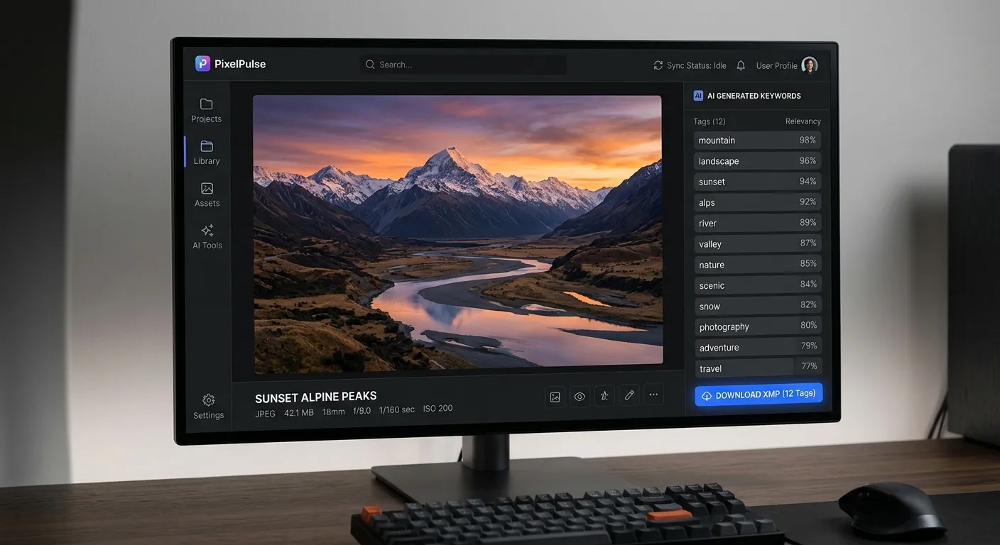

Every microstock photographer knows the immense dread of staring at a massive batch of uncaptioned, unprocessed images. Tagging hundreds of photos by hand takes hours of your day away from actual shooting and creatively drains you. To survive and stay competitive in today's fast-paced market, you need to reduce costs automate lightroom xmp keywords efficiently. Making this crucial shift in your daily workflow is the secret weapon used by top-earning contributors.

Manual keywording is not just a boring administrative task; it actively and aggressively eats into your hard-earned profit margins. When you spend ten hours a week typing out basic metadata for Adobe Stock or Shutterstock, you are losing valuable shooting time. By streamlining this specific process, you can focus purely on capturing the stunning visuals that buyers actually want to purchase. Every minute saved on tedious data entry is a minute earned back for your true photographic passion.

Fortunately, modern artificial intelligence has completely revolutionized how professionals handle extensive metadata generation. In this comprehensive guide, we will explore exactly how to streamline your workflow and massively boost your portfolio's visibility. You will learn how leveraging advanced platforms like meita.ai can transform your keywording process from a tedious chore into a highly profitable machine. Get ready to supercharge your rapid uploads and take your microstock earnings to the next level.

The Real Price of Manual Microstock Metadata
----------

### How Time Sinks Eat Your Profits ###

Photographers frequently underestimate exactly how much time manual keywording consumes on a daily basis. Typing out 50 distinct, highly relevant tags for a single image can easily take up to three minutes of focused work. Multiply that effort by a standard batch of 500 photos, and you are suddenly staring at 25 hours of mindless data entry. This is precious time you could otherwise spend scouting beautiful new locations or refining your raw edits.

When time equals money in the microstock industry, every single minute spent on tedious administrative tasks reduces your effective hourly rate. Many talented stock contributors find their monthly earnings plateau because they simply cannot process and upload images fast enough. You must actively find smart ways to reduce costs automate lightroom xmp keywords efficiently if you truly want to scale your portfolio. Breaking free from this massive bottleneck is the only real way to achieve consistent financial growth.

### The Hidden Costs of Poor Keywords ###

Human error remains another massive, hidden drain on overall microstock profitability and long-term portfolio success. After hours of staring at a bright screen and typing repetitive words, your brain naturally gets tired, leading to frustrating typos and highly irrelevant tags. Missing the exact, specific search term a buyer is looking for means your incredible photo will never appear in their commercial search results.

Inaccurate or sparse metadata directly translates to permanently lost sales on major platforms like Adobe Stock. Commercial buyers use highly specific, long-tail search terms to find exactly what their advertising campaigns desperately need. If your keywords do not perfectly match their specific intent, your stunning, high-quality image simply remains buried in the vast archives. Relying solely on manual entry leaves far too much room for these incredibly costly, entirely avoidable mistakes.

### The Creative Burnout Factor ###

Furthermore, coming up with fresh, highly relevant keywords requires constant, exhausting mental brainstorming. It is incredibly draining to invent 50 unique, descriptive words for slightly different angles of the exact same subject matter. This intense mental fatigue ultimately slows down your entire upload process and makes you absolutely dread post-production.

Creative burnout is a very real, dangerous threat to microstock photographers who try to handle every single task manually. When you are exhausted from typing out endless metadata, you are far less likely to pick up your camera the next day. Automating these tedious chores fiercely protects your creative energy and keeps your passion for photography alive and well.

Why You Must Reduce Costs Automate Lightroom XMP Keywords Efficiently
----------

### Speeding Up Your Editing Pipeline ###

The traditional microstock workflow usually requires exporting images, opening them in a separate clunky browser tab, and typing tags one by one. This highly inefficient method creates a massive, frustrating bottleneck between the vital editing phase and the final publishing phase. When you seamlessly adopt modern tools, this major workflow bottleneck disappears entirely from your daily routine.

By generating XMP sidecar files with powerful artificial intelligence, you can easily apply comprehensive metadata directly to your raw files or JPEGs inside Lightroom. This keeps your entire organizational workflow tightly centralized within your preferred, highly familiar editing software. You never have to break your deep creative focus to deal with tedious, uninspiring text fields ever again.

### Maximizing Adobe Stock Revenue ###

Major microstock agencies heavily prioritize properly and thoroughly tagged images in their complex, demanding search algorithms. Comprehensive, highly relevant keywords clearly signal to the platform that your image is exactly what the searching buyer wants to purchase. This significantly increases your ultimate chances of landing on the highly coveted first page of commercial search results.

When you smartly utilize robust automation tools, you guarantee that every single uploaded image receives the maximum allowed number of relevant tags. You no longer have to begrudgingly settle for just 10 or 15 rushed, low-quality keywords because you are too tired. A fully optimized, data-rich file naturally attracts more buyer views, which directly and consistently leads to more downloads and higher monthly royalties.

### Scaling Your Photography Business ###

Ultimately, a heavily streamlined workflow allows you to upload significantly more commercial content at a much faster pace. High-volume contributors consistently earn more money because they successfully cast a much wider net in the incredibly crowded microstock marketplace. Automating your essential metadata generation is the absolute key to effortlessly unlocking this highly lucrative high-volume upload strategy.

Scaling your photography business requires building highly efficient systems that can handle thousands of files without breaking down. Artificial intelligence provides the exact scalable framework you need to grow your impressive portfolio without ever hiring expensive assistants. You can effortlessly manage a massive, profitable agency-level catalog entirely on your own terms.

How Meita.ai Transforms Your Photography Workflow
----------

### Generating Highly Accurate Metadata ###

Meita.ai is brilliantly designed specifically for ambitious microstock contributors who want to aggressively maximize their earning potential. This advanced, user-friendly platform uses state-of-the-art vision AI to analyze your beautiful photos down to the absolute smallest visual detail. It flawlessly recognizes distinct objects, subtle emotions, complex lighting styles, and overarching conceptual themes with truly incredible precision.

Instead of struggling endlessly to find the perfect right words, you simply let meita.ai do all the heavy administrative lifting. The AI instantly and effortlessly generates highly optimized titles, compelling descriptions, and up to 50 highly relevant keywords. These precise, powerful tags are explicitly and strategically tailored for the demanding search algorithms used by Adobe Stock and Shutterstock.

### Understanding IPTC and EXIF Standards ###

Professional stock photography relies heavily on universally accepted IPTC and EXIF metadata formatting standards. Ensuring your generated keywords fit perfectly into these rigid industry standards is crucial for seamless, error-free agency uploads. Meita.ai automatically formats all generated textual data to strictly comply with these vital, overarching global photography requirements.

When you easily export your metadata, the platform ensures every single tag is perfectly placed in the correct IPTC keyword fields. This meticulous attention to technical detail completely prevents frustrating upload errors when you finally submit your files to the various microstock agencies. You can always confidently trust that your robust data is perfectly clean, standardized, and fully ready for immediate commercial distribution.

### Seamless Lightroom Classic Integration ###

One of the absolutely most powerful features of meita.ai is its ability to seamlessly export data as standard XMP sidecar files. This specific file format is universally recognized and embraced by Adobe Lightroom Classic, making mass synchronization incredibly fast and simple. You can effortlessly generate rich metadata online and instantly inject it straight into your massive local Lightroom catalog.

This specific automation feature is a massive game-changer for veteran photographers dealing with sprawling, disorganized digital archives. You can easily batch-process entire bulky folders of images through meita.ai and quickly download a convenient zip file of rich XMP data. Once properly extracted into your primary image folder, Lightroom will automatically and instantly read all the newly generated keywords.

Step-by-Step Guide to Embedding AI Keywords
----------

### Exporting and Importing XMP Files ###

To get started with this blazing fast process, simply upload low-resolution preview images to the highly intuitive meita.ai platform. The advanced AI will incredibly quickly analyze these small thumbnails and instantly generate your highly optimized metadata. Once the rapid digital processing is fully complete, you can easily review the keywords and make any tiny necessary tweaks.

Next, confidently click the prominent option to export your fresh metadata as standard XMP sidecar files. Meita.ai will quickly provide a downloadable folder containing individual, correctly named XMP files corresponding to each of your uploaded images. You must carefully ensure these crucial XMP files are placed in the exact same directory folder as your original, high-resolution photos.

### Syncing Data in Lightroom Classic ###

Once your new XMP files are safely and properly nested alongside your raw files, open up Adobe Lightroom Classic. Carefully navigate over to the Library module and select all the specific images you just processed through the AI platform. You want to make absolutely sure Lightroom knows exactly where to look for the brand new textual data.

Go directly to the top menu, click on "Metadata," and then confidently select "Read Metadata from File." Lightroom will immediately prompt you with a standard warning, simply asking if you truly want to overwrite the current catalog data. Quickly confirm this routine action to seamlessly pull the fresh, highly optimized meita.ai keywords directly into your local catalog.

### Troubleshooting Common Sync Issues ###

Occasionally, photographers might run into minor, easily fixable issues when attempting to sync their fresh XMP files. The most common problem perfectly occurs when the generated XMP file name does not exactly match the original raw image file name. You must always diligently ensure that "photo-01.cr2" is perfectly paired with an identically named "photo-01.xmp" file.

Another frequent syncing issue happens when users accidentally select the wrong destination folder inside the Lightroom Library module. Always routinely double-check that you have properly highlighted the correct, specific batch of images before clicking the read metadata command. Following these simple, straightforward troubleshooting steps guarantees a flawless, incredibly stress-free keyword integration process every single time.

Comparing Keywording Methods for Microstock
----------

Choosing the absolute right keywording strategy can literally make or break your entire long-term microstock career. Many ambitious beginners start with slow manual entry, but they quickly realize it is entirely unsustainable for managing massive portfolios. Upgrading to smart, AI-driven workflows is the most logical next step for serious, heavily profit-focused commercial contributors.

Let us take a close look at exactly how these different popular methods stack up against each other in real-world scenarios. Understanding these crucial differences will vividly show you exactly how much precious time and money you are currently leaving on the table. It perfectly highlights exactly why you desperately need to adopt modern software tools to streamline your daily workflow.

When you stubbornly rely solely on slow manual entry, you are literally trading hours of your life for a basic task a machine can do in seconds. You are also entirely subject to your own limited vocabulary and inevitable daily mental fatigue. Even if you try to use basic copy-paste text templates, you heavily risk using highly generic tags that do not accurately describe the specific photo.

Advanced AI metadata generators like meita.ai offer a radically different, highly efficient approach to this age-old workflow problem. They consistently provide custom, highly image-specific tags instantly, ensuring maximum search relevance for every single upload. This not only powerfully saves you countless hours but dramatically improves your overall search ranking on major stock platforms.

Below is a highly detailed, comprehensive comparison of traditional manual keywording versus using the advanced meita.ai platform. This clear data breakdown thoroughly covers essential metrics like processing speed, overall cost, ultimate accuracy, and total workflow impact.

|     Workflow Feature      |                  Manual Keywording                  |                  Meita.ai Automation                   |
|---------------------------|-----------------------------------------------------|--------------------------------------------------------|
|   **Processing Speed**    |        Up to 3 full minutes per single image        |         Just seconds for massive image batches         |
|   **Keyword Accuracy**    |       Highly prone to typos and human fatigue       |      Highly precise, AI-driven visual recognition      |
|  **Conceptual Tagging**   |  Requires intense, exhausting mental brainstorming  |Automatically includes deep emotional and abstract tags |
| **Lightroom Integration** |    Requires tedious, clunky manual copy-pasting     |    Seamlessly syncs via standard XMP sidecar files     |
|**Overall Cost Efficiency**|Massive hidden cost in permanently lost shooting time|Highly affordable with an immediate return on investment|

As the detailed table clearly shows, AI automation offers truly unparalleled, massive benefits for serious stock photographers. The initial software setup time is incredibly minimal, and the long-term return on your financial investment is absolutely massive. By making this simple software switch, you effectively future-proof your profitable microstock business against rapidly growing global competition.

Expert Tips for High-Converting Stock Metadata
----------

Even with incredibly powerful AI tools safely at your fingertips, a little bit of strategic human oversight goes a very long way. Deeply understanding exactly how commercial buyers search can significantly help you fine-tune the brilliant outputs from platforms like meita.ai. Here are some highly actionable, proven tips to ensure your generated metadata consistently converts into actual sales.

If you genuinely want to reduce costs automate lightroom xmp keywords efficiently, always keep these essential best practices in your mind. They will heavily help you easily maintain incredibly high quality standards across thousands of rapid agency uploads.

* **Review for Conceptual Terms:** Make sure your AI output includes vital abstract concepts like freedom, leadership, or tranquility. Commercial buyers often search for distinct emotions rather than literal, physical objects.
* **Order Greatly Matters:** Platforms like Adobe Stock place much higher algorithm weight on the first 10 keywords. Always ensure meita.ai's most relevant tags are placed at the very beginning of your list.
* **Remove Obvious Contradictions:** Briefly scan your generated keyword list to quickly remove any conflicting, contradictory terms. For example, an outdoor image should never be tagged as both sunny and overcast.
* **Include Demographic Details:** If your photo features actual people, ensure tags clearly describe age, ethnicity, and gender. Diverse demographic keywords are currently highly sought after by modern global marketing agencies.
* **Leverage Location Data:** For travel and beautiful landscape photography, highly specific geographic tags are absolutely vital. Ensure the exact city, specific region, and prominent landmarks are correctly identified in your XMP files.
* **Focus on Copy Space:** Always manually ensure tags like "copy space" or "text space" are included if your image has room for typography. Advertisers constantly seek out these highly flexible images for their commercial print campaigns.
* **Update Seasonal Trends:** Add highly relevant seasonal keywords like "summer vacation" or "holiday shopping" when appropriately needed. This simple strategy captures immediate, timely commercial buyer intent during peak global seasons.
* **Keep Brand Names Out:** Unless you are submitting strictly editorial content, completely remove any specific trademarked brand names. Meita.ai is smart, but doing a quick manual check ensures your commercial file will never be rejected.

Frequently Asked Questions About Reduce Costs Automate Lightroom XMP Keywords Efficiently
----------

### What is an XMP file in Lightroom Classic? ###

An XMP file is a tiny text file that safely stores crucial metadata side-by-side with your original image file. It neatly contains your applied edits, keywords, and long descriptions without permanently altering the original RAW or JPEG. This standard format makes it an incredibly safe, non-destructive way to manage your massive photo data.

### How does AI keywording save me money? ###

Time is your absolute most valuable asset as a working professional photographer. By drastically cutting keywording time from hours to mere minutes, you free yourself to shoot and edit much more content. This massively increased daily productivity directly leads to a much larger portfolio and significantly higher microstock royalties.

### Can meita.ai export keywords directly to Lightroom? ###

Yes, meita.ai perfectly allows you to instantly export your generated metadata as standard XMP sidecar files. You can easily and quickly place these files right next to your images on your local hard drive. Lightroom will then instantly read these text files and apply the rich keywords directly to your main catalog.

### Will AI keywords help me sell more on Adobe Stock? ###

Absolutely, because Adobe Stock relies heavily on accurate, highly comprehensive keywords to serve your images to eager buyers. AI tools like meita.ai easily generate highly relevant tags that perfectly match commercial buyer search intent. This smart optimization naturally pushes your photos much higher in the competitive search results.

### Do I need to upload massive RAW files to meita.ai? ###

No, you definitely do not need to waste bandwidth uploading massive, heavy RAW files. You can simply upload incredibly small, low-resolution JPEG previews for the advanced AI to carefully analyze. Once the lightweight XMP files are rapidly generated, you can seamlessly sync them with your high-res RAWs inside Lightroom.

### How can I start streamlining my workflow today? ###

You can effortlessly start by signing up for an advanced AI metadata generator exactly like meita.ai. Upload a small test batch of images, generate the smart tags, and quickly export the XMP files to your local drive. Sync them effortlessly in Lightroom to instantly see how beautifully it improves your daily workflow.

### Are AI-generated descriptions better than manual ones? ###

AI-generated descriptions are incredibly accurate, highly detailed, and perfectly optimized for demanding search algorithms. They consistently and flawlessly include the absolute most important keywords in a natural, highly readable format. This ensures you never miss crucial descriptive words that commercial buyers might actively use.

### Can I easily edit the AI keywords before applying them? ###

Yes, powerful platforms like meita.ai brilliantly give you complete, total control over your final metadata. You can easily review, add, or permanently delete any generated keywords before safely exporting your final XMP files. This strictly ensures your final exported tags perfectly meet your exact personal quality standards.

### Is meita.ai suitable for all microstock platforms? ###

Yes, the robust metadata safely generated is completely universal and seamlessly embedded into your final exported JPEGs. Whether you upload directly to Shutterstock, Adobe Stock, Getty Images, or Alamy, the rich keywords will be fully recognized. This makes highly profitable cross-platform uploading incredibly easy and fast.

### Does meita.ai recognize complex human emotions? ###

Yes, the state-of-the-art vision AI effortlessly recognizes highly complex human emotions and vital abstract concepts. It can easily tag an image with crucial terms like "joy," "frustration," or "determination" based entirely on facial expressions. These valuable conceptual keywords are incredibly popular with major advertising agencies.

Surviving and thriving in the highly competitive world of modern microstock photography requires a very smart, incredibly streamlined approach. You simply can no longer afford to waste countless hours manually typing tedious tags and long descriptions for every single uploaded image. When you reduce costs automate lightroom xmp keywords efficiently, you successfully reclaim your absolute most valuable resource: your precious time. By intelligently letting advanced artificial intelligence completely handle the tedious data entry, you can intensely focus on creating the stunning visuals that easily capture the global market's attention.

If you are truly ready to completely transform your slow editing pipeline, it is finally time to embrace the immense power of modern automation. Revolutionary platforms like meita.ai offer the absolute perfect blend of pinpoint accuracy, blazing speed, and highly seamless Lightroom integration. Stop foolishly letting incredibly slow metadata workflows massively eat into your hard-earned monthly microstock profits. Start enthusiastically using meita.ai today to instantly elevate your stock portfolio, dramatically improve your search rankings, and happily watch your monthly royalties soar.
