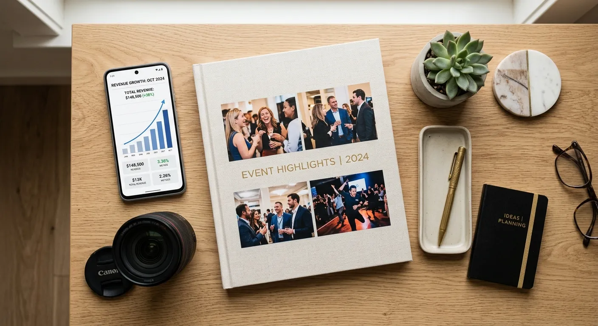

Event photographers often return from a busy weekend shoot with thousands of unculled images filling their memory cards. Sorting through these massive files is a daunting task that quickly eats into valuable editing and marketing time. When you decide to revamp event albums ai tagging vs manual curation is the biggest choice you will face today. Your approach to this workflow bottleneck directly dictates your overall profitability and stress levels.

For years, professionals relied solely on their own eyes and patience to categorize, tag, and organize their extensive portfolios. However, the landscape of digital asset management has dramatically shifted with the introduction of intelligent software. Modern creators now have access to powerful tools that can instantly "see" and categorize image content. Understanding the differences between these two methods is crucial for anyone looking to scale their photography business.

In this comprehensive guide, we will explore the evolving world of photo organization and metadata generation. You will learn the hidden costs of doing everything by hand and discover how automated tools like meita.ai can transform your microstock income. Whether you are uploading to Adobe Stock or refreshing a client gallery, optimizing your tagging strategy is the key to maximum discoverability.

The Evolution of Event Photography Organization
----------

The transition from analog to digital photography brought an explosion in the sheer volume of images captured at any given event. Photographers no longer worried about film costs, leading to massive digital hoarding. As portfolios grew, the need for efficient organization became a critical survival skill for working creatives. If you want to efficiently revamp event albums ai tagging vs manual curation histories offer valuable context.

Early digital management required meticulous folder structures and countless hours of keyboard data entry. Photographers had to manually type metadata into every single image if they wanted to find it later. This tedious process created a massive backlog of unorganized photos sitting idle on external hard drives.

### The Old Way of Sorting Photos ###

Historically, manual photo sorting required a photographer to open an image, analyze its contents, and manually type relevant keywords into an EXIF data editor. This method relies entirely on human stamina and memory. A typical wedding album could easily take several days just to properly tag and categorize for stock agency submissions.

This traditional approach is highly prone to human error and fatigue-induced mistakes. After typing keywords for the hundredth photo of a bride walking down the aisle, a photographer's vocabulary naturally shrinks. As a result, valuable LSI keywords and descriptive terms are often left out, hurting the image's future search visibility.

Furthermore, manual sorting severely limits how many images a contributor can upload to microstock platforms. Time spent typing is time taken away from shooting new events or securing new clients. For high-volume shooters, this older method simply cannot scale with a growing business.

### The Rise of Artificial Intelligence in Photography ###

The introduction of machine learning has revolutionized how we interact with visual data. Artificial intelligence can now analyze pixels, lighting, and subjects to understand exactly what is happening in a photograph. This technological leap allows software to generate highly accurate descriptive terms in mere milliseconds.

Advanced platforms are trained on millions of images, giving them an incredibly vast vocabulary of keywords. They can recognize specific objects, emotional concepts, and even complex event scenarios without human intervention. This capability is rapidly changing the standard for digital asset management.

By leveraging computer vision, photographers can bypass the dreaded blank keyword box entirely. The software does the heavy lifting, presenting a ready-to-use list of optimized tags. This shift represents a massive competitive advantage for those who adopt the technology early.

Deep Dive Into Manual Curation for Event Portfolios
----------

Despite the rapid advancement of automated tools, many purists still cling to traditional keywording methods. They believe that only the creator of the image can truly capture its essence in text. While this perspective has some merit, it is important to critically examine the reality of doing everything by hand.

Manual curation requires immense dedication and a deep understanding of search engine optimization (SEO). You must constantly research what buyers are looking for and manually apply those trends to your tags. As we explore how to revamp event albums ai tagging vs manual curation becomes a debate of quality versus scale.

### The Human Touch in Photo Selection ###

The strongest argument for human curation is our innate ability to understand nuanced emotion and abstract concepts. A human knows the subtle difference between a "forced smile" and "genuine joy" at a corporate retreat. We can inject storytelling elements into our metadata that a machine might occasionally overlook.

Additionally, manual keywording allows for complete, uncompromised control over the final metadata output. You can ensure that your distinct branding or specific client terminology is perfectly represented. For very small, highly specialized portfolios, this level of microscopic control can be deeply satisfying.

However, this emotional intelligence comes at a steep price. The hyper-focus required to maintain this quality across thousands of images is mentally draining. Most photographers find that their tagging quality drops significantly after just an hour of continuous work.

### The Hidden Costs of Manual Tagging ###

The most significant hidden cost of manual curation is the loss of your most valuable resource: time. Every hour spent typing metadata is an hour you are not out capturing profitable event photography. This creates a severe bottleneck that limits your earning potential on microstock websites.

There is also the cost of inconsistency to consider. Human creators naturally use different synonyms depending on their mood or fatigue level on any given day. One day you might tag a photo as "corporate event," and the next day as "business conference," breaking the consistency algorithms prefer.

Finally, manual tagging often leads to "keyword block," where creators struggle to think of the recommended 30 to 50 keywords required for maximum stock visibility. This results in under-tagged images that get buried in Adobe Stock search results, ultimately costing you passive income.

How AI Keywording Transforms Photo Management
----------

Embracing smart automation is the fastest way to clear your backlog and monetize your dusty hard drives. Modern metadata generators analyze your photos and instantly provide rich, SEO-friendly descriptions. This technology completely flips the traditional workflow, turning a tedious chore into a rapid review process.

Tools designed specifically for stock contributors understand exactly what buyer algorithms are looking for. They don't just identify objects; they identify commercial concepts. Let's look at how automated systems are reshaping the industry standards.

### Speed and Efficiency at Scale ###

The most immediate benefit of artificial intelligence is blistering speed. What used to take days of grueling manual data entry can now be accomplished in minutes. You can drag and drop an entire wedding album into an AI tool and watch the metadata populate instantly.

This efficiency allows you to process and upload massive batches of event photos to microstock agencies seamlessly. Instead of agonizing over a few dozen images, you can submit hundreds of viable stock photos every week. High volume is the secret to building a sustainable passive income stream.

Moreover, AI never gets tired or suffers from a shrinking vocabulary. The final photo in a batch of one thousand will receive the exact same robust, 50-keyword treatment as the very first photo. This relentless stamina is impossible for a human to match.

### Consistent Metadata for Microstock Success ###

Search algorithms on platforms like Shutterstock and Adobe Stock rely heavily on consistent, accurate metadata. If your keywords are all over the place, the algorithm struggles to categorize your portfolio accurately. AI ensures a uniform tagging structure across your entire library.

This consistency builds trust with the search engine, gradually improving your overall ranking as a contributor. When your images rank higher, they are seen by more commercial buyers, leading to more downloads and revenue. Smart tagging systems understand the exact hierarchy and formatting these platforms demand.

This is where specialized platforms excel. By generating standardized, highly relevant keyword clusters, AI ensures your event photography meets the strict technical requirements of top-tier stock agencies. Your images are prepped for success before you even hit the upload button.

Why Microstock Contributors Choose Smart Tagging
----------

Event photographers possess a goldmine of commercially viable images that often go unused after the client gallery is delivered. From elegant table settings at weddings to dynamic keynote speakers at corporate functions, these shots are highly sought after by stock photo buyers. To truly revamp event albums ai tagging vs manual curation requires looking at the overall return on investment.

Monetizing these assets requires specialized metadata that speaks directly to commercial intent. Manual keywording is simply too slow to make high-volume microstock uploading viable for busy professionals. That is exactly why top earners are pivoting to intelligent automation.

### Maximizing Discoverability on Adobe Stock ###

Adobe Stock is one of the most lucrative platforms for event and lifestyle imagery. However, its search engine is highly competitive, demanding precise titles and comprehensive keyword lists. Buyers search using conceptual terms like "teamwork," "celebration," or "networking," which manual taggers often forget to include.

Intelligent tagging software excels at identifying these abstract, high-value commercial concepts. It automatically bridges the gap between literal objects in the frame and the emotional narrative the buyer wants to purchase. This dual-layered tagging significantly boosts your visibility.

By filling all 50 keyword slots with highly relevant, AI-generated terms, you cast the widest possible net for potential buyers. More visibility translates directly into more licensing opportunities and higher monthly royalty checks.

### How Meita.ai Streamlines Your Workflow ###

When it comes to generating metadata tailored specifically for microstock, meita.ai stands in a league of its own. It is designed to act as your virtual keywording assistant, entirely removing the friction from your upload process. You simply provide the images, and meita.ai delivers agency-ready titles, descriptions, and keywords.

Unlike generic image recognition tools, meita.ai is fine-tuned for the specific needs of stock photography contributors. It formats the metadata perfectly so it can be seamlessly embedded or exported for easy uploading. This ensures your event albums are ready for the marketplace in record time.

By integrating meita.ai into your post-production routine, you reclaim countless hours of your work week. You can focus your energy on booking more events and shooting better photos, while the platform handles the tedious administrative work of maximizing your portfolio's earning potential.

Feature Breakdown: AI Tagging Compared to Manual Work
----------

To make an informed decision for your photography business, you need a clear side-by-side comparison of the two methodologies. Before you revamp event albums ai tagging vs manual curation differences must be clearly mapped out. Below is a detailed breakdown of how automated tools stack up against traditional human effort.

|  Feature / Aspect  |                    AI Tagging (e.g., meita.ai)                    |                          Manual Curation                           |
|--------------------|-------------------------------------------------------------------|--------------------------------------------------------------------|
|**Processing Speed**|     Instantaneous; processes thousands of images in minutes.      |      Extremely slow; limited by human typing speed and focus.      |
| **Keyword Volume** |    Easily generates 30-50 highly relevant keywords per photo.     |  Often results in sparse tagging (10-15 keywords) due to fatigue.  |
|  **Consistency**   | Maintains perfect uniformity and LSI relevance across all files.  |    Highly variable; dependent on the photographer's daily mood.    |
|  **Scalability**   |Infinite scalability. Ideal for high-volume microstock portfolios. | Poor scalability. Creates massive bottlenecks as portfolios grow.  |
|**Emotional Nuance**|Strong conceptual tagging, though occasionally misses deep context.|   Excellent at identifying hyper-specific storytelling elements.   |
|**Cost Efficiency** |  High ROI; frees up hours of billable time for the photographer.  |High hidden cost; wastes valuable time that could be spent shooting.|

As the table illustrates, relying on manual data entry is no longer a viable business strategy for volume shooters. The sheer speed and scalability of platforms like meita.ai offer a distinct competitive advantage. By automating the heavy lifting, you ensure your event archives actually generate income rather than gathering digital dust.

Pro Tips to Maximize Your Event Album Revenue
----------

Upgrading your workflow is only the first step toward microstock success. To truly dominate the search results on platforms like Adobe Stock, you need to use your new tools strategically. Here are expert tips to get the most out of your metadata generation.

* **Batch Process Similar Scenes:** Group your event photos by scene (e.g., "wedding reception," "corporate keynote") before running them through meita.ai. This ensures the AI grasps the overarching context, providing even more accurate conceptual keywords.
* **Review and Refine:** While AI is incredibly accurate, taking 10 seconds to review the generated tags allows you to add specific brand names or location details that a machine wouldn't know. Think of AI as doing 95% of the work.
* **Focus on Commercial Appeal:** When you revamp event albums ai tagging vs manual curation strategies, always prioritize images with clean backgrounds, genuine emotion, and clear subjects. Good metadata cannot fix a blurry photo.
* **Max Out Your Tags:** Microstock agencies allow up to 50 keywords for a reason. Let meita.ai fill those slots with relevant synonyms and LSI keywords to maximize your search footprint.
* **Update Older Portfolios:** Don't just focus on new shoots. Run your archived event albums from years past through meita.ai to breathe new life into forgotten assets and create sudden passive income.

Implementing these strategies will drastically improve the performance of your uploads. Automation gives you the power to act like a large media agency, even if you are a solo photographer. Efficiency and optimization are the true secrets to microstock profitability.

Frequently Asked Questions about revamp event albums ai tagging vs manual curation
----------

### What is AI tagging in photography? ###

AI tagging uses advanced computer vision algorithms to "look" at a photograph and identify objects, concepts, and emotions. It then automatically generates a list of highly relevant, SEO-optimized keywords. This eliminates the need for photographers to manually type metadata for every image.

### Does manual curation still matter? ###

Manual curation is still useful for highly sensitive or specialized projects where hyper-specific storytelling is required. However, for high-volume microstock uploading, it is generally too slow to be profitable. Most professionals now use AI to generate the bulk of tags, and briefly review them manually.

### How does AI help sell event photos on Adobe Stock? ###

Algorithms on platforms like Adobe Stock rely on comprehensive metadata to show your photos to buyers. AI tools like meita.ai generate exhaustive, 50-word keyword lists that cover conceptual and literal terms. This massively increases the chances of your event photos appearing in relevant buyer searches.

### Can meita.ai recognize specific event contexts? ###

Yes, advanced tools are trained on millions of images and understand complex environments like weddings, corporate conferences, and parties. They can identify contextual elements like "networking," "celebration," or "team building." This conceptual tagging is highly prized by commercial stock buyers.

### Will automated keywording hurt my search rankings? ###

No, automated keywording will actually improve your rankings when done correctly. AI provides consistent, relevant, and diverse vocabulary that search engines love. It prevents the repetitive "keyword stuffing" that tired humans often resort to.

### How long does manual tagging usually take? ###

Tagging a single image manually with 50 relevant keywords can take a photographer 2 to 5 minutes. For an event album of 500 photos, this equates to roughly 16 to 40 hours of tedious typing. AI software accomplishes this same task in just a few minutes.

### Is AI metadata accurate for microstock sites? ###

Tools designed specifically for microstock, such as meita.ai, are incredibly accurate. They are programmed to format titles, descriptions, and keywords exactly how agencies demand. They prioritize commercial terms that buyers actually use when searching for assets.

### Can I combine both AI and manual strategies? ###

Absolutely. The most efficient workflow is a hybrid approach. You use AI to instantly generate 95% of your metadata and keyword clusters. Then, you spend a few seconds manually adding specific venue names or unique local contexts before uploading.

### Why should I upgrade my old event portfolios? ###

Old event albums sitting on hard drives are wasted assets that generate zero revenue. By rapidly processing them through an AI tagger, you can easily upload thousands of older images to microstock sites. This instantly creates a new stream of passive income with minimal effort.

Conclusion
----------

Navigating the modern landscape of digital asset management doesn't have to be an overwhelming chore. As we have explored, when you look to revamp event albums ai tagging vs manual curation presents a clear winner for high-volume creators. Manual data entry is simply too time-consuming, inconsistent, and draining to support a growing microstock portfolio. By embracing automated technology, you unlock the ability to scale your business, process massive archives, and get your best work in front of paying buyers faster than ever before.

If you are tired of spending hours staring at a blank keyword box, it is time to upgrade your workflow. Let intelligent automation handle the tedious administrative tasks so you can get back behind the camera where you belong. Try [meita.ai](https://meita.ai) today to instantly generate agency-ready titles, descriptions, and keywords for your event photography, and start turning your digital archives into real passive income.
