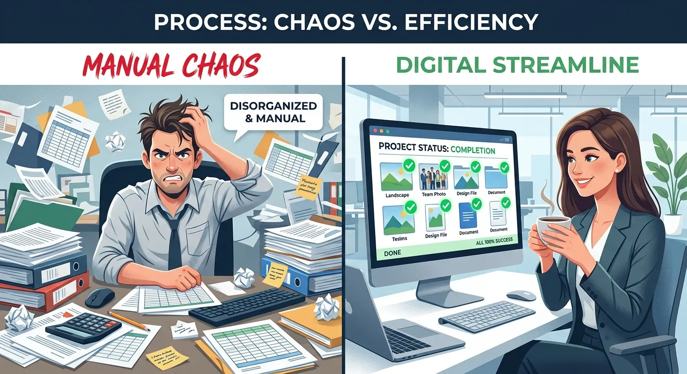

As a microstock contributor, you already know that capturing stunning photos is only half the battle. The real bottleneck happens behind the desk when you have to title, describe, and keyword hundreds of files manually. If you want to rapidly scale your portfolio, you need to save 50 more time bulk image processing with iptc metadata. Automating this tedious step is the secret weapon used by the industry's top earners.

Tagging individual images drains your creative energy and limits your earning potential on platforms like Adobe Stock and Shutterstock. By embedding data directly into your files, you completely eliminate repetitive data entry from your daily routine. This smart workflow allows you to upload ready-to-sell assets across multiple agencies simultaneously without missing a beat. The days of copy-pasting from messy spreadsheets are officially over.

In this comprehensive guide, we will explore how automated tagging transforms your daily workflow and boosts your bottom line. We will show you how leveraging an advanced AI platform like Meita.ai can effortlessly handle the heavy lifting. Get ready to streamline your uploads, rank higher in search results, and get back behind the camera where you truly belong.

How Embedding IPTC Data Transforms Microstock Workflows
----------

### What Is IPTC Metadata Exactly? ###

IPTC stands for the International Press Telecommunications Council, a standardized format used globally for describing visual assets. It allows creators to embed essential information like titles, descriptions, and keywords directly into the image file itself. This means the critical text data travels seamlessly with your photo wherever it is copied or moved. It acts as a digital passport for your creative work.

When you upload an embedded JPEG to a stock photography agency, their system instantly reads this hidden information. You no longer have to copy and paste tags into clunky, unresponsive web forms. This global standardization is the fundamental building block of modern, high-speed microstock portfolio management. It bridges the gap between your local hard drive and the global marketplace.

### Why Stock Agencies Prefer Embedded Tags ###

Platforms like Adobe Stock, Getty Images, and Shutterstock process millions of visual assets every single week. They highly prefer contributors who upload files containing properly formatted, embedded metadata. It significantly reduces processing errors on their end and speeds up the review queue for everyone. Files that require no manual adjustment simply move through the system faster.

Embedded tags also ensure strict data consistency across multiple platforms and search engines. If you submit the exact same image to five different microstock websites, the keywords remain perfectly identical. This consistency helps external search algorithms index your photos accurately, leading to higher visibility and increased sales. Consistent tagging is a proven strategy for building a recognizable brand presence.

### The Problem With Manual Keywording ###

Typing out unique keywords for a batch of 500 images is a mind-numbing task that can take days. Human error is inevitable, leading to spelling mistakes and irrelevant tags that severely hurt your search ranking. Many photographers experience deep creative fatigue, choosing fewer keywords simply to finish the exhausting job faster. This directly sabotages the discoverability of their hard work.

Relying on cumbersome spreadsheets to track your descriptions only adds unnecessary friction to your day. Switching constantly between spreadsheet cells and browser windows kills your productivity and mental focus. Ultimately, time spent typing at a keyboard is precious time stolen from shooting new, profitable content. Breaking free from this cycle is essential for your business growth.

Automating Your Portfolio With AI Keywording Tools
----------

### Leveraging Meita For Faster Uploads ###

Artificial intelligence has revolutionized how we approach tedious administrative tasks in the commercial photography sector. A modern AI keywording tool can analyze the visual contents of your photos and generate highly relevant tags instantly. This technology understands deep context, recognizing not just objects, but also complex concepts, moods, and lighting styles. It sees your image almost exactly how a human buyer would.

To truly save 50 more time bulk image processing with iptc metadata, you need a robust solution built for volume. Meita's advanced vision models can process massive batches of stock photos in minutes using parallel AI workers. You simply drag and drop your files into the interface, and the platform handles the complex visual analysis automatically. It is a completely hands-off approach to professional keywording.

### Eliminating Spreadsheets From Your Process ###

Moving away from external tracking documents is a massive psychological relief for active stock contributors. With an AI-driven platform, you generate, review, and embed your tags all within a single, unified interface. There is no more risky copying and pasting between Excel cells and your agency's upload portal. You minimize the risk of pasting the wrong keywords onto the wrong image.

Meita.ai allows you to export your newly generated metadata as a neat CSV if you still need it. However, embedding the data directly into the file is always the superior, frictionless choice. Writing the EXIF data straight to the JPEG prepares the file for immediate, universal distribution anywhere online. This creates a highly efficient pipeline from your editing suite directly to the buyer.

### Scaling Your Stock Photography Business ###

Success in the competitive microstock industry is often a pure numbers game requiring thousands of high-quality assets. You simply cannot achieve this critical volume if you are perpetually bogged down by administrative bottlenecks. Automating your metadata workflow allows you to easily double or triple your weekly upload limits without burning out. Volume brings visibility, and visibility brings reliable passive income.

As you regain your free time, you can focus heavily on identifying lucrative market trends and planning complex photoshoots. The fastest growing portfolios belong to creators who delegate the mundane keywording phase to artificial intelligence. Embracing these advanced [bulk batch stock photo keywording tools](https://meita.ai/en-us/bulk-metadata-generator) is no longer a luxury. It is a strict competitive necessity for serious professionals.

Comparing Manual vs Automated Bulk Image Metadata Generation
----------

Understanding the stark differences between traditional tagging and modern automated workflows highlights why AI is strictly essential. The manual route is heavily labor-intensive, highly prone to typos, and simply does not scale well over time. Transitioning to a smarter process yields immediate, highly measurable returns on your personal time investment. The math heavily favors automation.

When you aim to save 50 more time bulk image processing with iptc metadata, the raw data speaks for itself. Below is a detailed breakdown comparing the outdated way of doing things with the cutting-edge approach. This comparison shows exactly how top-tier microstock contributors are dominating the current marketplace.

|     Workflow Feature      |           Manual Metadata Entry            |        Automated AI Generation (Meita.ai)        |
|---------------------------|--------------------------------------------|--------------------------------------------------|
|**Average Processing Time**|        3-5 minutes per single image        |          Seconds per batch of hundreds           |
| **Accuracy & Relevance**  |       Prone to human error and typos       |  Highly accurate, context-aware visual tagging   |
|      **Scalability**      |   Very low; causes rapid creator burnout   |   Limitless; easily handles 500+ files at once   |
|   **Agency Compliance**   |   Requires constant manual rule-checking   |Automatically formats to strict industry standards|
|     **Cost of Labor**     |High (Your personal time or paid assistants)|      Extremely low cost per processed image      |
| **Software Requirements** |Messy mix of Excel, Bridge, and web browsers|      One clean, centralized web application      |
|  **Concept Recognition**  |Relies strictly on the creator's vocabulary |Suggests trending, high-value commercial concepts |

The Financial Impact Of Faster Metadata Processing
----------

### Increasing Your Weekly Upload Volume ###

The direct correlation between portfolio size and monthly revenue is undeniable in the modern microstock industry. Photographers who consistently upload large, targeted batches of quality images see exponential growth in their royalty checks. By eliminating manual data entry, you remove the primary obstacle preventing you from doubling your upload volume. More images online simply equals more opportunities for diverse sales.

Instead of spending your valuable weekends typing out descriptions, you can dedicate those hours to editing and color correction. A streamlined workflow means your fresh images hit the market while visual trends are still highly relevant. Speed to market often dictates who captures the lion's share of sales for specific seasonal topics. Agility is just as important as image quality.

### Reducing Administrative Overhead Costs ###

Many established stock photographers eventually end up hiring virtual assistants to handle their growing metadata creation needs. While delegating is smart, paying hourly wages for slow, manual data entry eats directly into your profit margins. Artificial intelligence provides a much more cost-effective solution that works instantly around the clock without supervision. You keep more of the money you earn.

A premium AI tool costs a tiny fraction of what you would pay a human assistant for the exact same volume. Furthermore, the AI never gets tired, never makes spelling errors, and never needs a day off. This massive reduction in overhead costs makes your stock photography business significantly more resilient and profitable. It allows solo creators to compete with massive studios.

### Capturing Trending Search Volumes Quickly ###

Commercial design trends and fast-paced news cycles move incredibly fast, demanding quick turnaround times from contributors. If an unexpected global event occurs, commercial buyers immediately flood stock agencies looking for relevant conceptual images. If your files are stuck in a manual keywording backlog, you miss out on these lucrative, high-volume search spikes. Timing is absolutely everything in editorial and conceptual stock.

Embedding your data instantly ensures you can aggressively capture these fleeting market opportunities without any delay. You can shoot, process, tag, and distribute an entire topical collection in a single afternoon. This extreme agility transforms you from a casual hobbyist into a highly responsive visual content provider. Buyers will learn to rely on your rapidly updated portfolio.

Pro Tips To Maximize Your Stock Photo Tagging Efficiency
----------

Even with powerful AI tools at your immediate disposal, optimizing your foundational workflow habits can yield even better results. Small, deliberate tweaks to how you organize and process your assets make a substantial difference over thousands of files. These expert strategies will help you maintain high acceptance rates across all your stock agencies. Efficiency requires both great software and smart habits.

Before you launch your next major upload session, strongly consider implementing these proven microstock techniques. They are specifically designed to keep your growing portfolio organized and your monthly sales consistently climbing upward.

* **Group similar images together:** Processing dedicated batches of photos from the exact same shoot allows AI tools to process visual data much faster.
* **Review AI suggestions for tone:** While AI is incredibly accurate, taking a quick glance to ensure the conceptual tags match your artistic vision is crucial.
* **Front-load your important keywords:** Many agency search algorithms heavily prioritize the first ten keywords. Ensure your most descriptive, high-value terms are placed at the very beginning of your list.
* **Use a dedicated bulk processor:** Leveraging a specialized [bulk batch stock photo keywording tool](https://meita.ai/en-us/bulk-metadata-generator) like Meita.ai ensures you are utilizing maximum processing power.
* **Keep titles highly descriptive:** Avoid overly artistic titles. Buyers search for literal descriptions like "Smiling woman drinking coffee in modern office," not vague phrases.
* **Stay updated on agency guidelines:** Adobe Stock and Shutterstock occasionally update their metadata policies. Keep your tags clean and compliant to avoid sudden account strikes.

Overcoming Common Errors In Batch Stock Image Processing
----------

### Avoiding Keyword Spamming Penalties ###

Keyword spamming is the frowned-upon practice of adding irrelevant, highly-searched terms to an image to artificially boost visibility. Stock agencies actively penalize this toxic behavior, often burying the offending images or outright banning the contributor. Quality and strict relevance must always take precedence over sheer keyword quantity. Trying to trick the algorithm always backfires eventually.

AI metadata generators naturally protect you from this dangerous pitfall by strictly analyzing exactly what is in the frame. Because the generated tags are derived directly from the visual data, they remain highly accurate and conceptually sound. This keeps your portfolio in excellent standing with agency reviewers. Honest tagging builds long-term trust with your buyers.

### Handling Title And Description Limits ###

Every microstock platform has slightly different character limits for titles and descriptions, which can be frustrating to manage manually. A title that works perfectly on Shutterstock might be rejected for being too long on a smaller agency platform. Keeping track of these varying arbitrary rules slows down your workflow significantly. It forces you to edit files repeatedly during the upload phase.

Fortunately, when you save 50 more time bulk image processing with iptc metadata using AI, length constraints are easily managed. High-quality generators inherently craft concise, descriptive titles that fit comfortably within universal industry standards. This ensures a remarkably smooth, error-free upload process across your entire distribution network. You upload once and move on to the next project.

### Maintaining Consistent Artistic Vision ###

One common fear photographers have when transitioning to AI is losing their unique voice in the asset descriptions. They worry that automated tools might misunderstand the subtle, artistic intent behind a highly stylized conceptual photograph. While AI focuses heavily on literal objects, modern tools are incredibly adept at recognizing moods and abstract concepts. You do not have to sacrifice artistic integrity for speed.

The best bulk processors always provide a clear review phase before the final data is embedded into the JPEG. This allows you to quickly inject specific artistic keywords or niche terminology that the AI might have deemed secondary. You get the incredible speed of automation while retaining absolute creative control over your portfolio's presentation.

Frequently Asked Questions about save 50 more time bulk image processing with iptc metadata
----------

### What is the main benefit of embedding IPTC data into photos? ###

Embedding IPTC data directly into your JPEGs ensures your titles and keywords travel safely with the file forever. This completely eliminates the need for manual data entry on individual stock agency websites. It is widely considered the most effective way to streamline your daily microstock workflow.

### How does AI actually help with bulk image processing? ###

Advanced AI tools analyze your visual content to automatically generate highly accurate descriptions and relevant keywords in mere seconds. Platforms like Meita.ai easily process hundreds of images simultaneously, saving you countless hours of tedious typing. This automation allows you to scale your stock portfolio much faster.

### Can I really save 50 more time bulk image processing with iptc metadata? ###

Yes, by removing the manual step of typing and copying tags between spreadsheets and upload portals, your processing time plummets. Many highly active contributors report saving well over half their administrative time by switching to AI tools. This incredible efficiency translates directly into much higher production rates.

### Is AI-generated metadata accepted by Adobe Stock and Shutterstock? ###

Absolutely. Major stock agencies actively welcome accurate, AI-generated tags because they are often more relevant and consistently formatted than human-entered data. As long as the keywords accurately describe the specific image without spamming, they will be easily approved.

### Do I need special software to embed metadata? ###

While you can use complex photo editing software like Lightroom, specialized AI web platforms are much faster for bulk processing. A dedicated tool allows you to drag, drop, generate, and embed the data seamlessly in one centralized place. This purpose-built software is designed specifically for high-volume stock contributors.

### What happens if I upload an image without embedded tags? ###

If you upload an image without embedded data, you will be forced to manually type the title and keywords into the agency's website. If you submit to multiple agencies, you must repeat this tedious, slow process for every single platform. This is highly inefficient and extremely prone to spelling errors.

### Can I edit the AI-generated keywords before saving? ###

Yes, reputable metadata platforms always allow you to easily review and refine your tags before finalizing them. You can quickly add specific geographic locations, brand names, or remove any terms you feel are slightly unnecessary. You always retain complete, absolute creative control over your assets.

### How many images can Meita.ai process at once? ###

Meita.ai is built specifically for heavy-duty microstock workflows and can comfortably process 500+ stock photos in mere minutes. It utilizes 50 parallel AI workers to ensure lightning-fast generation without freezing, crashing, or slowing down your computer. This makes it absolutely ideal for managing massive, commercial photo shoots.

Conclusion
----------

Transitioning from agonizing manual typing to a sleek, automated workflow is the smartest financial decision any stock photographer can make. When you choose to save 50 more time bulk image processing with iptc metadata, you instantly remove the biggest bottleneck in your creative process. By letting artificial intelligence handle the tedious task of tagging, you ensure your images are highly discoverable across every major microstock platform. You simply cannot afford to waste hours doing a task that software can complete in seconds with higher accuracy.

Stop letting endless spreadsheets, clunky agency upload forms, and creative fatigue drain your energy and limit your monthly royalty income. It is time to scale your portfolio effortlessly and get your premium assets in front of commercial buyers faster than ever before. Try [Meita.ai](https://meita.ai/en-us/bulk-metadata-generator) today to automate your keywording, embed your data seamlessly, and take complete, profitable control of your stock photography business.
