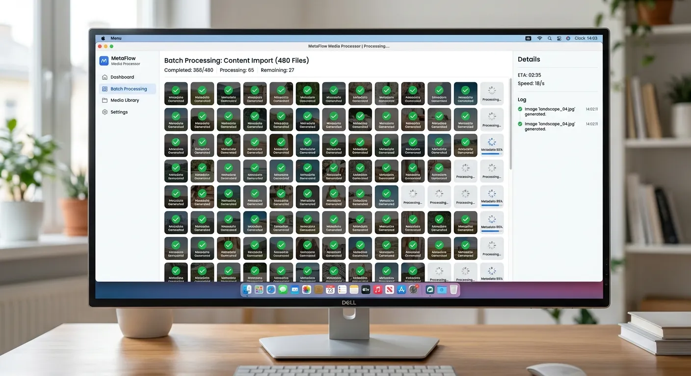

Every microstock contributor knows the exhausting feeling of capturing stunning images, only to spend hours typing out titles and keywords. You want a stock photo roi boost ai batch processing success story of your own, but manual tagging is constantly holding you back. Fortunately, the landscape of portfolio management has fundamentally changed for the better.

By adopting intelligent automation, you can eliminate the frustrating bottleneck of metadata creation. Artificial intelligence now possesses the visual recognition capabilities to analyze your photography instantly. This means you can focus entirely on shooting new concepts while software handles the administrative heavy lifting.

This article explores how advanced platforms like Meita.ai are revolutionizing the microstock industry for independent creators. You will learn actionable strategies to speed up your workflow, improve your search visibility, and significantly increase your passive income. Read on to discover how smart metadata management can transform your photography business.

The Evolution of Microstock Metadata Generation
----------

### Moving Past Manual Keywording ###

For decades, stock photographers accepted manual keywording as a necessary evil of the business. Contributors would spend countless hours staring at screens, trying to brainstorm fifty relevant tags for a single image. This tedious process drained creative energy and limited how many photos a creator could realistically upload.

Human error also played a massive role in manual metadata entry. A tired photographer might misspell a crucial keyword or completely forget to include a synonym that a buyer might search for. These small mistakes directly resulted in lost sales and lower search engine rankings on agency websites.

Furthermore, manual tagging creates a massive scale issue. If it takes five minutes to properly keyword one image, processing a batch of five hundred photos becomes a week-long endeavor. Experiencing a true stock photo roi boost ai batch processing success requires embracing modern tools that eliminate these outdated methods.

### The Rise of Artificial Intelligence in Stock ###

The introduction of vision-based artificial intelligence has completely disrupted the microstock industry. Modern AI algorithms can "see" an image and instantly recognize objects, colors, moods, and concepts. This technological leap allows software to generate highly accurate keywords in mere seconds.

Beyond simple object recognition, advanced AI understands the context of a scene. It can differentiate between a "sad business meeting" and a "productive corporate collaboration," applying the correct emotional tags automatically. This nuanced understanding ensures your images surface for highly specific buyer queries.

Platforms like Meita.ai have taken this technology and tailored it specifically for stock contributors. By training their models on successful stock photography data, they ensure the generated tags match what actual buyers are typing into search bars. This alignment between AI generation and buyer intent is crucial for driving revenue.

### Scaling Your Portfolio Without Burnout ###

Burnout is one of the leading reasons talented photographers abandon their microstock portfolios. The cycle of shooting, editing, and endlessly tagging quickly feels more like a data entry job than a creative pursuit. AI automation breaks this cycle by removing the most repetitive task from your plate.

With batch processing, you can upload hundreds of images at the end of a long shoot. While you rest or plan your next creative project, the software works in the background to analyze and tag every file. You wake up to a fully processed portfolio ready for distribution.

This massive reduction in administrative time allows you to double or triple your output. More images in your portfolio naturally leads to more opportunities for sales across multiple agencies. Ultimately, scaling your library through automation is the most reliable path to increasing your monthly earnings.

Maximizing Earnings Through Search Optimization
----------

### Understanding Microstock Algorithms ###

Stock photo agencies like Adobe Stock and Shutterstock use complex search algorithms to rank images. These systems rely almost entirely on the metadata provided by the contributor to understand what an image contains. If your titles and keywords are weak, even an award-winning photo will remain invisible.

Algorithms prioritize relevance, meaning the tags must accurately reflect the visual content. Keyword stuffing—the practice of adding irrelevant but popular tags—is actively penalized by top agencies. AI generators prevent this by strictly adhering to the visual evidence present in your files.

Additionally, search engines often weigh the first few keywords more heavily than those at the end of your list. Smart metadata tools automatically order your keywords by relevance. This optimization ensures the algorithm instantly grasps the primary subject of your photograph.

### Targeting Specific Buyer Intent ###

Commercial buyers usually have a highly specific image in mind when they search a stock agency. They rarely search for generic terms like "woman." Instead, they search for descriptive phrases like "smiling senior woman drinking coffee outdoors."

To capture these sales, your metadata must include long-tail keywords and conceptual synonyms. A reliable AI tool excels at generating these lateral concepts that a human might overlook. It bridges the gap between your visual art and the specific phrasing a marketing director might use.

By covering both literal descriptions and abstract concepts, your images cast a wider net. This comprehensive approach ensures your portfolio appeals to a diverse range of buyers. Over time, this targeted optimization directly translates into a higher return on investment.

### Improving Discoverability with Accurate Tags ###

Discoverability is the lifeblood of any successful stock photography business. If your photos do not appear on the first few pages of search results, your chances of making a sale plummet. Accurate, comprehensive tagging is the only way to climb these highly competitive rankings.

When an image generates a sale, agency algorithms boost its ranking, creating a snowball effect. Accurate metadata is the catalyst for that crucial first sale. It puts your image in front of the right buyer at exactly the right time.

Consistently uploading well-tagged content signals to the agencies that you are a professional contributor. Some platforms even reward high-quality, accurately tagged portfolios with better overall visibility. Investing in excellent metadata is truly an investment in your long-term discoverability.

Accelerating Workflow with Bulk Tagging Automation
----------

### Managing Massive Image Collections ###

Professional stock photographers rarely deal with single images; they manage massive collections numbering in the thousands. Attempting to organize, keyword, and title these vast libraries manually is an exercise in frustration. When photographers achieve a stock photo roi boost ai batch processing success, it is rarely by accident.

Using a [bulk batch stock photo keywording tool](https://meita.ai/en-us/bulk-metadata-generator) changes the dynamic entirely. You can drag and drop entire folders of exported JPEGs directly into the web interface. The system then utilizes dozens of parallel AI workers to process the queue with blazing speed.

This bulk approach is especially useful for event photography, travel batches, or large studio sessions. Instead of tackling images one by one, you handle them as a cohesive project. This top-down management style keeps your file organization clean and your workflow moving rapidly.

### Ensuring Consistency Across Agencies ###

Most successful microstock contributors upload their portfolios to multiple agencies to maximize their revenue streams. However, keeping your metadata consistent across platforms like Adobe Stock, iStock, and Freepik can be challenging. Each site has its own quirks and formatting preferences.

AI batch processing centralizes your metadata creation. You generate the perfect titles and tags once, and then apply them universally. This single source of truth prevents discrepancies where an image might perform well on one site but fail on another due to missing tags.

Furthermore, consistent tagging helps build your personal brand identity across different marketplaces. Buyers who appreciate your style can easily find more of your work using the same search terms. Uniformity in metadata is a hallmark of a professional, agency-level contributor.

### Exporting Formats for Top Stock Sites ###

Once your metadata is generated, getting it into the agency platforms is the final hurdle. Manually copying and pasting keywords into individual agency portals defeats the purpose of automation. You need a streamlined export process to finalize your workflow.

Modern platforms excel at generating CSV files that are perfectly formatted for specific agencies. For example, using a dedicated [Shutterstock keywording tool](https://meita.ai/en-id/shutterstock-keywording) allows you to download a spreadsheet tailored exactly to their upload requirements. You simply attach the CSV to your image batch on the agency site.

This seamless transition from AI generation to agency upload saves countless hours of administrative friction. It allows you to submit hundreds of images to multiple agencies in a matter of minutes. By mastering this export process, you unlock the true speed of automated portfolio management.

Transforming Your Photography Business Model
----------

### Converting Saved Time Into Revenue ###

In the world of microstock photography, time literally equals money. Every hour spent agonizing over keywords is an hour you are not shooting new, profitable concepts. This is the core foundation of a stock photo roi boost ai batch processing success strategy.

When you automate your metadata, you reclaim dozens of hours every month. You can reinvest this newfound time directly into revenue-generating activities. Whether that means researching market trends or booking more studio time, your business immediately becomes more productive.

The financial return on investment from AI tools is usually realized within the first few bulk uploads. The cost of a premium metadata generator is vastly outweighed by the value of your reclaimed time. Treating your workflow optimization as a business expense is a critical mindset shift.

### Focusing Energy on Creative Production ###

Most photographers entered the microstock industry because they love capturing beautiful images, not because they enjoy data entry. Manual tagging drains the joy out of the creative process. It turns a passionate hobby or exciting career into a monotonous chore.

By delegating the metadata creation to artificial intelligence, you protect your creative energy. You can focus on composing the perfect shot, adjusting complex lighting setups, and directing models. This renewed focus naturally leads to higher-quality photographs.

Better photographs command more attention from buyers and result in more frequent downloads. When you elevate your production value, your entire portfolio becomes more competitive. Automation doesn't just speed up your workflow; it indirectly improves your artistic output.

### Building a Sustainable Passive Income ###

The ultimate goal for most microstock contributors is to build a robust, reliable stream of passive income. You want your portfolio to generate money while you sleep, travel, or work on other projects. However, a portfolio only becomes truly passive when the upload process is streamlined.

If maintaining your stock library requires constant, grueling administrative work, it is an active job, not passive income. AI batch processing removes the manual labor, moving your business closer to true passive revenue. You upload the content, and the automation handles the rest.

This sustainability is vital for long-term success in a highly competitive industry. Creators who rely on efficient, automated systems can weather market changes and continue growing their libraries for years. By embracing technology today, you secure your financial future in the stock photography market.

AI Versus Manual Metadata Generation Comparison
----------

Understanding the stark differences between manual entry and automated processing highlights why top earners have made the switch. The table below breaks down the critical metrics that impact your photography business's bottom line. Review these comparisons to see exactly how automation provides a distinct competitive advantage in the microstock marketplace.

|    Process Feature    |                          Manual Keywording                          |                     Meita.ai Batch Processing                     |                              Impact on Business                              |
|-----------------------|---------------------------------------------------------------------|-------------------------------------------------------------------|------------------------------------------------------------------------------|
| **Processing Speed**  |                    3-5 minutes per single image                     |        Seconds for hundreds of images via parallel workers        |Massive reduction in administrative bottleneck, allowing higher upload volume.|
| **Keyword Accuracy**  |      Prone to human error, typos, and fatigue-driven omissions      |Highly accurate, vision-based tagging with contextual understanding|     Better search engine ranking on agency sites, leading to more sales.     |
|    **Scalability**    |     Severely limited by the photographer's available free time      | Virtually unlimited; easily handles thousands of files seamlessly |     Allows for rapid portfolio growth and diversification across niches.     |
|**Conceptual Synonyms**|Relies strictly on the creator's vocabulary and brainstorming ability|Automatically generates lateral concepts and long-tail buyer terms | Captures niche buyer intent, increasing the chances of unexpected downloads. |
| **Export Efficiency** |   Requires tedious copy-pasting for each individual stock agency    |Instant CSV generation tailored for Adobe Stock, Shutterstock, etc.| Streamlines the final upload phase, turning a multi-hour task into minutes.  |

Expert Tips for Enhancing Your Microstock Workflow
----------

To guarantee your own stock photo roi boost ai batch processing success, follow these advanced industry strategies. Integrating these best practices into your daily routine will drastically improve your efficiency. For even more detailed guidance, be sure to review these [tips to speed up your stock photo workflow](https://meita.ai/blog/meita-tips-and-tricks).

* **Batch by Concept:** Group your photo uploads by theme or shoot location. This helps the AI contextually understand the series and allows you to apply sweeping title modifications across the entire batch effortlessly.
* **Review and Refine:** While AI is incredibly accurate, taking 60 seconds to scan the generated keywords ensures perfection. Delete any tags that feel slightly off-brand and add any hyper-specific location names the AI might not know.
* **Utilize Metadata Templates:** If you shoot a lot of similar content (like a specific studio background), save a metadata template. You can append this standard data to the AI's dynamic keywords for maximum coverage.
* **Export in CSV Format:** Never copy and paste keywords manually. Always use the CSV export feature to upload data in bulk to Shutterstock and Adobe Stock, matching the exact column requirements of each platform.
* **Leverage Parallel Processing:** Don't wait for one batch to finish before starting another. Meita.ai allows you to queue up multiple folders, letting the parallel AI workers crunch the data while you edit your next set of photos.
* **Analyze High-Performing Tags:** Keep an eye on which images sell best and study their metadata. Use those successful keywords to inform your future creative shoots, building a data-driven production strategy.

Frequently Asked Questions about stock photo roi boost ai batch processing success
----------

### How does AI batch processing actually boost my microstock ROI? ###

AI batch processing drastically reduces the hours you spend typing out titles and tags. By automating this administrative task, you save valuable time that can be reinvested into shooting more photos. A larger, high-quality portfolio directly leads to a higher return on investment and increased sales.

### Is AI-generated metadata accepted by agencies like Adobe Stock and Shutterstock? ###

Yes, all major microstock agencies accept AI-generated metadata. The agencies only care that the keywords accurately describe the visual content of the image. Advanced tools like Meita.ai are specifically designed to meet the strict quality and relevance standards of top stock platforms.

### Can artificial intelligence accurately keyword complex conceptual photography? ###

Modern visual AI has evolved far beyond simple object recognition. It can interpret mood, tone, human emotion, and abstract concepts within your images. This ensures your conceptual photography is tagged with the nuanced, long-tail keywords that commercial buyers actually search for.

### How many images can I process at once using bulk metadata tools? ###

High-performance platforms like Meita.ai utilize parallel AI workers to process massive queues rapidly. You can easily drag and drop 500 or more images into the system at a single time. The software processes them simultaneously, turning hours of manual labor into minutes.

### Will I still need to manually review the keywords generated by the AI? ###

While AI is highly accurate, a quick manual review is always considered a best practice. Scanning the tags allows you to remove any irrelevant terms or add specific proper nouns, like a local landmark's name. This final human touch ensures your metadata is completely flawless before uploading.

### How do I transfer the AI-generated keywords to my stock agency accounts? ###

The most efficient way to transfer metadata is by exporting a CSV file directly from the AI platform. Tools like Meita.ai format these spreadsheets specifically for agencies like Shutterstock and Adobe Stock. You simply upload the CSV file alongside your images in the agency portal.

### Does AI keywording prevent the issue of keyword stuffing? ###

Yes, AI tools naturally prevent keyword stuffing because they only generate tags based on the actual visual data present in the image. Manual keywording often tempts photographers to add popular but irrelevant tags, which agencies penalize. AI ensures your metadata remains highly relevant and algorithm-friendly.

### Is the cost of an AI metadata generator worth it for beginner contributors? ###

Even for beginners, the time saved by using an AI generator often outweighs the subscription cost. It prevents early burnout and helps new contributors scale their portfolios fast enough to see real income. Treating it as a basic business utility is highly recommended for growth.

Securing a stock photo roi boost ai batch processing success does not happen overnight, but the right tools make it an inevitable outcome. By completely eliminating the friction of manual keywording, you empower yourself to scale your portfolio at an unprecedented rate. You transform from an overwhelmed hobbyist into a highly efficient, high-volume professional contributor capable of competing with the industry's top earners.

If you are ready to reclaim your creative time and drastically increase your monthly stock revenue, it is time to upgrade your workflow. Stop wasting hours typing out tags and let intelligent automation do the heavy lifting for you. Try Meita.ai today to experience blazing-fast bulk metadata generation, and watch your microstock business reach its true financial potential.
