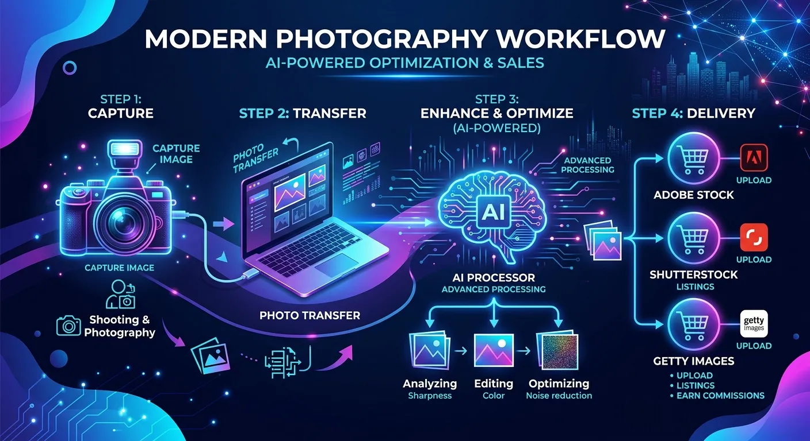
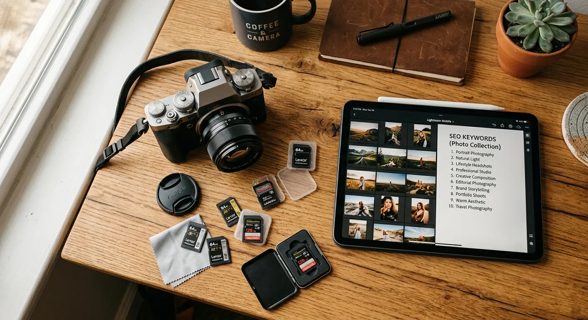

Every professional photographer and microstock contributor knows the sinking feeling of staring at a hard drive filled with thousands of unsorted images. The creative high of a successful photoshoot quickly fades when you realize the monumental task of culling, tagging, and organizing lies ahead. If you want to streamline photo library management with ai tools, you are in the exact right place.

Historically, organizing digital assets was a grueling manual process that stole hours away from actual photography. Stock contributors would spend entire weekends just writing titles, descriptions, and keywords for a single batch of images. Today, artificial intelligence has completely revolutionized this workflow, turning a multi-day chore into a task that takes mere minutes.

In this comprehensive guide, we will explore how machine learning is changing the way visual artists handle their portfolios. You will discover actionable strategies to automate your workflow, maximize your microstock earnings, and reclaim your valuable time. We will also introduce you to powerful platforms like meita.ai, which are specifically designed to eliminate the metadata bottleneck once and for all.

The Rising Need for AI in Stock Photography Workflows
----------

### Tackling the Digital Hoarding Problem ###

Digital cameras and massive memory cards have made it easier than ever to capture thousands of frames in a single session. While this abundance of choice is great for creativity, it creates a massive logistical nightmare during post-production. Photographers often find themselves paralyzed by the sheer volume of files they need to process.

Without a reliable system, these raw files end up sitting on hard drives gathering digital dust. This "digital hoarding" not only wastes storage space but also represents lost revenue for stock photographers. You cannot sell an image that is buried in an unnamed folder from three years ago.

This is where intelligent software steps in to save the day. When you streamline photo library management with ai tools, you instantly cut through the clutter. AI algorithms can rapidly scan your folders, identify the best shots, and safely discard blurry or poorly exposed duplicates.

### The Microstock Metadata Bottleneck ###

For contributors to agencies like Adobe Stock, Shutterstock, and Getty Images, taking the photo is only ten percent of the job. The real challenge lies in the metadata: the titles, descriptions, and keywords that make your images searchable. This step is historically the most dreaded part of the microstock business.

Manual keywording requires you to think like a buyer, anticipating every possible search term someone might use. If you miss a crucial conceptual keyword, your stunning photo will never appear in customer search results. Doing this accurately for hundreds of images is mentally exhausting and prone to human error.

Platforms like meita.ai were built specifically to shatter this bottleneck. By analyzing the visual contents of your image, meita.ai automatically generates highly relevant, SEO-optimized metadata in seconds. This allows contributors to scale their portfolios effortlessly without sacrificing keyword quality.

### Reclaiming Your Creative Time ###

Time is the most valuable asset any creative professional possesses. Every hour spent typing keywords into a spreadsheet is an hour you could have spent shooting new concepts. For full-time microstock contributors, this time deficit directly limits their earning potential.

Automating your administrative tasks flips this script entirely. By delegating the heavy lifting to algorithms, you drastically reduce your screen time. You can finally focus on lighting, composition, and trend research instead of data entry.

Ultimately, AI does not replace the photographer; it empowers them. It acts as an incredibly fast, highly accurate studio assistant that works around the clock. Embracing these tools is no longer a luxury—it is a competitive necessity.

Core Features of AI Photo Management Software
----------

### Smart Image Culling and Selection ###

The first step in any post-production workflow is separating the winning shots from the outtakes. AI culling software accelerates this process by evaluating images based on technical perfection. It instantly flags photos with missed focus, closed eyes, or severe under-exposure.

Advanced systems can even group similar images from a continuous burst sequence. The software highlights the single best frame based on subject expression and sharpness. This means you only review the top five percent of your shoot, saving countless hours of tedious zooming and panning.

By removing the emotional attachment photographers sometimes have to mediocre shots, AI ensures only the highest quality images make it to the editing room. This strict quality control is essential for maintaining a premium stock photography portfolio.

### Automated Tagging and Keyword Generation ###

Image recognition technology has reached astonishing levels of accuracy in recent years. Modern AI does not just see a "dog"; it sees a "Golden Retriever puppy playing with a red frisbee in a sunny park." This deep contextual understanding is the engine behind automated metadata generation.

With meita.ai, microstock contributors can drag and drop their entire finalized gallery into the platform. The AI instantly scans the visual elements, recognizes objects, settings, and even abstract concepts like "teamwork" or "freedom." It then outputs a perfect, comma-separated list of up to 50 targeted keywords.

Furthermore, meita.ai generates catchy, descriptive titles that align with what stock agency algorithms prefer. Because it is tailored specifically for the microstock industry, it avoids spammy, irrelevant tags that could get your portfolio penalized.

### Facial Recognition and Subject Grouping ###

Event and portrait photographers frequently struggle with organizing images by the people in them. Manually sorting through a wedding or corporate event to find every picture of a specific VIP is incredibly tedious. AI solves this through advanced facial recognition algorithms.

The software scans your entire catalog, identifies unique faces, and automatically creates smart albums for each person. Even if the subject is looking away or wearing glasses, the AI can reliably match their features across different lighting conditions.

For stock contributors dealing with model releases, this feature is invaluable. You can quickly isolate all images featuring a specific model, ensuring you attach the correct legal release forms before uploading to agencies.

How to Build an Automated Microstock Workflow
----------

### Ingesting and Backing Up Files ###

A seamless workflow starts the moment you pull the memory card from your camera. Your first priority should always be secure, redundant backups. Many modern AI library tools integrate directly with your ingest process, automatically copying files to multiple drives.

During this initial import, you can set your software to apply basic global metadata, such as your copyright information and the shoot location. It is also the perfect time to let your AI culling tool run its first pass in the background.

By the time you sit down with your coffee, the software has already backed up your files and separated the keepers from the rejects. You are immediately ready to start the creative editing process.

### Integrating AI Metadata Generators ###

Once your final JPEG files are edited and exported, the real magic begins. This is where you leverage AI to handle the commercial preparation of your assets. Instead of opening a spreadsheet, you upload your batch to a dedicated metadata tool.

Using meita.ai at this stage is a game-changer for stock contributors. You simply upload your images, and the platform's vision models analyze every pixel. Within moments, your entire batch is populated with rich, highly searchable titles and keywords.

The best part is that meita.ai allows you to review and tweak these suggestions. If you shot a highly specific niche concept, you can easily add custom keywords to the AI-generated list. This hybrid approach guarantees both speed and absolute precision.

### Exporting and Uploading to Agencies ###

The final step is delivering your optimized assets to the marketplaces. Managing multiple uploads across Adobe Stock, Shutterstock, and Freepik can be chaotic. However, standardizing your metadata first makes this infinitely easier.

Platforms like meita.ai allow you to export your newly generated metadata directly into the files (via EXIF/IPTC data) or as a structured CSV file. Most major stock agencies readily accept these CSV files, allowing you to bulk-upload thousands of images simultaneously.

When you streamline photo library management with ai tools in this manner, the actual upload process takes seconds. Your files arrive at the agency perfectly tagged, automatically mapping to the correct input fields, ready for review.

Maximizing Earnings with Smart Metadata
----------

### Why Accuracy Beats Volume in Stock Photos ###

In the early days of microstock, contributors could succeed by simply uploading massive quantities of average images. Today, the market is highly saturated. The algorithms that drive search results on stock sites now prioritize relevance and buyer engagement over sheer volume.

If your photo is tagged with inaccurate keywords just to get more views, buyers will click away. Stock agencies monitor this "bounce rate" closely. If buyers consistently ignore your image after searching a specific keyword, the algorithm will bury your photo.

This is why the precision of AI tagging is so crucial. Tools like meita.ai ensure your metadata accurately reflects the image content. High relevance leads to better conversion rates, which in turn boosts your ranking in the agency's search engine.

### Leveraging AI for Niche Discovery ###

One often overlooked benefit of AI metadata generators is their ability to uncover niche concepts. When an AI scans your image, it might suggest conceptual keywords that you never would have considered. These unique tags often have lower competition on stock sites.

For example, you might upload a photo of a person working late at a laptop. You might keyword it with "business, working, laptop." However, the AI might add conceptual tags like "burnout, dedication, remote work culture, overtime."

These conceptual keywords are exactly what high-paying commercial buyers search for. By consistently using AI to broaden your keyword vocabulary, you expose your portfolio to a much wider, more lucrative audience.

### Scaling Your Portfolio Effortlessly ###

To make a sustainable full-time income from microstock, you need a large, actively growing portfolio. The most successful contributors have tens of thousands of live assets. Reaching this milestone manually takes years of grinding effort.

AI acts as a massive force multiplier for your output. Because tools like meita.ai handle the most time-consuming part of the process, you can double or triple your weekly upload volume. You spend your energy conceptualizing new shoots rather than managing data.

As your portfolio scales, your passive income grows alongside it. The upfront investment in learning and adopting AI workflows pays off exponentially as your asset library expands without the traditional growing pains.

Comparing Traditional Workflows vs AI Photo Organization
----------

Understanding the stark differences between legacy methods and modern AI workflows highlights exactly why the industry is shifting. For stock contributors, the contrast in time investment and output quality is staggering. Let's look at a direct comparison of the two approaches.

When you look at the data, the choice is obvious. Manual processing is a bottleneck that actively restricts your earning potential. AI tools provide the speed and accuracy necessary to compete in the modern visual marketplace.

|   Workflow Feature    |                 Traditional Manual Method                 |               AI-Powered Workflow (e.g., meita.ai)                |
|-----------------------|-----------------------------------------------------------|-------------------------------------------------------------------|
|   **Image Culling**   |Requires manual review of every single frame, taking hours.|      Automated grouping and technical evaluation in minutes.      |
|**Keyword Generation** |  Brainstorming and typing 30-50 tags per image manually.  |  Instant, context-aware metadata generation across bulk batches.  |
|**Conceptual Accuracy**|Limited by the photographer's vocabulary and current mood. |Analyzes buyer intent to include high-converting abstract concepts.|
| **Agency Uploading**  |     Copy-pasting details into individual web portals.     |   Seamless CSV exports and embedded IPTC data for bulk uploads.   |
|    **Scalability**    |       Extremely low. Burns out the creator quickly.       |       Infinite. Easily handle thousands of files per week.        |

Expert Tips for Optimizing Your Digital Assets
----------

Even with the best AI tools at your disposal, maintaining a clean library requires good habits. Combining smart software with strong foundational organization ensures you never lose a file again. Here are the best practices used by top microstock professionals.

Implementing these strategies will drastically reduce your administrative friction. The goal is to create a frictionless pipeline from your camera sensor to the stock agency's marketplace.

* **Use a Consistent Folder Structure:** Always organize your root drives by Year, then by Month, and finally by Shoot Name (e.g., 2023 \> 10-October \> Corporate\_Office\_Shoot). This chronological foundation prevents chaos.
* **Batch Process Everything:** Never keyword images one by one. Group visually similar images together and run them through meita.ai simultaneously to ensure consistent metadata across the series.
* **Embed Metadata in the File:** Whenever possible, write your AI-generated metadata directly into the JPEG's EXIF/IPTC data. This ensures your keywords travel permanently with the file, no matter where you move it.
* **Embrace the CSV Export:** Learn how to use CSV spreadsheets for multi-agency uploads. Meita.ai easily exports your data into this format, allowing you to submit to Adobe Stock and Shutterstock with a single click.
* **Review AI Suggestions:** AI is brilliant, but it lacks personal context. Always quickly scan your generated keywords to ensure they accurately represent the specific niche you were targeting during the shoot.
* **Cull Ruthlessly:** Do not hoard mediocre images. If a photo does not have commercial stock value, delete it. A smaller, higher-quality library is much easier to manage and monetize.

Frequently Asked Questions about streamline photo library management with ai tools
----------

### How exactly does AI generate photo keywords? ###

AI tools use computer vision and deep learning models to analyze the pixels in an image. They identify objects, colors, human expressions, and relationships between elements. The software then translates these visual data points into highly relevant text keywords optimized for search engines.

### Is AI metadata accepted by major stock agencies? ###

Yes, major platforms like Adobe Stock, Shutterstock, and Getty Images fully support metadata generated by AI tools. In fact, many agencies prefer it because AI tends to provide more accurate, objective, and comprehensive tags than human contributors.

### Can meita.ai handle batch processing for large shoots? ###

Absolutely. Meita.ai is designed specifically for high-volume microstock contributors. You can upload massive batches of images simultaneously, and the AI will generate titles, descriptions, and keywords for all of them in a fraction of the time it takes manually.

### Will AI photo culling accidentally delete my good photos? ###

No, AI culling software never permanently deletes files without your explicit permission. It simply flags and separates the technical rejects from the keepers, allowing you to review the suggested cuts before moving them to the trash.

### Do I still need to use Lightroom if I use AI tools? ###

Yes, AI organization tools are meant to complement, not replace, your editing software. You will still use Lightroom or Capture One for color grading and retouching, while using AI for culling and generating microstock metadata.

### How does AI help with conceptual keywords? ###

Modern AI is trained on millions of images and their associated texts, allowing it to understand abstract ideas. If it sees a person standing on a mountain peak, it will intelligently suggest conceptual tags like "achievement," "success," and "overcoming adversity."

### Is it difficult to learn how to use AI photo management software? ###

Not at all. Most modern AI platforms, including meita.ai, feature highly intuitive drag-and-drop interfaces. If you know how to upload a photo to social media, you have the technical skills required to use these automated workflow tools.

### Can I export AI-generated keywords into a CSV file? ###

Yes, exporting to CSV is a standard feature for professional microstock tools. Platforms like meita.ai allow you to download a perfectly formatted CSV sheet that maps directly to the upload requirements of top stock photography agencies.

The days of struggling with disorganized hard drives and agonizing over metadata are officially behind us. When you streamline photo library management with ai tools, you are making a direct investment in your creative business. You instantly eliminate the most tedious aspects of post-production, freeing up countless hours to do what you actually love: capturing stunning imagery.

If you are ready to scale your stock photography portfolio and maximize your earnings without the burnout, it is time to upgrade your workflow. Try [meita.ai](https://meita.ai) today to experience the fastest, most accurate metadata generator built specifically for microstock professionals. Stop typing keywords and start shooting more—let AI handle the heavy lifting for you.
