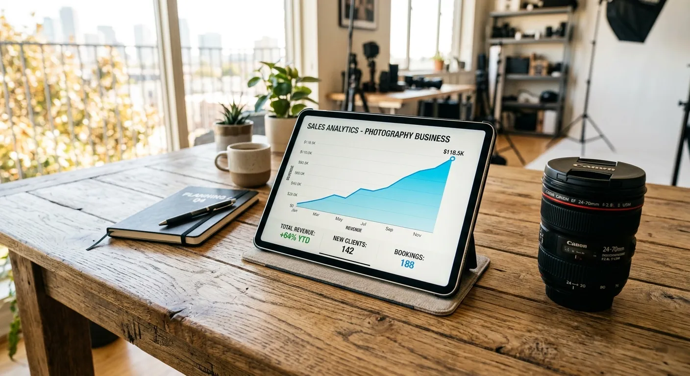

Every microstock photographer knows the quiet dread of the upload queue. You spend hours capturing the perfect shot, editing it to perfection, and then hit a massive roadblock. The tedious process of adding titles, descriptions, and tags to hundreds of images can drain your creative energy instantly. The debate over streamlining seo ai tags vs manual photo keywords is a daily reality for modern creators aiming to maximize their portfolio's visibility.

Search engine optimization is the undisputed lifeblood of any successful stock photography business. If buyers cannot find your images through search queries, those images simply will not sell. For years, contributors relied entirely on their own vocabulary and memory to attach relevant metadata to their art. Today, advanced artificial intelligence platforms are fundamentally changing how we approach this critical step in the microstock workflow.

In this comprehensive guide, we will explore the ongoing shift from traditional typing to intelligent automation. You will discover how modern tools like Meita.ai can drastically reduce your administrative time while boosting your ranking potential on platforms like Adobe Stock. By understanding these two distinct approaches, you can build a more profitable, efficient, and stress-free strategy for your creative business.

The Evolution of Image Metadata Creation
----------

### Traditional Keywording Struggles ###

In the early days of microstock, content creators had no choice but to type every single metadata field by hand. This required staring at an image and brainstorming dozens of relevant terms, concepts, and synonyms from scratch. While this method ensured a personal touch, it was an incredibly slow and mentally exhausting process. Photographers often experienced keyword fatigue after uploading just a small batch of photos.

Memory limitations also played a significant role in missing potential sales opportunities. A human looking at a picture of a business meeting might remember to tag "corporate" and "office" but easily forget vital terms like "collaboration" or "teamwork." This lack of conceptual depth often resulted in lower search rankings. If you are struggling with these manual limitations, learning [how to use AI to generate stock photo keywords](https://meita.ai/blog/ai-stock-photo-keywords-tutorial) can completely transform your daily operations.

### The Rise of Automated Metadata Tools ###

As the stock photography industry grew, the need for faster workflows became undeniably apparent. Early software solutions attempted to help by offering basic keyword suggestions based on simple visual recognition. However, these early tools were frequently inaccurate and required heavy human correction. They were a step in the right direction, but they lacked the semantic understanding needed for true search optimization.

Fast forward to today, and machine learning models have achieved remarkable sophistication. Modern platforms analyze an image's subject matter, lighting, mood, and implied concepts with staggering accuracy. These intelligent systems can instantly generate rich, highly relevant descriptions and tags that perfectly align with what buyers are actively searching for.

### Why Microstock Contributors Are Switching ###

The transition toward automated metadata is driven primarily by the basic economic principle of time versus money. Every hour spent typing tags is an hour stolen from shooting new content or editing existing photos. Microstock contributors are rapidly adopting AI solutions to reclaim their valuable creative time. Automation shifts the burden of data entry from the artist to the machine.

Furthermore, automation provides a level of consistency that is hard to maintain manually. When you process thousands of images, human error inevitably creeps into your workflow. By adopting a platform designed to scale, contributors can submit much larger portfolios without sacrificing the quality of their search optimization.

Evaluating the Manual Tagging Process
----------

### Control and Precision Pros ###

Manual keywording offers a level of absolute control that some meticulous artists prefer to maintain. When you type your own tags, you can ensure that highly specific, niche terminology is included accurately. This is particularly useful for specialized photography, such as rare botanical species or highly technical medical equipment. You know exactly what your subject is, and you can dictate the metadata accordingly.

Additionally, manual tagging allows you to weave specific localized slang or regional terms into your descriptions. If an image relies heavily on cultural context that an algorithm might miss, human input becomes invaluable. This precise control ensures that your highly specialized assets reach their intended target audience.

### Time Consumption and Bottlenecks ###

Despite the benefits of precision, manual tagging remains the biggest bottleneck in the stock photography pipeline. Processing a batch of just fifty images can easily take several hours of tedious data entry. This massive time investment creates a frustrating backlog, leaving hundreds of ready-to-sell photos sitting idle on hard drives. The slower your upload rate, the slower your portfolio growth.

This slow pace also discourages contributors from experimenting with different visual niches. If you know that shooting a new subject means spending hours researching new vocabulary, you might avoid stepping outside your comfort zone. Ultimately, this bottleneck severely limits your overall earning potential in competitive marketplaces.

### Human Bias in Search Optimization ###

One of the hidden flaws of manual keywording is our inherent human bias and limited working vocabulary. We naturally gravitate toward the same descriptive words, repeatedly ignoring valuable synonyms. This repetition can inadvertently hurt your visibility if buyers are using different search terms. Understanding the [dangers of over keywording microstock](https://meita.ai/blog/over-keywording-vs-under-keywording-finding-the-right-balance-for-microstock) and finding the right balance is crucial to avoiding spammy metadata.

Moreover, humans often focus entirely on the literal elements of a photo while completely missing the conceptual themes. A photographer might tag "man, computer, desk" but miss the high-value emotional concepts like "frustration, deadline, stress." AI systems are specifically trained to bridge this gap, ensuring your images capture both literal and emotional search intents.

Exploring Artificial Intelligence Keywording Solutions
----------

### Speed and Bulk Processing Power ###

When photographers compare streamlining seo ai tags vs manual photo keywords, the sheer speed of automation always stands out. Modern artificial intelligence can "look" at an image and generate dozens of optimized tags in mere seconds. This rapid processing turns a multi-hour chore into a quick, manageable task. You can drag and drop an entire hard drive folder and have the metadata ready in minutes.

For high-volume shooters, this bulk processing power is an absolute game-changer. Utilizing the [best AI keywording tool](https://meita.ai/en-id/best-keywording-tool) allows you to process up to 50 images in parallel using advanced cloud architecture. This means your workflow scales effortlessly, whether you are uploading ten photos or ten thousand.

### Consistency Across Stock Portfolios ###

Maintaining consistent metadata quality across your entire portfolio is incredibly difficult when doing it by hand. Your mood, energy levels, and focus change from day to day, directly impacting the quality of your manual tags. AI, on the other hand, never gets tired or distracted. It applies the same rigorous analytical standards to your first photo as it does to your thousandth.

This unwavering consistency is vital for building a trustworthy presence on microstock agencies. When every image in your portfolio features rich, perfectly spelled, and highly relevant metadata, algorithms learn to trust your content. Consistent quality signals to search engines that your portfolio is a reliable source of premium imagery.

### Catching Hidden Visual Elements ###

Artificial intelligence excels at identifying subtle details in a photograph that human eyes often gloss over. A background element, a specific architectural style, or a particular color palette can all be highly searchable terms. AI vision models scan the entire frame, picking up on these secondary elements and adding them to your keyword list automatically.

By capturing these hidden details, your images are suddenly eligible to appear in a much wider variety of search queries. This expanded visibility directly translates to more potential buyers viewing your work. Automation ensures that no viable sales opportunity is left on the table due to oversight.

Impact on Microstock Sales and Visibility
----------

### Ranking Algorithms and Metadata ###

Understanding the financial impact of streamlining seo ai tags vs manual photo keywords is vital for ambitious contributors. Stock photo agencies rely entirely on complex search algorithms to connect buyers with the right images. These algorithms read your titles, descriptions, and tags to determine exactly where your photo should rank. Highly relevant, structured metadata is the key to pushing your content to the first page of results.

AI tools are frequently trained on the very same SEO principles that these algorithms prioritize. By generating tags that match actual buyer intent, automated tools help your images surface faster. When your photos consistently appear at the top of search queries, your download numbers and royalty checks naturally increase.

### Meeting Agency Standards Effectively ###

Every major microstock platform has its own set of strict rules regarding metadata formatting and keyword limits. Keeping track of these varying rules while manually typing can be an absolute nightmare. Some platforms punish contributors for keyword spamming, while others demand highly detailed conceptual tags. Navigating this maze is much easier with intelligent software.

Automated platforms are designed to export your metadata in agency-compliant formats. Meita.ai, for example, generates perfectly structured CSV files tailored for platforms like Adobe Stock. If you are unsure about agency limits, reading up on the [optimal keyword strategy](https://meita.ai/blog/stock-photo-keyword-count) will help you configure your AI tools perfectly.

### Scaling Your Upload Volume ###

In the microstock industry, volume is just as important as individual image quality. To generate a full-time income, contributors typically need thousands of active images in their portfolios. Manual tagging creates a hard ceiling on how fast you can grow that portfolio. There are simply not enough hours in the day to keyword thousands of images by hand.

Embracing AI solutions shatters this ceiling, allowing you to upload fresh content as fast as you can shoot and edit it. This rapid scaling keeps your portfolio active, signaling to platform algorithms that you are a consistent, high-value contributor. More uploads mean more visibility, leading to a compounding effect on your monthly earnings.

Finding the Perfect Workflow Strategy
----------

### Combining Technology with Human Review ###

As you master streamlining seo ai tags vs manual photo keywords, you will notice distinct workflow trends emerging. The most successful stock photographers do not blindly trust AI, nor do they stubbornly cling to manual typing. Instead, they use a powerful hybrid approach. They utilize AI to generate the heavy lifting of base keywords and descriptions instantly.

Once the automated list is generated, the photographer briefly reviews the tags to ensure absolute accuracy. During this quick review, they can inject highly specific niche terms or remove anything slightly off-base. This hybrid method combines the lightning speed of machine learning with the nuanced precision of human oversight.

### Choosing the Right Software Tools ###

Not all automated tagging platforms are created equal. Some offer basic features, while others provide comprehensive workflow management. When selecting a tool, you need to prioritize platforms that allow for easy bulk processing and flexible export options. You also want a platform that understands the specific needs of microstock contributors.

Meita.ai stands out by allowing users to bring their own API keys, drastically lowering processing costs to fractions of a cent per image. With features like 50 parallel image processing and direct CSV exports, it easily integrates into any existing workflow. Choosing software built specifically for stock photographers ensures you get exactly the tools you need.

### Tracking Your Portfolio Performance ###

Implementing a new workflow is only half the battle; tracking the results is where you secure long-term success. After switching to AI-generated metadata, monitor your portfolio's views and sales carefully. Look for trends in which types of keywords are driving the most lucrative traffic to your account.

Analyzing this data helps you continuously refine your overall keywording approach. You can adjust your AI prompts to focus more heavily on specific concepts. To get a deeper understanding of search strategies, exploring how to balance [long-tail vs short-tail microstock keywords](https://meita.ai/blog/long-tail-vs-short-tail-keywords-for-microstock-finding-your-sweet-spot) will give you a massive competitive advantage.

Comparing Tagging Methods Side by Side
----------

To truly appreciate the value of modern software, it is helpful to look at a direct comparison. The table below outlines the core differences between traditional manual data entry and using an advanced platform like Meita.ai. This breakdown highlights why the industry is rapidly shifting toward intelligent automation.

|   Feature / Aspect   |                    Manual Keywording                    |                 AI Automation (Meita.ai)                  |
|----------------------|---------------------------------------------------------|-----------------------------------------------------------|
| **Processing Speed** |      Very slow; 2-5 minutes per image on average.       |  Lightning fast; processes dozens of images in seconds.   |
|**Conceptual Tagging**| Relies heavily on human memory and limited vocabulary.  |Automatically includes broad semantic and conceptual tags. |
|   **Consistency**    |Prone to spelling errors, fatigue, and skipped synonyms. |    100% consistent formatting and spelling every time.    |
|   **Scalability**    |Extremely difficult to scale for large portfolio uploads.|Effortless scaling with parallel processing and bulk CSVs. |
|  **Workflow Cost**   |  Costs valuable time that could be spent creating art.  |Highly cost-effective, often fractions of a cent per photo.|

Expert Strategies for Metadata Optimization
----------

Transitioning to an automated workflow is just the first step toward dominating stock photography search results. To truly maximize your earning potential, you must actively optimize how you use these powerful tools. Here are proven strategies from industry experts to help you get the most out of your metadata.

* **Prioritize Relevance Over Quantity:** Do not just accept 50 keywords because the limit allows it. Ensure every single tag is strictly relevant to the image. Search engines penalize portfolios that consistently use spammy or unrelated metadata.
* **Embrace the Hybrid Method:** Let the AI do ninety percent of the work, but always perform a quick visual review. Add your highly specific niche knowledge to the final 10% of the keyword list for ultimate precision.
* **Leverage Batch Processing:** Group similar images together before running them through your tagging software. This helps maintain thematic consistency and makes the final human review process much faster.
* **Focus on Conceptual Themes:** Ensure your tags describe the emotion or concept of the photo, not just literal objects. Words like "freedom," "stress," or "innovation" often drive higher-paying commercial sales than literal descriptions.
* **Update Older Portfolios:** Do not just use these tools for new shoots. Take your oldest, worst-performing batches of photos and run them through Meita.ai to revitalize their search ranking with fresh, optimized metadata.

Frequently Asked Questions about streamlining seo ai tags vs manual photo keywords
----------

### What is the main difference between manual and AI keywording? ###

Manual keywording requires a human to type out every title, description, and tag from memory. AI keywording uses machine learning models to instantly analyze an image and generate highly relevant metadata automatically.

### Does AI keywording improve stock photo sales? ###

Yes, because it ensures comprehensive, accurate, and conceptually rich tags that buyers actually search for. Better metadata leads to higher search rankings, which naturally results in more views and increased sales.

### Can I still edit AI-generated tags? ###

Absolutely. The best platforms allow you to review and edit the generated metadata before exporting. This hybrid approach ensures you maintain creative control while saving hours of typing.

### Will stock agencies reject AI-generated metadata? ###

No, stock agencies only care about the accuracy and relevance of the tags provided. As long as the AI generates accurate, non-spammy keywords that follow agency guidelines, your photos will be accepted.

### How does Meita.ai differ from other tools? ###

Meita.ai allows users to use their own API keys, reducing costs to roughly a penny per image. It also features incredibly fast 50-worker parallel processing and generates agency-ready CSV files.

### Is it expensive to use AI keywording platforms? ###

It can be with traditional subscription models. However, platforms like Meita.ai utilize a bring-your-own-key model, making it incredibly affordable even for high-volume microstock contributors.

### Do I need to include long-tail keywords? ###

Yes, long-tail keywords are highly specific phrases that face less competition in stock agency search algorithms. Modern AI tools are excellent at naturally incorporating these valuable phrases into your descriptions.

### How many keywords should I aim for? ###

Most major agencies allow up to 50 keywords per image. However, quality always beats quantity; aim for 25 to 40 highly relevant, descriptive tags rather than maxing out the limit with fluff.

### What happens if an AI tool makes a mistake? ###

While AI is highly accurate, it can occasionally misinterpret abstract images. This is why a quick human review before final upload is always recommended to ensure perfect accuracy.

### Can AI identify conceptual metadata? ###

Yes, advanced AI models are specifically trained to recognize emotional and conceptual themes. They can easily look at a photo of a mountain climber and accurately tag concepts like "perseverance" and "achievement."

Conclusion
----------

The microstock industry is more competitive today than it has ever been, making portfolio discoverability your top priority. Are you ready to stop debating streamlining seo ai tags vs manual photo keywords and start optimizing your creative workflow? By moving away from the tedious, time-consuming process of manual typing, you free yourself to do what you do best: create stunning visual content. Embracing intelligent automation gives you the competitive edge needed to rank higher, meet agency standards, and ultimately grow your monthly royalties.

There has never been a better time to revolutionize your stock photography business with cutting-edge technology. Meita.ai offers the perfect blend of speed, affordability, and precision, allowing you to generate metadata ten times faster than traditional methods. Stop letting your beautiful images gather dust in the upload queue. Try Meita.ai today, streamline your entire keywording process, and watch your portfolio's sales potential soar to new heights.
